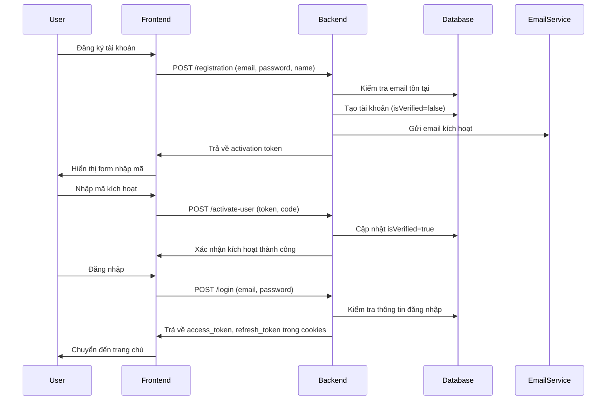

# Authentication & Authorization Flow

Hệ thống E-Learning sử dụng cơ chế xác thực và phân quyền đa dạng, bao gồm cả JWT (cho Backend) và NextAuth (cho Frontend). Dưới đây là phân tích chi tiết về luồng xác thực và phân quyền trong hệ thống.

## Mô Hình Xác Thực



## 1. JWT Authentication (Backend)

### Đăng Ký Tài Khoản

```typescript
// Backend/controller/user.controller.ts
export const registrationUser = catchAsyncErrors(
  async (req: Request, res: Response, next: NextFunction) => {
    try {
      const { name, email, password } = req.body;
      
      // Kiểm tra email đã tồn tại
      const emailExists = await userModel.findOne({ email });
      if (emailExists) {
        return next(new ErrorHandler("Email already exists", 400));
      }
      
      // Tạo activation token và code
      const activationToken = createActivationToken(user);
      const activationCode = activationToken.activationCode;
      
      // Dữ liệu cho email
      const data = { user: { name: user.name }, activationCode };
      
      // Gửi email
      await sendMail({
        email: user.email,
        subject: "Activate your account",
        template: "activation-mail.ejs",
        data,
      });
      
      // Trả về kết quả
      res.status(201).json({
        success: true,
        message: `Please check your email: ${user.email} to activate your account!`,
        activationToken: activationToken.token,
      });
    } catch (error: any) {
      return next(new ErrorHandler(error.message, 400));
    }
  }
);
```

### Kích Hoạt Tài Khoản

```typescript
// Backend/controller/user.controller.ts
export const activateUser = catchAsyncErrors(
  async (req: Request, res: Response, next: NextFunction) => {
    try {
      const { activation_token, activation_code } = req.body;
      
      // Verify token
      const newUser: { user: IUser; activationCode: string } = jwt.verify(
        activation_token,
        process.env.ACTIVATION_SECRET as string
      ) as { user: IUser; activationCode: string };
      
      // Kiểm tra mã kích hoạt
      if (newUser.activationCode !== activation_code) {
        return next(new ErrorHandler("Invalid activation code", 400));
      }
      
      // Kiểm tra email tồn tại
      const { name, email, password } = newUser.user;
      const existUser = await userModel.findOne({ email });
      if (existUser) {
        return next(new ErrorHandler("Email already exists", 400));
      }
      
      // Tạo user
      const user = await userModel.create({
        name,
        email,
        password,
      });
      
      // Trả về kết quả
      res.status(201).json({
        success: true,
      });
    } catch (error: any) {
      return next(new ErrorHandler(error.message, 400));
    }
  }
);
```

### Đăng Nhập

```typescript
// Backend/controller/user.controller.ts
export const loginUser = catchAsyncErrors(
  async (req: Request, res: Response, next: NextFunction) => {
    try {
      const { email, password } = req.body;
      
      // Validate input
      if (!email || !password) {
        return next(new ErrorHandler("Please enter email and password", 400));
      }
      
      // Tìm user và so sánh password
      const user = await userModel.findOne({ email }).select("+password");
      if (!user) {
        return next(new ErrorHandler("Invalid email or password", 400));
      }
      
      const isPasswordMatch = await user.comparePassword(password);
      if (!isPasswordMatch) {
        return next(new ErrorHandler("Invalid email or password", 400));
      }
      
      // Tạo JWT token
      const accessToken = user.SignAccessToken();
      const refreshToken = user.SignRefreshToken();
      
      // Lưu vào cookies
      res.cookie("access_token", accessToken, accessTokenOptions);
      res.cookie("refresh_token", refreshToken, refreshTokenOptions);
      
      // Trả về kết quả
      res.status(200).json({
        success: true,
        accessToken,
        user,
      });
    } catch (error: any) {
      return next(new ErrorHandler(error.message, 400));
    }
  }
);
```

### Tokens JWT

```typescript
// Backend/models/user.model.ts
userSchema.methods.SignAccessToken = function () {
  return jwt.sign({ id: this._id }, process.env.ACCESS_TOKEN || "", {
    expiresIn: "5m",
  });
};

userSchema.methods.SignRefreshToken = function () {
  return jwt.sign({ id: this._id }, process.env.REFRESH_TOKEN || "", {
    expiresIn: "3d",
  });
};
```

### Middleware Authentication

```typescript
// Backend/middleware/auth.ts
export const isAuthenticated = asyncHandler(
  async (req: Request, res: Response, next: NextFunction) => {
    // Lấy token từ cookies
    const accessToken = req.cookies.access_token;
    
    if (!accessToken) {
      return next(new ErrorHandler("Please login to access this resource", 401));
    }
    
    // Verify token
    const decoded = jwt.verify(
      accessToken,
      process.env.ACCESS_TOKEN as string
    ) as JwtPayload;
    
    if (!decoded) {
      return next(new ErrorHandler("Access token is not valid", 401));
    }
    
    // Tìm user từ token
    const user = await userModel.findById(decoded.id);
    if (!user) {
      return next(new ErrorHandler("User not found", 404));
    }
    
    // Gán user vào request
    req.user = user;
    next();
  }
);
```

### Middleware Authorization

```typescript
// Backend/middleware/auth.ts
export const authorizeRoles = (...roles: string[]) => {
  return (req: Request, res: Response, next: NextFunction) => {
    if (!roles.includes(req.user?.role || "")) {
      return next(
        new ErrorHandler(
          `Role (${req.user?.role}) is not allowed to access this resource`,
          403
        )
      );
    }
    next();
  };
};
```

## 2. NextAuth (Frontend)

### Cấu Hình NextAuth

```typescript
// Frontend/pages/api/auth/[...nextauth].ts
import NextAuth from "next-auth";
import GoogleProvider from "next-auth/providers/google";
import GithubProvider from "next-auth/providers/github";
import CredentialsProvider from "next-auth/providers/credentials";
import { API } from "@/redux/features/api/apiSlice";

export default NextAuth({
  providers: [
    GoogleProvider({
      clientId: process.env.GOOGLE_CLIENT_ID || "",
      clientSecret: process.env.GOOGLE_CLIENT_SECRET || "",
    }),
    GithubProvider({
      clientId: process.env.GITHUB_CLIENT_ID || "",
      clientSecret: process.env.GITHUB_CLIENT_SECRET || "",
    }),
    CredentialsProvider({
      name: "Credentials",
      credentials: {
        email: { label: "Email", type: "email" },
        password: { label: "Password", type: "password" },
      },
      async authorize(credentials) {
        try {
          const { data } = await API.post("/auth/login", {
            email: credentials?.email,
            password: credentials?.password,
          });
          
          if (data?.user) {
            return data.user;
          }
          return null;
        } catch (error) {
          throw new Error("Invalid email or password");
        }
      },
    }),
  ],
  callbacks: {
    async jwt({ token, user, account }) {
      if (user) {
        token.accessToken = user.accessToken;
        token.user = user;
      }
      
      if (account && account.type === "oauth") {
        // Handle social login
      }
      
      return token;
    },
    async session({ session, token }) {
      session.user = token.user;
      session.accessToken = token.accessToken;
      return session;
    },
  },
  pages: {
    signIn: "/auth/login",
  },
  session: {
    strategy: "jwt",
    maxAge: 30 * 24 * 60 * 60, // 30 days
  },
  secret: process.env.NEXTAUTH_SECRET,
});
```

### Redux Authentication

```typescript
// Frontend/redux/features/auth/authSlice.ts
import { PayloadAction, createSlice } from "@reduxjs/toolkit";

const initialState = {
  token: "",
  user: "",
};

const authSlice = createSlice({
  name: "auth",
  initialState,
  reducers: {
    userRegistration: (state, action: PayloadAction<{ token: string }>) => {
      state.token = action.payload.token;
    },
    userLoggedIn: (
      state,
      action: PayloadAction<{ accessToken: string; user: string }>
    ) => {
      state.token = action.payload.accessToken;
      state.user = action.payload.user;
    },
    userLoggedOut: (state) => {
      state.token = "";
      state.user = "";
    },
  },
});

export const { userRegistration, userLoggedIn, userLoggedOut } =
  authSlice.actions;

export default authSlice.reducer;
```

### Frontend Authentication Flow

```typescript
// Frontend/app/components/Auth/Login.tsx
"use client";
import React, { useState } from "react";
import { useFormik } from "formik";
import * as Yup from "yup";
import { AiOutlineEye, AiOutlineEyeInvisible } from "react-icons/ai";
import { useLoginUserMutation } from "@/redux/features/auth/authApi";
import { useSelector } from "react-redux";
import toast from "react-hot-toast";
import {
  useSession,
  signIn,
  signOut,
} from "next-auth/react";

const schema = Yup.object().shape({
  email: Yup.string()
    .email("Invalid email address")
    .required("Email is required"),
  password: Yup.string().required("Password is required"),
});

const Login = ({ setRoute, setOpen }: Props) => {
  const [show, setShow] = useState(false);
  const { data: session } = useSession();
  const [loginUser, { isLoading, isSuccess, error }] = useLoginUserMutation();
  
  const formik = useFormik({
    initialValues: { email: "", password: "" },
    validationSchema: schema,
    onSubmit: async ({ email, password }) => {
      // JWT Login
      await loginUser({ email, password });
      
      // Or NextAuth login
      // await signIn("credentials", {
      //   email,
      //   password,
      //   redirect: false,
      // });
    },
  });
  
  return (
    <div>
      {/* Login form JSX */}
    </div>
  );
};
```

### Social Authentication

```typescript
// Frontend/app/components/Auth/Login.tsx
// Social authentication with NextAuth
const handleSocialAuth = async (provider: string) => {
  try {
    const result = await signIn(provider, {
      redirect: false,
      callbackUrl: "/",
    });
    
    if (result?.error) {
      toast.error(result.error);
    }
  } catch (error) {
    toast.error("Social authentication failed");
  }
};

// JSX for social login buttons
<div className="social-login">
  <button onClick={() => handleSocialAuth("google")}>
    Sign in with Google
  </button>
  <button onClick={() => handleSocialAuth("github")}>
    Sign in with GitHub
  </button>
</div>
```

## 3. Protected Routes & Components

### Backend Route Protection

```typescript
// Backend/routes/user.route.ts
import express from "express";
import { authorizeRoles, isAuthenticated } from "../middleware/auth";

const userRouter = express.Router();

// Public routes
userRouter.post("/registration", registrationUser);
userRouter.post("/activate-user", activateUser);
userRouter.post("/login", loginUser);

// Protected routes
userRouter.get("/logout", isAuthenticated, logoutUser);
userRouter.get("/me", isAuthenticated, getUserInfo);
userRouter.put("/update-user-info", isAuthenticated, updateUserInfo);

// Admin routes
userRouter.get(
  "/get-users",
  isAuthenticated,
  authorizeRoles("admin"),
  getAllUsers
);
userRouter.put(
  "/update-user",
  isAuthenticated,
  authorizeRoles("admin"),
  updateUserRole
);
```

### Frontend Route Protection

```typescript
// Frontend/app/components/Route/ProtectedRoute.tsx
"use client";
import { useSelector } from "react-redux";
import { redirect } from "next/navigation";
import { useLoadUserQuery } from "@/redux/features/api/apiSlice";
import Loader from "../Loader/Loader";

interface ProtectedRouteProps {
  children: React.ReactNode;
}

export default function ProtectedRoute({ children }: ProtectedRouteProps) {
  const { user, token } = useSelector((state: any) => state.auth);
  const { isLoading } = useLoadUserQuery(undefined, {
    skip: !token,
  });

  if (isLoading) {
    return <Loader />;
  }

  if (!user) {
    redirect("/login");
  }

  return <>{children}</>;
}
```

### Admin Route Protection

```typescript
// Frontend/app/components/Route/AdminProtectedRoute.tsx
"use client";
import { useSelector } from "react-redux";
import { redirect } from "next/navigation";
import { useLoadUserQuery } from "@/redux/features/api/apiSlice";
import Loader from "../Loader/Loader";

interface AdminProtectedRouteProps {
  children: React.ReactNode;
}

export default function AdminProtectedRoute({ children }: AdminProtectedRouteProps) {
  const { user, token } = useSelector((state: any) => state.auth);
  const { isLoading } = useLoadUserQuery(undefined, {
    skip: !token,
  });

  if (isLoading) {
    return <Loader />;
  }

  if (!user) {
    redirect("/login");
  }

  if (user.role !== "admin") {
    redirect("/");
  }

  return <>{children}</>;
}
```

## 4. Đăng Xuất

```typescript
// Backend/controller/user.controller.ts
export const logoutUser = catchAsyncErrors(
  async (req: Request, res: Response, next: NextFunction) => {
    try {
      // Xóa cookies
      res.cookie("access_token", "", { maxAge: 1 });
      res.cookie("refresh_token", "", { maxAge: 1 });
      
      // Xóa session trong Redis (nếu có)
      // await redis.del(req.user._id);
      
      // Trả về kết quả
      res.status(200).json({
        success: true,
        message: "Logged out successfully",
      });
    } catch (error: any) {
      return next(new ErrorHandler(error.message, 400));
    }
  }
);

// Frontend/app/components/Profile/Logout.tsx
const handleLogout = async () => {
  // JWT Logout
  await logoutUser();
  
  // NextAuth Logout
  // await signOut({ redirect: false });
  
  // Redirect
  router.push("/");
};
```

## 5. Token Refresh

```typescript
// Backend/controller/user.controller.ts
export const updateAccessToken = catchAsyncErrors(
  async (req: Request, res: Response, next: NextFunction) => {
    try {
      // Lấy refresh token
      const refresh_token = req.cookies.refresh_token;
      
      // Verify refresh token
      const decoded = jwt.verify(
        refresh_token,
        process.env.REFRESH_TOKEN as string
      ) as JwtPayload;
      
      if (!decoded) {
        return next(new ErrorHandler("Could not refresh token", 400));
      }
      
      // Tìm user từ Redis hoặc Database
      const user = await userModel.findById(decoded.id);
      
      if (!user) {
        return next(new ErrorHandler("User not found", 404));
      }
      
      // Tạo access token mới
      const accessToken = user.SignAccessToken();
      const refreshToken = user.SignRefreshToken();
      
      // Lưu vào cookies
      res.cookie("access_token", accessToken, accessTokenOptions);
      res.cookie("refresh_token", refreshToken, refreshTokenOptions);
      
      // Trả về kết quả
      res.status(200).json({
        success: true,
        accessToken,
      });
    } catch (error: any) {
      return next(new ErrorHandler(error.message, 400));
    }
  }
);

// Frontend/redux/features/api/apiSlice.ts
export const apiSlice = createApi({
  reducerPath: "api",
  baseQuery: fetchBaseQuery({
    baseUrl: process.env.NEXT_PUBLIC_SERVER_URI,
  }),
  endpoints: (builder) => ({
    refreshToken: builder.query({
      query: (data) => ({
        url: "refresh",
        method: "GET",
        credentials: "include" as const,
      }),
    }),
    // ... other endpoints
  }),
});

// Frontend/app/utils/refreshToken.ts
export const refreshToken = async () => {
  try {
    // Call refresh token endpoint
    const res = await fetch(`${process.env.NEXT_PUBLIC_SERVER_URI}/refresh`, {
      method: "GET",
      credentials: "include",
    });
    
    const data = await res.json();
    return data;
  } catch (error) {
    console.error("Error refreshing token", error);
  }
};
```

## 6. Xử Lý Lỗi Authentication

```typescript
// Frontend/redux/features/auth/authApi.ts
builder.addMatcher(
  (action) => {
    return (
      action.payload?.status === 401 &&
      action.payload?.data?.message === "Please login to access this resource"
    );
  },
  (state, action) => {
    // Logout user or refresh token
    store.dispatch(userLoggedOut());
    toast.error("Session expired. Please login again.");
  }
);
```

## 7. Password Hashing và So Sánh

```typescript
// Backend/models/user.model.ts
userSchema.pre<IUser>("save", async function (next) {
  if (!this.isModified("password")) {
    next();
  }
  // Hash password trước khi lưu
  this.password = await bcrypt.hash(this.password, 10);
  next();
});

userSchema.methods.comparePassword = async function (
  enteredPassword: string
): Promise<boolean> {
  return await bcrypt.compare(enteredPassword, this.password);
};
```

## 8. Email Verification

```typescript
// Backend/utils/sendMail.ts
import nodemailer, { Transporter } from "nodemailer";
import ejs from "ejs";
import path from "path";

interface EmailOptions {
  email: string;
  subject: string;
  template: string;
  data: { [key: string]: any };
}

const sendMail = async (options: EmailOptions): Promise<void> => {
  const transporter: Transporter = nodemailer.createTransport({
    host: process.env.SMTP_HOST,
    port: parseInt(process.env.SMTP_PORT || "587"),
    service: process.env.SMTP_SERVICE,
    auth: {
      user: process.env.SMTP_MAIL,
      pass: process.env.SMTP_PASSWORD,
    },
  });

  // Template path
  const templatePath = path.join(__dirname, "../mails", options.template);

  // Render template
  const html: string = await ejs.renderFile(templatePath, options.data);

  // Email options
  const mailOptions = {
    from: process.env.SMTP_MAIL,
    to: options.email,
    subject: options.subject,
    html,
  };

  // Send email
  await transporter.sendMail(mailOptions);
};

export default sendMail;
```

## 9. Cookies & Security

```typescript
// Backend/app.ts
import cookieParser from "cookie-parser";
import cors from "cors";

// Cookie options
export const accessTokenOptions = {
  expires: new Date(Date.now() + 5 * 60 * 1000), // 5 minutes
  maxAge: 5 * 60 * 1000,
  httpOnly: true,
  sameSite: "lax",
  secure: process.env.NODE_ENV === "production",
};

export const refreshTokenOptions = {
  expires: new Date(Date.now() + 3 * 24 * 60 * 60 * 1000), // 3 days
  maxAge: 3 * 24 * 60 * 60 * 1000,
  httpOnly: true,
  sameSite: "lax",
  secure: process.env.NODE_ENV === "production",
};

// Setup middleware
app.use(cookieParser());
app.use(
  cors({
    origin: process.env.CORS_ORIGIN || "http://localhost:3000",
    credentials: true,
  })
);
```

## 10. Provider Redux trong Frontend

```typescript
// Frontend/app/Provider.tsx
"use client";
import { store } from "@/redux/store";
import { Provider } from "react-redux";
import { SessionProvider } from "next-auth/react";
import { ThemeProvider } from "next-themes";

export function Providers({ children }: { children: React.ReactNode }) {
  return (
    <Provider store={store}>
      <SessionProvider>
        <ThemeProvider attribute="class" defaultTheme="system" enableSystem>
          {children}
        </ThemeProvider>
      </SessionProvider>
    </Provider>
  );
}
```

## 11. Lưu Trữ Thông Tin User

```typescript
// Frontend/redux/features/api/apiSlice.ts
loadUser: builder.query({
  query: (data) => ({
    url: "me",
    method: "GET",
    credentials: "include" as const,
  }),
  async onQueryStarted(arg, { queryFulfilled, dispatch }) {
    try {
      const result = await queryFulfilled;
      dispatch(
        userLoggedIn({
          accessToken: result.data.accessToken,
          user: result.data.user,
        })
      );
    } catch (error: any) {
      console.log(error);
    }
  },
}),

// Frontend/app/layout.tsx
import { Providers } from "./Provider";

export default function RootLayout({
  children,
}: {
  children: React.ReactNode;
}) {
  return (
    <html lang="en">
      <body>
        <Providers>{children}</Providers>
      </body>
    </html>
  );
}
```