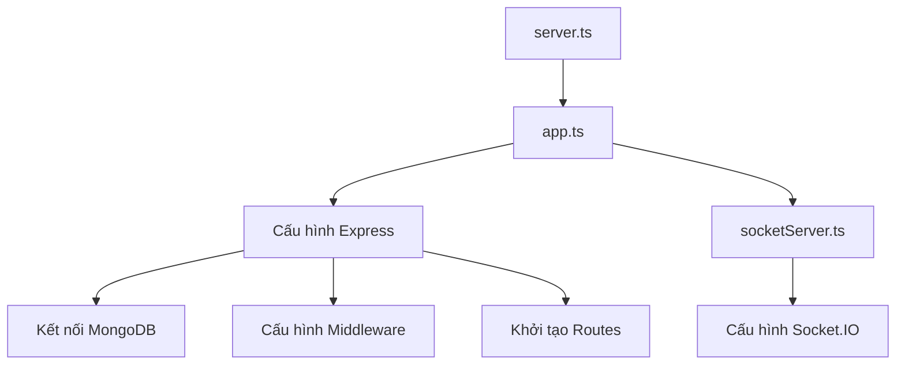
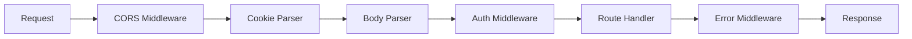
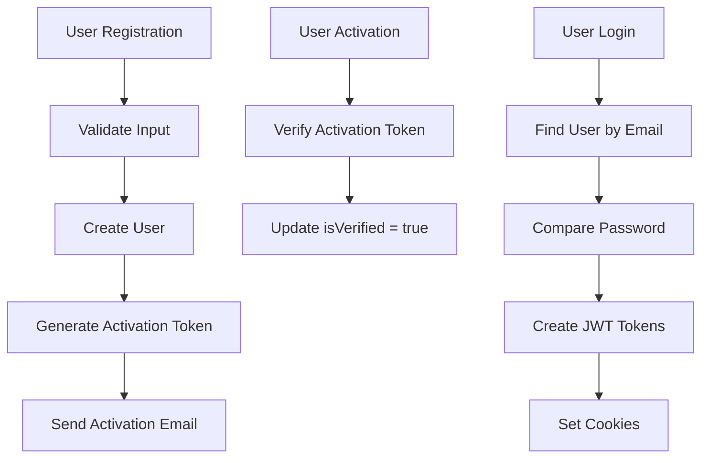
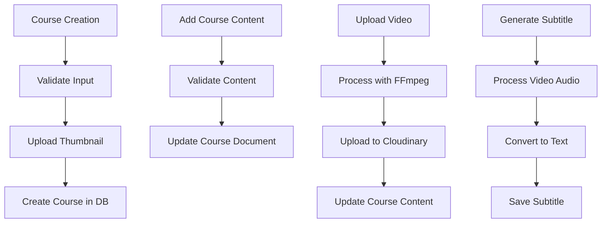
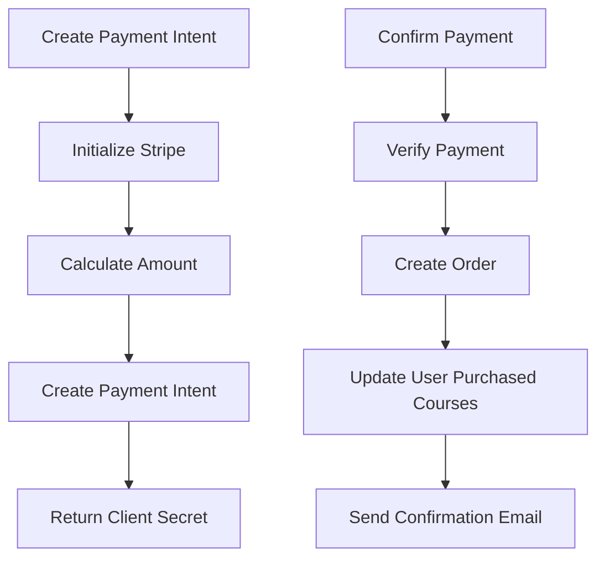
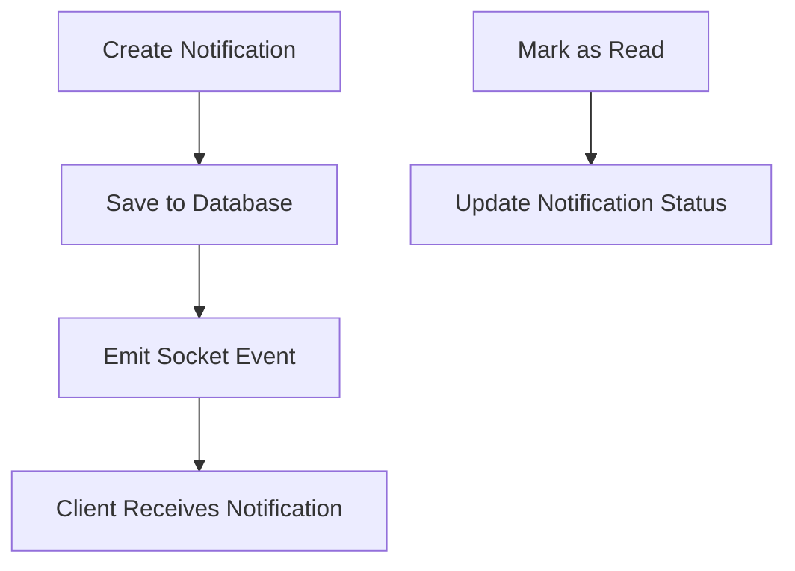

# Backend Architecture

## Cấu Trúc Dự Án Backend

Dự án Backend của E-Learning được xây dựng dựa trên Express.js và TypeScript, theo mô hình kiến trúc MVC (Model-View-Controller). Dưới đây là cấu trúc thư mục và luồng xử lý chính của dự án:

```
Backend/
├── @types/                # Type definitions
├── controller/            # Xử lý logic nghiệp vụ
│   ├── analytics.controller.ts
│   ├── course.controller.ts
│   ├── layout.controller.ts
│   ├── notification.controller.ts
│   ├── order.controller.ts
│   └── user.controller.ts
├── mails/                 # Templates email
├── middleware/            # Middleware
│   ├── auth.ts            # Authentication middleware
│   ├── catchAsyncErrors.ts # Error handling
│   └── error.ts           # Error middleware
├── models/                # MongoDB schemas
│   ├── ai.model.ts
│   ├── course.model.ts
│   ├── layout.model.ts
│   ├── notification.model.ts
│   ├── order.model.ts
│   ├── subtitle.model.ts
│   └── user.model.ts
├── routes/                # API routes
│   ├── analytics.route.ts
│   ├── course.route.ts
│   ├── layout.route.ts
│   ├── notification.route.ts
│   ├── order.route.ts
│   └── user.route.ts
├── services/              # Services
│   ├── ai.service.ts      # AI integration service
│   ├── course.service.ts  # Course service
│   ├── email.service.ts   # Email service
│   └── order.service.ts   # Order service
├── utils/                 # Utility functions
│   ├── ErrorHandler.ts    # Custom error handler
│   ├── jwt.ts             # JWT utilities
│   ├── redis.ts           # Redis configuration
│   └── sendMail.ts        # Email sending utility
├── uploads/               # Temporary file storage
├── app.ts                 # Express application setup
├── server.ts              # Server entry point
└── socketServer.ts        # Socket.IO server
```

## Kiến Trúc MVC

### 1. Models
- Định nghĩa schema dữ liệu sử dụng Mongoose
- Mỗi model đại diện cho một collection trong MongoDB
- Bao gồm các phương thức và hooks liên quan

### 2. Controllers
- Xử lý logic nghiệp vụ
- Tương tác với models và services
- Trả về response cho client

### 3. Routes
- Định nghĩa các API endpoints
- Kết nối request với controllers
- Áp dụng middleware (auth, validation, etc.)

## Luồng Xử Lý Backend

### 1. Khởi Tạo Ứng Dụng



#### server.ts
- Entry point của ứng dụng
- Khởi tạo HTTP server
- Xử lý uncaught exceptions và unhandled rejections

#### app.ts
- Cấu hình Express app
- Kết nối các middleware
- Kết nối các routes

#### socketServer.ts
- Cấu hình Socket.IO server
- Xử lý real-time notifications

### 2. Middleware



#### Danh sách Middleware chính:
- **CORS**: Xử lý Cross-Origin Resource Sharing
- **Cookie Parser**: Parse cookies
- **Body Parser**: Parse request body
- **isAuthenticated**: Kiểm tra authentication
- **authorizeRoles**: Kiểm tra role-based authorization
- **Error Handler**: Xử lý và định dạng lỗi

### 3. Authentication Flow



#### JWT Authentication:
- **Access Token**: Short-lived (5 minutes)
- **Refresh Token**: Long-lived (3 days)
- Stored in HTTP-only cookies
- Token refresh mechanism

### 4. Course Management Flow



### 5. Order Processing Flow



### 6. Notification System



## Database Interaction

### Mongoose Models
- Sử dụng Mongoose ODM cho MongoDB
- Type-safe với TypeScript interfaces
- Validation built-in

```typescript
// Ví dụ từ user.model.ts
const userSchema = new mongoose.Schema<IUser>({
  name: {
    type: String,
    required: [true, "Please enter your name"],
  },
  email: {
    type: String,
    required: [true, "Please enter your email"],
    validate: {
      validator: function (value: string) {
        return emailRegexPattern.test(value);
      },
      message: "please enter a valid email",
    },
    unique: true,
  },
  // ... other fields
});
```

### Error Handling

Backend sử dụng mô hình error handling thống nhất:

```typescript
// ErrorHandler.ts
class ErrorHandler extends Error {
  statusCode: number;

  constructor(message: string, statusCode: number) {
    super(message);
    this.statusCode = statusCode;
    Error.captureStackTrace(this, this.constructor);
  }
}

// Trong controller
if (!user) {
  return next(new ErrorHandler("User not found", 404));
}

// Middleware xử lý lỗi
app.use((err, req, res, next) => {
  err.statusCode = err.statusCode || 500;
  err.message = err.message || "Internal Server Error";
  
  // Handle specific error types
  if (err.code === 11000) {
    // Duplicate key error
  }
  
  res.status(err.statusCode).json({
    success: false,
    message: err.message,
  });
});
```

### Async Error Handling

Sử dụng catchAsyncErrors wrapper để xử lý lỗi trong các hàm async:

```typescript
// catchAsyncErrors.ts
const catchAsyncErrors = (fn: Function) => (req: Request, res: Response, next: NextFunction) => {
  Promise.resolve(fn(req, res, next)).catch(next);
};

// Sử dụng trong controller
export const loginUser = catchAsyncErrors(async (req: Request, res: Response, next: NextFunction) => {
  // handler code
});
```

## Tích Hợp Bên Thứ Ba

### 1. Cloudinary
- Upload và quản lý hình ảnh và video
- Tối ưu hóa media files
- Transcoding videos

### 2. Google Generative AI
- Tích hợp AI cho phân tích nội dung
- Tạo transcript từ video
- Chatbot trả lời câu hỏi

### 3. Stripe
- Xử lý thanh toán
- Webhook để nhận updates từ thanh toán

### 4. Nodemailer
- Gửi email xác thực
- Gửi email thông báo
- Sử dụng EJS templates

## API Design

### RESTful API
- Resources được đại diện bởi URLs
- Sử dụng HTTP methods (GET, POST, PUT, DELETE)
- Stateless communication

### Authentication API
- Đăng ký, xác thực và đăng nhập
- Social auth
- Password reset

### Course API
- CRUD operations cho khóa học
- Upload và xử lý video
- Quản lý nội dung khóa học

### Order API
- Tạo và quản lý đơn hàng
- Tích hợp với Stripe
- Webhook handling

### Notification API
- Tạo và quản lý thông báo
- Real-time notifications với Socket.IO

### Analytics API
- Thống kê người dùng
- Thống kê khóa học
- Thống kê doanh thu

## Deployment & CI/CD

### Environment Variables
- .env file cho local development
- Production environment variables

### Security Considerations
- CORS configuration
- Rate limiting
- Helmet for HTTP headers
- XSS protection
- CSRF protection

## Backend Performance

### Caching
- Redis cho caching
- Cache invalidation

### Database Optimization
- Indexes
- Query optimization

### Video Processing
- FFmpeg cho xử lý video
- Chunked uploads
- Background processing