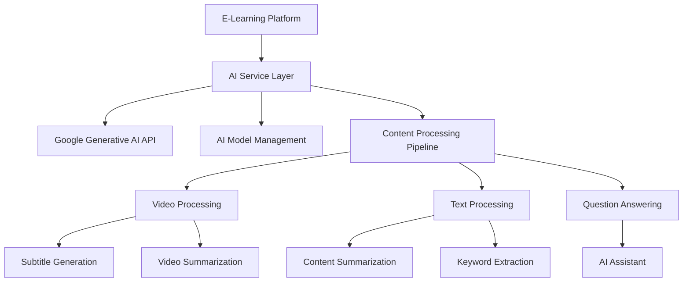
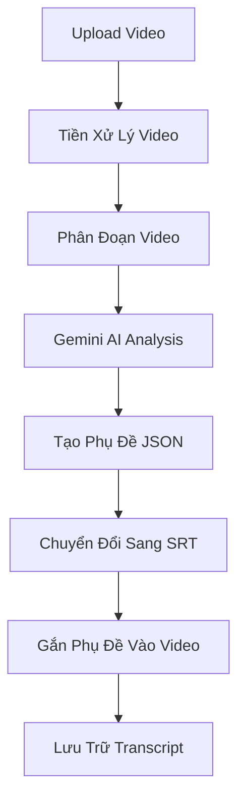
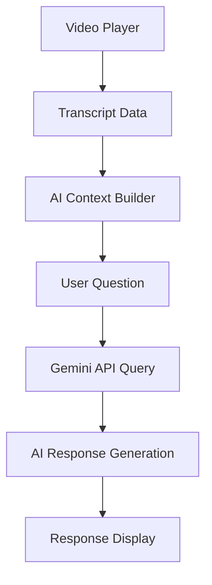
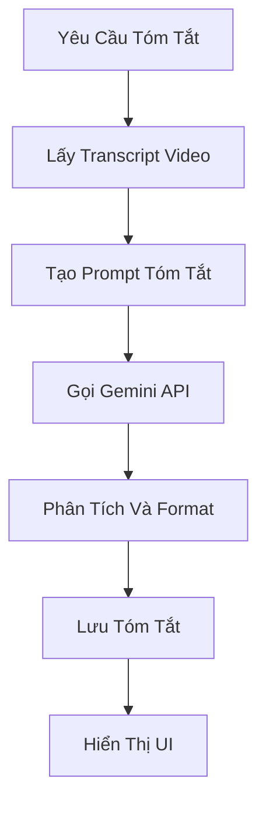
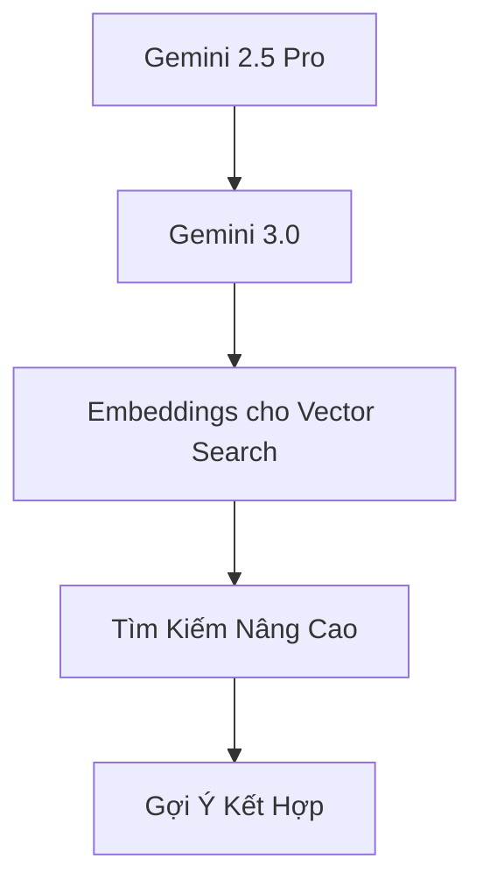

# Tính Năng AI Trong Dự Án E-Learning

Dự án E-Learning tích hợp các tính năng AI tiên tiến để nâng cao trải nghiệm học tập, tự động hóa quá trình tạo nội dung, và cung cấp hỗ trợ học tập cá nhân hóa cho người dùng. Tài liệu này mô tả chi tiết về các tính năng AI và cách chúng được triển khai trong dự án.

## 1. Tổng Quan Tích Hợp AI

### 1.1. Công Nghệ AI Sử Dụng

- **Google Generative AI (Gemini)** - Mô hình đa phương thức chính được sử dụng cho:
  - Phân tích video và tạo phụ đề
  - Trả lời câu hỏi từ nội dung khóa học
  - Sinh tóm tắt tự động
  - Chatbot trợ giảng thông minh

### 1.2. Kiến Trúc Tích Hợp AI



## 2. Tạo Phụ Đề Tự Động Với AI

### 2.1. Quy Trình Tạo Phụ Đề



### 2.2. Cấu Hình Gemini AI

```typescript
// Khởi tạo Gemini API
const genAI = new GoogleGenerativeAI(process.env.GEMINI_API_KEY || '');
const model = genAI.getGenerativeModel({
    model: 'gemini-2.0-flash', // hoặc 'gemini-2.5-pro' cho chất lượng tốt hơn
});

// Tạo phụ đề từ video
export async function callGeminiApi(videoBase64: string, options: GeminiApiOptions = {}): Promise<Subtitle[]> {
  try {
    const mimeType = options.mimeType || 'video/mp4';
    const contentType = options.contentType || 'lecture';
    const segmentInfo = options.segmentInfo || null;

    // Chuẩn bị prompt
    const prompt = getEnhancedPrompt(contentType, segmentInfo);

    // Chuẩn bị request parts
    const requestParts: Part[] = [
      { text: prompt },
      {
        inlineData: {
          mimeType: mimeType,
          data: videoBase64
        }
      }
    ];

    // Gọi API
    const result: GenerateContentResult = await model.generateContent({
      contents: [{ role: "user", parts: requestParts }],
      generationConfig: {
        temperature: 0.2,
        topK: 32,
        topP: 0.95,
        maxOutputTokens: 8192,
      }
    });

    // Xử lý response
    const response = result.response;
    const responseText = response.text();
    
    // Tìm phần JSON trong response
    // và xử lý thành mảng Subtitle objects
    // ...

    return subtitles;
  } catch (error) {
    // Xử lý lỗi và retry
    // ...
  }
}
```

### 2.3. Prompt Engineering

Để đạt được kết quả phụ đề chất lượng cao, dự án sử dụng kỹ thuật prompt engineering nâng cao:

```typescript
function getEnhancedPrompt(contentType = 'lecture', segmentInfo: SegmentInfo | null = null): string {
  let prompt = `Tạo phụ đề chính xác bằng TIẾNG VIỆT cho video ${contentType} này. RẤT QUAN TRỌNG: Phụ đề PHẢI HOÀN TOÀN bằng TIẾNG VIỆT CÓ DẤU, không chấp nhận bất kỳ phụ đề nào bằng tiếng Anh.`;

  // Thêm chi tiết về định dạng cần thiết
  prompt += `
  Trả về phụ đề theo định dạng JSON sau:
  [
    {
      "index": (số thứ tự bắt đầu từ 0),
      "startTime": (thời gian bắt đầu định dạng mm:ss.sss),
      "endTime": (thời gian kết thúc định dạng mm:ss.sss),
      "text": (nội dung phụ đề bằng tiếng Việt)
    }
  ]
  
  Hướng dẫn QUAN TRỌNG về thời gian phụ đề:
  1. Bắt đầu từ giây thứ 0 và đảm bảo phụ đề liên tục
  2. Mỗi phụ đề KHÔNG quá 6 giây và KHÔNG ít hơn 1 giây
  3. Phụ đề phải ĐỒNG BỘ chính xác với lời nói trong video
  4. Sử dụng thời gian chính xác trong định dạng mm:ss.sss (phút:giây.mili giây)
  
  Hướng dẫn QUAN TRỌNG về nội dung phụ đề:
  1. Phụ đề PHẢI bằng TIẾNG VIỆT, hãy dịch từ tiếng Anh sang tiếng Việt nếu cần
  2. Mỗi phụ đề tối đa 2 dòng, mỗi dòng KHÔNG quá 42 ký tự
  3. KHÔNG viết tắt mà viết đầy đủ các từ và cụm từ
  4. Giữ nguyên ý nghĩa và sử dụng chính xác thuật ngữ chuyên ngành
  5. LOẠI BỎ từ lặp lại, từ đệm, và các âm thanh không có nội dung (ừm, ah, etc.)
  6. ĐẢM BẢO phụ đề tiếng Việt có đầy đủ dấu thanh và dấu câu chính xác
  `;

  // Thêm hướng dẫn cho từng loại nội dung video
  if (contentType === 'lecture') {
    prompt += `
    Hướng dẫn đặc biệt cho video bài giảng:
    1. Ưu tiên dịch và giữ lại các thuật ngữ học thuật, công thức chính xác
    2. Nếu giảng viên viết lên bảng, đảm bảo phụ đề đồng bộ với nội dung được viết
    3. Phụ đề phải đúng ngữ pháp, dấu câu, viết hoa tên riêng
    4. Nếu có các câu hỏi từ giảng viên, giữ lại cấu trúc câu hỏi trong phụ đề
    5. Dịch các thuật ngữ kỹ thuật một cách nhất quán xuyên suốt video
    `;
  } else if (contentType === 'tutorial') {
    // Hướng dẫn cho video tutorial
    // ...
  }

  // Thêm thông tin về phân đoạn nếu cần
  if (segmentInfo) {
    prompt += `
    Thông tin về phân đoạn này:
    - Đây là phân đoạn ${segmentInfo.index + 1} của video
    - Thời gian bắt đầu: ${segmentInfo.startTime} giây
    - Thời lượng phân đoạn: ${segmentInfo.duration} giây
    - Kết thúc phân đoạn tại: ${segmentInfo.startTime + segmentInfo.duration} giây
    `;
  }

  return prompt;
}
```

### 2.4. Mô Hình AI Subtitle

```typescript
// Subtitle Model
export interface Subtitle {
    index: number;
    start: number; // Thời gian bắt đầu (giây)
    end: number; // Thời gian kết thúc (giây)
    text: string; // Nội dung phụ đề
}

// RawSubtitle từ AI response
export interface RawSubtitle {
    index: number;
    startTime: string; // Format mm:ss.sss
    endTime: string; // Format mm:ss.sss
    text: string;
}

// Segment Info
export interface SegmentInfo {
    index: number;
    startTime: number;
    duration: number;
    totalDuration?: number;
}
```

## 3. AI Assistant Cho Nội Dung Khóa Học

### 3.1. Mô Hình Chat AI trong Khóa Học



### 3.2. Truy Vấn AI Dựa Trên Context

```typescript
// Backend/services/ai.service.ts
export async function generateAIResponse(
  question: string,
  courseId: string,
  videoId: string,
  userId: string
): Promise<string> {
  try {
    // Lấy transcript từ database
    const transcription = await AIModel.findOne({
      Course: courseId,
      title: videoId
    });

    if (!transcription) {
      return "Không tìm thấy dữ liệu cho video này để trả lời câu hỏi.";
    }

    // Tạo context từ transcript
    const context = transcription.transcription;

    // Chuẩn bị prompt
    const prompt = `
    Bạn là trợ lý AI thông minh cho nền tảng học trực tuyến.
    
    CONTEXT:
    ${context}
    
    QUESTION:
    ${question}
    
    Dựa trên thông tin trong nội dung video được cung cấp, hãy trả lời câu hỏi trên một cách chi tiết.
    Trả lời bằng tiếng Việt, có dấu đầy đủ, dễ hiểu.
    Nếu câu hỏi nằm ngoài nội dung video, hãy trả lời rằng: "Câu hỏi này nằm ngoài phạm vi nội dung của video."
    `;

    // Gọi API Gemini
    const genAI = new GoogleGenerativeAI(process.env.GEMINI_API_KEY || '');
    const model = genAI.getGenerativeModel({ model: 'gemini-2.5-pro' });
    
    const result = await model.generateContent(prompt);
    const response = result.response.text();

    // Lưu lịch sử trò chuyện
    await saveUserAIInteraction(userId, courseId, videoId, question, response);

    return response;
  } catch (error) {
    console.error("Error generating AI response:", error);
    return "Đã xảy ra lỗi khi xử lý câu hỏi của bạn. Vui lòng thử lại sau.";
  }
}
```

### 3.3. Component AI Assistant

```tsx
// Frontend/app/components/AI/AiChat.tsx
"use client";
import React, { useState, useRef, useEffect } from "react";
import { useSelector } from "react-redux";
import { useAskAiMutation } from "@/redux/features/api/apiSlice";
import { FiSend, FiX } from "react-icons/fi";
import { toast } from "react-hot-toast";

interface AiChatProps {
  courseId: string;
  videoId: string;
}

const AiChat: React.FC<AiChatProps> = ({ courseId, videoId }) => {
  const [question, setQuestion] = useState("");
  const [chatHistory, setChatHistory] = useState<Array<{
    role: "user" | "ai";
    content: string;
    timestamp: Date;
  }>>([]);
  const chatEndRef = useRef<HTMLDivElement>(null);
  const [isExpanded, setIsExpanded] = useState(false);

  // RTK Query mutation
  const [askAi, { isLoading }] = useAskAiMutation();

  // Auto-scroll to bottom on new messages
  useEffect(() => {
    if (chatEndRef.current) {
      chatEndRef.current.scrollIntoView({ behavior: "smooth" });
    }
  }, [chatHistory]);

  // Handle sending question
  const handleSendQuestion = async (e: React.FormEvent) => {
    e.preventDefault();
    
    if (!question.trim()) return;
    
    // Add user question to chat
    setChatHistory((prev) => [
      ...prev,
      { role: "user", content: question, timestamp: new Date() }
    ]);
    
    const currentQuestion = question;
    setQuestion("");
    
    try {
      // Call API
      const response = await askAi({
        courseId,
        videoId,
        question: currentQuestion
      }).unwrap();
      
      // Add AI response to chat
      setChatHistory((prev) => [
        ...prev,
        { role: "ai", content: response.answer, timestamp: new Date() }
      ]);
    } catch (error) {
      console.error("Error asking AI:", error);
      toast.error("Không thể nhận câu trả lời từ AI");
      
      // Add error message to chat
      setChatHistory((prev) => [
        ...prev,
        { 
          role: "ai", 
          content: "Xin lỗi, tôi không thể xử lý câu hỏi của bạn lúc này. Vui lòng thử lại sau.", 
          timestamp: new Date() 
        }
      ]);
    }
  };

  // Format timestamp
  const formatTime = (date: Date) => {
    return date.toLocaleTimeString([], { hour: '2-digit', minute: '2-digit' });
  };

  return (
    <div className={`fixed bottom-4 right-4 bg-white dark:bg-gray-800 shadow-lg rounded-lg overflow-hidden transition-all duration-300 z-40 ${
      isExpanded ? "w-96 h-[500px]" : "w-12 h-12"
    }`}>
      {isExpanded ? (
        <div className="flex flex-col h-full">
          {/* Header */}
          <div className="bg-blue-600 text-white p-3 flex justify-between items-center">
            <h3 className="font-medium">Trợ lý AI</h3>
            <button
              onClick={() => setIsExpanded(false)}
              className="text-white hover:text-gray-200"
            >
              <FiX size={18} />
            </button>
          </div>
          
          {/* Chat History */}
          <div className="flex-1 overflow-y-auto p-3 bg-gray-50 dark:bg-gray-900">
            {chatHistory.length === 0 ? (
              <div className="text-center text-gray-500 dark:text-gray-400 my-4">
                <p>Xin chào! Tôi là trợ lý AI của khóa học này.</p>
                <p className="mt-2">Hãy đặt câu hỏi về nội dung bạn đang xem.</p>
              </div>
            ) : (
              chatHistory.map((message, index) => (
                <div
                  key={index}
                  className={`mb-3 ${
                    message.role === "user" ? "text-right" : "text-left"
                  }`}
                >
                  <div
                    className={`inline-block max-w-[80%] rounded-lg p-3 ${
                      message.role === "user"
                        ? "bg-blue-600 text-white"
                        : "bg-gray-200 dark:bg-gray-700 text-gray-800 dark:text-white"
                    }`}
                  >
                    <p className="whitespace-pre-wrap">{message.content}</p>
                    <p className="text-xs mt-1 opacity-70">
                      {formatTime(message.timestamp)}
                    </p>
                  </div>
                </div>
              ))
            )}
            <div ref={chatEndRef} />
          </div>
          
          {/* Input Form */}
          <form
            onSubmit={handleSendQuestion}
            className="p-3 border-t dark:border-gray-700"
          >
            <div className="flex">
              <input
                type="text"
                value={question}
                onChange={(e) => setQuestion(e.target.value)}
                disabled={isLoading}
                placeholder="Nhập câu hỏi của bạn..."
                className="flex-1 border dark:border-gray-600 rounded-l-lg px-3 py-2 focus:outline-none focus:ring-2 focus:ring-blue-600 dark:bg-gray-700 dark:text-white"
              />
              <button
                type="submit"
                disabled={!question.trim() || isLoading}
                className={`bg-blue-600 text-white px-3 py-2 rounded-r-lg hover:bg-blue-700 focus:outline-none focus:ring-2 focus:ring-blue-600 ${
                  !question.trim() || isLoading ? "opacity-50 cursor-not-allowed" : ""
                }`}
              >
                {isLoading ? (
                  <div className="h-5 w-5 border-2 border-white border-t-transparent rounded-full animate-spin"></div>
                ) : (
                  <FiSend size={20} />
                )}
              </button>
            </div>
          </form>
        </div>
      ) : (
        <button
          onClick={() => setIsExpanded(true)}
          className="w-full h-full bg-blue-600 text-white flex items-center justify-center rounded-full"
        >
          <svg
            xmlns="http://www.w3.org/2000/svg"
            width="20"
            height="20"
            viewBox="0 0 24 24"
            fill="none"
            stroke="currentColor"
            strokeWidth="2"
            strokeLinecap="round"
            strokeLinejoin="round"
          >
            <path d="M21 15a2 2 0 0 1-2 2H7l-4 4V5a2 2 0 0 1 2-2h14a2 2 0 0 1 2 2z"></path>
          </svg>
        </button>
      )}
    </div>
  );
};

export default AiChat;
```

## 4. Tóm Tắt Nội Dung Video Tự Động

### 4.1. Quy Trình Tạo Tóm Tắt



### 4.2. API Endpoint Tóm Tắt

```typescript
// Backend/controllers/ai.controller.ts
export const generateVideoSummary = catchAsyncError(
  async (req: Request, res: Response, next: NextFunction) => {
    try {
      const { courseId, videoId } = req.body;
      
      // Kiểm tra quyền truy cập
      // Đảm bảo người dùng đã mua khóa học này
      const user = await UserModel.findById(req.user?._id);
      const courseExists = user?.courses.some(
        (course) => course.courseId.toString() === courseId
      );
      
      if (!courseExists) {
        return next(new ErrorHandler("Bạn không có quyền truy cập vào nội dung này", 403));
      }
      
      // Lấy transcript
      const aiData = await AIModel.findOne({
        Course: courseId,
        title: videoId
      });
      
      if (!aiData) {
        return next(new ErrorHandler("Không tìm thấy dữ liệu transcript cho video này", 404));
      }
      
      // Tạo prompt
      const prompt = `
      Dưới đây là nội dung của một video giáo dục:
      
      ${aiData.transcription}
      
      Hãy tạo một bản tóm tắt chi tiết của video này bằng tiếng Việt. Bản tóm tắt cần:
      
      1. Có độ dài khoảng 300-500 từ
      2. Bao gồm các ý chính và điểm quan trọng
      3. Có cấu trúc rõ ràng với các đề mục chính
      4. Có phần kết luận ngắn gọn
      
      Format tóm tắt theo cấu trúc Markdown, với các mục được đánh dấu rõ ràng.
      `;
      
      // Gọi API Gemini
      const genAI = new GoogleGenerativeAI(process.env.GEMINI_API_KEY || '');
      const model = genAI.getGenerativeModel({ model: 'gemini-2.5-pro' });
      
      const result = await model.generateContent(prompt);
      const summary = result.response.text();
      
      // Lưu summary vào database nếu chưa có
      let summaryDoc = await SummaryModel.findOne({
        courseId,
        videoId
      });
      
      if (!summaryDoc) {
        summaryDoc = await SummaryModel.create({
          courseId,
          videoId,
          content: summary,
          createdBy: req.user?._id
        });
      } else {
        // Cập nhật nếu đã tồn tại
        summaryDoc.content = summary;
        summaryDoc.updatedAt = new Date();
        await summaryDoc.save();
      }
      
      res.status(200).json({
        success: true,
        summary
      });
    } catch (error: any) {
      return next(new ErrorHandler(error.message, 500));
    }
  }
);
```

## 5. Phân Tích Dữ Liệu Học Tập Với AI

### 5.1. Phân Tích Tiến Độ Học Tập

Hệ thống sử dụng AI để phân tích hành vi và tiến độ học tập của học viên.

```typescript
// Phân tích hành vi xem video
export const analyzeViewingPatterns = async (userId: string, courseId: string) => {
  try {
    // Lấy dữ liệu xem video của user
    const viewingData = await ViewingModel.find({
      userId,
      courseId
    }).sort({ createdAt: 1 });
    
    if (!viewingData.length) {
      return {
        insights: "Chưa có đủ dữ liệu để phân tích."
      };
    }
    
    // Chuẩn bị dữ liệu cho phân tích
    const formattedData = viewingData.map(item => ({
      videoId: item.videoId,
      watchTime: item.watchTime,
      completionRate: item.completionRate,
      pauseCount: item.pauseCount,
      rewindCount: item.rewindCount,
      date: item.createdAt
    }));
    
    // Tạo prompt phân tích với Gemini
    const prompt = `
    Dưới đây là dữ liệu xem video của một học viên:
    
    ${JSON.stringify(formattedData, null, 2)}
    
    Hãy phân tích dữ liệu và cung cấp:
    1. Thói quen học tập (thời gian, mức độ tập trung)
    2. Các video có vấn đề (pause/rewind nhiều)
    3. Tiến độ hoàn thành khóa học
    4. Đề xuất cải thiện
    
    Trả về kết quả bằng tiếng Việt, định dạng JSON với các trường:
    - learningHabits: phân tích thói quen học tập
    - problemVideos: danh sách video có vấn đề
    - progress: phần trăm hoàn thành ước tính
    - recommendations: mảng các đề xuất cải thiện
    `;
    
    // Gọi Gemini API và trả về kết quả
    // ...
    
    return analysisResult;
  } catch (error) {
    console.error("Error analyzing viewing patterns:", error);
    throw error;
  }
};
```

### 5.2. Gợi Ý Cá Nhân Hóa

```typescript
// Tạo gợi ý khóa học dựa trên hành vi học tập
export const generatePersonalizedRecommendations = async (userId: string) => {
  try {
    // Lấy lịch sử học tập và sở thích
    const user = await UserModel.findById(userId);
    const completedCourses = await OrderModel.find({ userId })
      .populate('courseId');
    const viewingHistory = await ViewingModel.find({ userId });
    
    // Chuẩn bị dữ liệu cho AI
    const userProfile = {
      completedCourses: completedCourses.map(order => ({
        id: order.courseId._id,
        name: order.courseId.name,
        categories: order.courseId.categories,
        tags: order.courseId.tags,
        level: order.courseId.level,
        completionRate: calculateCompletionRate(viewingHistory, order.courseId._id)
      })),
      interests: user.interests || [],
      skills: user.skills || []
    };
    
    // Get available courses
    const allCourses = await CourseModel.find();
    
    // Tạo prompt cho AI
    const prompt = `
    Dưới đây là thông tin học tập của người dùng:
    
    ${JSON.stringify(userProfile, null, 2)}
    
    Và đây là danh sách tất cả các khóa học có sẵn:
    
    ${JSON.stringify(allCourses.map(course => ({
      id: course._id,
      name: course.name,
      description: course.description,
      categories: course.categories,
      tags: course.tags,
      level: course.level
    })), null, 2)}
    
    Hãy gợi ý 5 khóa học phù hợp nhất cho người dùng này dựa trên:
    1. Mối liên hệ với các khóa học đã hoàn thành
    2. Cùng chủ đề hoặc nâng cao từ các khóa học đã học
    3. Phù hợp với sở thích và kỹ năng
    4. Tiến trình học tập (level phù hợp)
    
    Đồng thời, giải thích lý do đề xuất mỗi khóa học. Trả về kết quả dưới dạng JSON với cấu trúc:
    {
      "recommendations": [
        {
          "courseId": "ID khóa học",
          "reason": "Lý do đề xuất"
        }
      ]
    }
    `;
    
    // Gọi Gemini API và xử lý kết quả
    // ...
    
    return recommendations;
  } catch (error) {
    console.error("Error generating recommendations:", error);
    throw error;
  }
};
```

## 6. Đánh Giá Kỹ Thuật Và Hiệu Suất AI

### 6.1. Độ Chính Xác Phụ Đề

Để đảm bảo chất lượng phụ đề, hệ thống sử dụng các kỹ thuật sau:

1. **Retry & Fallback**: Thử lại với các mô hình khác nhau nếu gặp lỗi
2. **Post-processing**: Điều chỉnh thời gian và nội dung phụ đề sau khi tạo
3. **Quality Checking**: Kiểm tra chất lượng phụ đề tự động

```typescript
// Hậu xử lý phụ đề
function enhancedPostProcessSubtitles(subtitles: Subtitle[]): Subtitle[] {
  if (!subtitles || subtitles.length === 0) {
    return [];
  }

  // Sắp xếp theo thời gian bắt đầu
  subtitles.sort((a, b) => a.start - b.start);

  // Bước 1: Loại bỏ phụ đề trùng lặp
  const deduplicatedSubtitles: Subtitle[] = [];
  // ... implementation
  
  // Bước 2: Điều chỉnh thời gian hiển thị
  const adjustedSubtitles = deduplicatedSubtitles.map(sub => {
    // ... implement timing adjustments
  });
  
  // Bước 3: Đảm bảo không có chồng chéo
  const finalSubtitles: Subtitle[] = [];
  // ... implementation
  
  return finalSubtitles;
}
```

### 6.2. Mức Sử Dụng Token

Hệ thống theo dõi và tối ưu hóa việc sử dụng token AI:

```typescript
// Monitoring token usage
const monitorTokenUsage = async (
  prompt: string,
  response: string,
  model: string,
  feature: string
) => {
  // Estimate token count using tokenizer
  const promptTokens = countTokens(prompt);
  const responseTokens = countTokens(response);
  
  // Log to database
  await TokenUsageModel.create({
    promptTokens,
    responseTokens,
    totalTokens: promptTokens + responseTokens,
    model,
    feature,
    timestamp: new Date()
  });
  
  // Check if approaching limits
  const usageToday = await TokenUsageModel.aggregate([
    {
      $match: {
        timestamp: { $gte: new Date(new Date().setHours(0, 0, 0, 0)) }
      }
    },
    {
      $group: {
        _id: null,
        totalTokens: { $sum: "$totalTokens" }
      }
    }
  ]);
  
  const totalUsageToday = usageToday[0]?.totalTokens || 0;
  const limit = parseInt(process.env.DAILY_TOKEN_LIMIT || "1000000");
  
  if (totalUsageToday > limit * 0.8) {
    // Alert admins about high usage
    console.warn(`AI token usage at ${Math.round(totalUsageToday/limit*100)}% of daily limit`);
  }
};
```

## 7. Bảo Mật Và Quyền Riêng Tư

### 7.1. Xử Lý Dữ Liệu AI

```typescript
// Cấu hình bảo mật cho AI
const aiSecurityConfig = {
  // Không lưu dữ liệu người dùng trên Gemini
  apiConfig: {
    safetySettings: [
      {
        category: "HARM_CATEGORY_HARASSMENT",
        threshold: "BLOCK_MEDIUM_AND_ABOVE"
      },
      {
        category: "HARM_CATEGORY_HATE_SPEECH",
        threshold: "BLOCK_MEDIUM_AND_ABOVE"
      },
      {
        category: "HARM_CATEGORY_SEXUALLY_EXPLICIT",
        threshold: "BLOCK_MEDIUM_AND_ABOVE"
      },
      {
        category: "HARM_CATEGORY_DANGEROUS_CONTENT",
        threshold: "BLOCK_MEDIUM_AND_ABOVE"
      }
    ],
    privacy: {
      storeUsageData: false,
      storeFeedbackData: false
    }
  },
  
  // Xử lý dữ liệu nhạy cảm
  processSensitiveData: (content: string): string => {
    // Phát hiện và che thông tin cá nhân
    return content
      .replace(/\b[A-Z0-9._%+-]+@[A-Z0-9.-]+\.[A-Z]{2,}\b/gi, "[EMAIL]")
      .replace(/\b(?:\d[ -]*?){13,16}\b/g, "[CREDIT_CARD]")
      .replace(/\b(?:\d{3}[ -]*?){3}\d{4}\b/g, "[PHONE]");
  }
};

// Sử dụng trong các API call
const callAIWithPrivacy = async (prompt: string, options = {}) => {
  // Xử lý dữ liệu nhạy cảm trước khi gửi đến AI
  const processedPrompt = aiSecurityConfig.processSensitiveData(prompt);
  
  // Gọi API với cấu hình bảo mật
  const genAI = new GoogleGenerativeAI(process.env.GEMINI_API_KEY || '');
  const model = genAI.getGenerativeModel({
    model: 'gemini-2.5-pro',
    safetySettings: aiSecurityConfig.apiConfig.safetySettings
  });
  
  const result = await model.generateContent(processedPrompt);
  return result.response.text();
};
```

## 8. Kế Hoạch Phát Triển AI

### 8.1. Roadmap Tính Năng AI
- **Q2 2025**: Cải thiện độ chính xác phụ đề, hỗ trợ thêm ngôn ngữ
- **Q3 2025**: Thêm tính năng tạo quiz tự động từ nội dung video
- **Q4 2025**: Phân tích cảm xúc (sentiment) từ feedback người dùng
- **Q1 2026**: Phân tích nội dung video để tạo mục lục tự động

### 8.2. Mô Hình AI Mới

