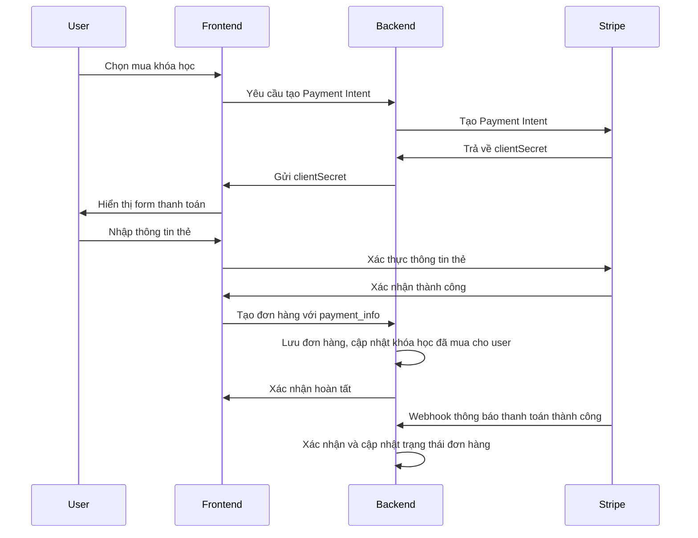

# Hệ Thống Thanh Toán

Dự án E-Learning tích hợp hệ thống thanh toán với Stripe để xử lý các giao dịch mua khóa học. Dưới đây là phân tích chi tiết về luồng thanh toán và cách triển khai.

## 1. Tổng Quan Về Hệ Thống Thanh Toán

### 1.1. Công Nghệ Sử Dụng
- **Stripe API**: Xử lý thanh toán an toàn
- **Stripe.js & Stripe Elements**: UI components cho form thanh toán
- **Webhook**: Nhận thông báo từ Stripe khi thanh toán thành công/thất bại

### 1.2. Các Loại Thanh Toán
- **Mua khóa học riêng lẻ**: Thanh toán một lần cho một khóa học
- **Đăng ký gói thành viên**: Thanh toán định kỳ (đang phát triển)

### 1.3. Luồng Thanh Toán Tổng Quát



## 2. Cài Đặt Stripe

### 2.1. Backend Setup

```typescript
// Backend/config/stripe.ts
import Stripe from 'stripe';
import dotenv from 'dotenv';

dotenv.config();

const stripe = new Stripe(process.env.STRIPE_SECRET_KEY || '', {
  apiVersion: '2023-10-16', // Sử dụng phiên bản API mới nhất
  appInfo: {
    name: 'E-Learning Platform',
    version: '1.0.0',
  },
});

export default stripe;
```

### 2.2. Frontend Setup

```typescript
// Frontend/app/utils/stripe.ts
import { loadStripe, Stripe } from '@stripe/stripe-js';

let stripePromise: Promise<Stripe | null>;

const getStripe = () => {
  if (!stripePromise) {
    stripePromise = loadStripe(process.env.NEXT_PUBLIC_STRIPE_PUBLISHABLE_KEY || '');
  }
  return stripePromise;
};

export default getStripe;
```

## 3. Tạo Payment Intent (Backend)

```typescript
// Backend/controller/order.controller.ts
export const createPayment = catchAsyncErrors(
  async (req: Request, res: Response, next: NextFunction) => {
    try {
      const { courseId } = req.body;
      
      // Tìm khóa học
      const course = await CourseModel.findById(courseId);
      if (!course) {
        return next(new ErrorHandler("Course not found", 404));
      }
      
      const user = req.user as IUser;
      
      // Kiểm tra xem người dùng đã mua khóa học này chưa
      const courseExistInUser = user.courses.some(
        (userCourse) => userCourse.courseId.toString() === courseId
      );
      
      if (courseExistInUser) {
        return next(
          new ErrorHandler("You have already purchased this course", 400)
        );
      }
      
      // Tạo Payment Intent với Stripe
      const paymentIntent = await stripe.paymentIntents.create({
        amount: Math.round(course.price * 100), // Stripe sử dụng cent (smallest unit)
        currency: "usd",
        metadata: {
          userId: user._id.toString(),
          courseId: course._id.toString(),
        },
        description: `Purchase of course: ${course.name}`,
        automatic_payment_methods: {
          enabled: true,
        },
      });
      
      // Trả về client secret
      res.status(200).json({
        success: true,
        clientSecret: paymentIntent.client_secret,
      });
    } catch (error: any) {
      return next(new ErrorHandler(error.message, 500));
    }
  }
);
```

## 4. Xử Lý Thanh Toán (Frontend)

### 4.1. Components Thanh Toán

#### CheckoutForm Component

```tsx
// Frontend/app/components/Payment/CheckoutForm.tsx
import { useEffect, useState } from 'react';
import { 
  PaymentElement,
  useStripe, 
  useElements 
} from '@stripe/react-stripe-js';
import { useCreateOrderMutation } from '@/redux/features/orders/ordersApi';
import { toast } from 'react-hot-toast';
import { styles } from '@/app/styles/style';
import { useRouter } from 'next/navigation';
import socketIO from "socket.io-client";

const ENDPOINT = process.env.NEXT_PUBLIC_SOCKET_SERVER_URI || "";
const socketId = socketIO(ENDPOINT, { transports: ["websocket"] });

const CheckOutForm = ({ data, user, refetch }) => {
  const stripe = useStripe();
  const elements = useElements();
  const [message, setMessage] = useState(null);
  const [createOrder, { data: orderData, error }] = useCreateOrderMutation();
  const [isLoading, setIsLoading] = useState(false);
  const router = useRouter();

  useEffect(() => {
    if (!stripe) {
      return;
    }

    // Lấy clientSecret từ URL
    const clientSecret = new URLSearchParams(window.location.search).get(
      "payment_intent_client_secret"
    );

    if (!clientSecret) {
      return;
    }

    // Kiểm tra kết quả thanh toán từ URL (khi redirect từ Stripe về)
    stripe.retrievePaymentIntent(clientSecret).then(({ paymentIntent }) => {
      switch (paymentIntent.status) {
        case "succeeded":
          setMessage("Payment succeeded!");
          break;
        case "processing":
          setMessage("Your payment is processing.");
          break;
        case "requires_payment_method":
          setMessage("Your payment was not successful, please try again.");
          break;
        default:
          setMessage("Something went wrong.");
          break;
      }
    });
  }, [stripe]);

  const handleSubmit = async (e) => {
    e.preventDefault();

    if (!stripe || !elements) {
      return;
    }

    setIsLoading(true);

    // Xác nhận thanh toán
    const { error, paymentIntent } = await stripe.confirmPayment({
      elements,
      redirect: "if_required",
    });

    if (error) {
      setMessage(error.message);
      setIsLoading(false);
    } else if (paymentIntent && paymentIntent.status === "succeeded") {
      setIsLoading(false);
      // Tạo đơn hàng sau khi thanh toán thành công
      createOrder({ courseId: data._id, payment_info: paymentIntent });
    }
  };

  useEffect(() => {
    if (orderData) {
      // Cập nhật lại thông tin người dùng
      refetch();
      
      // Gửi thông báo realtime đến admin
      socketId.emit("notification", {
        title: "New Order",
        message: `You have a new order from ${user.name}`,
        userId: user._id,
      });
      
      // Chuyển hướng đến trang khóa học
      router.push(`/course-access/${data._id}`);
    }
    
    if (error) {
      if ("data" in error) {
        const errorMessage = error as any;
        toast.error(errorMessage.data.message);
      }
    }
  }, [orderData, error, router, data, refetch, user]);

  return (
    <form id="payment-form" onSubmit={handleSubmit}>
      <PaymentElement id="payment-element" />
      <button 
        disabled={isLoading || !stripe || !elements} 
        className={`${styles.button} mt-2 !h-[35px] w-full`}
      >
        <span id="button-text">
          {isLoading ? "Paying..." : "Pay now"}
        </span>
      </button>
      
      {/* Hiển thị thông báo lỗi */}
      {message && (
        <div id="payment-message" className="text-red-500 mt-2">
          {message}
        </div>
      )}
    </form>
  );
};

export default CheckOutForm;
```

#### PaymentPage Component

```tsx
// Frontend/app/course/payment/[id]/page.tsx
"use client";
import { useEffect, useState } from "react";
import { Elements } from "@stripe/react-stripe-js";
import { useLoadUserQuery } from "@/redux/features/api/apiSlice";
import { useCreatePaymentMutation, useGetStripePublishablekeyQuery } from "@/redux/features/orders/ordersApi";
import { useGetCourseDetailsQuery } from "@/redux/features/courses/coursesApi";
import CheckoutForm from "@/app/components/Payment/CheckoutForm";
import Loader from "@/app/components/Loader/Loader";
import { redirect } from "next/navigation";
import getStripe from "@/app/utils/stripe";

const Payment = ({ params }: { params: { id: string } }) => {
  const [clientSecret, setClientSecret] = useState("");
  const [stripePromise, setStripePromise] = useState<any>(null);
  
  const { data: config } = useGetStripePublishablekeyQuery({});
  const { data: userData, isSuccess, refetch } = useLoadUserQuery(undefined, {});
  const { data: courseData } = useGetCourseDetailsQuery(params.id, {
    skip: !isSuccess,
  });
  
  const [createPayment, { data: paymentData, error }] = useCreatePaymentMutation();

  useEffect(() => {
    // Kiểm tra xem người dùng đã đăng nhập chưa
    if (isSuccess) {
      const isUserAlreadyPurchased = userData?.user?.courses?.find(
        (item: any) => item.courseId === params.id
      );
      
      // Nếu đã mua khóa học, chuyển hướng đến trang xem khóa học
      if (isUserAlreadyPurchased) {
        redirect(`/course-access/${params.id}`);
      }
    }
    
    // Lấy Stripe publishable key
    if (config) {
      const publishablekey = config?.publishablekey;
      setStripePromise(getStripe());
    }
    
    // Tạo payment intent khi có thông tin khóa học
    if (courseData && isSuccess) {
      const createPaymentIntent = async () => {
        try {
          const response = await createPayment({
            courseId: params.id,
          });
          
          if ("data" in response) {
            setClientSecret(response.data.clientSecret);
          }
          
          if ("error" in response) {
            console.error("Error creating payment intent:", response.error);
          }
        } catch (error) {
          console.error("Error in payment intent:", error);
        }
      };
      
      createPaymentIntent();
    }
  }, [config, courseData, isSuccess, params.id, userData?.user]);

  // Hiển thị loading khi đang tải
  if (!courseData?.course || !userData?.user || !config || !clientSecret || !stripePromise) {
    return <Loader />;
  }

  const options = {
    clientSecret,
    appearance: {
      theme: 'stripe',
      labels: 'floating',
    },
  };

  return (
    <div className="w-full flex min-h-screen">
      <div className="w-[95%] 800px:w-[90%] m-auto py-10 flex flex-col md:flex-row items-start justify-between">
        <div className="w-full 800px:w-[65%] md:pr-5">
          <Elements stripe={stripePromise} options={options}>
            <CheckoutForm
              data={courseData?.course}
              user={userData?.user}
              refetch={refetch}
            />
          </Elements>
        </div>
        
        {/* Hiển thị thông tin khóa học */}
        <div className="w-full 800px:w-[35%] md:pl-5 mt-8 md:mt-0">
          <div className="w-full bg-white dark:bg-slate-900 p-4 rounded-lg shadow">
            <h2 className="text-xl font-semibold mb-3">Order Summary</h2>
            <div className="flex items-center mb-3">
              
              <div>
                <h3 className="font-medium">{courseData?.course?.name}</h3>
                <p className="text-sm text-gray-500 dark:text-gray-400">
                  {courseData?.course?.categories}
                </p>
              </div>
            </div>
            <div className="border-t border-gray-200 dark:border-gray-700 pt-3">
              <div className="flex justify-between mb-2">
                <span>Original price:</span>
                <span>${courseData?.course?.estimatedPrice || courseData?.course?.price + 50}</span>
              </div>
              <div className="flex justify-between mb-2">
                <span>Discount:</span>
                <span className="text-green-500">
                  -${(courseData?.course?.estimatedPrice || courseData?.course?.price + 50) - courseData?.course?.price}
                </span>
              </div>
              <div className="flex justify-between font-semibold text-lg mt-2 border-t border-gray-200 dark:border-gray-700 pt-2">
                <span>Total:</span>
                <span>${courseData?.course?.price}</span>
              </div>
            </div>
          </div>
        </div>
      </div>
    </div>
  );
};

export default Payment;
```

## 5. Xử Lý Đơn Hàng (Backend)

```typescript
// Backend/controller/order.controller.ts
export const createOrder = catchAsyncErrors(
  async (req: Request, res: Response, next: NextFunction) => {
    try {
      const { courseId, payment_info } = req.body;
      
      const user = req.user as IUser;
      
      // Kiểm tra xem người dùng đã mua khóa học này chưa
      const courseExistInUser = user.courses.some(
        (course) => course.courseId === courseId
      );
      
      if (courseExistInUser) {
        return next(
          new ErrorHandler("You have already purchased this course", 400)
        );
      }
      
      // Tìm khóa học
      const course = await CourseModel.findById(courseId);
      
      if (!course) {
        return next(new ErrorHandler("Course not found", 404));
      }
      
      // Tạo đơn hàng mới
      const newOrder = await OrderModel.create({
        courseId: course._id,
        userId: user._id,
        payment_info,
      });
      
      // Cập nhật số lượng đã mua của khóa học
      course.purchased += 1;
      await course.save();
      
      // Thêm khóa học vào danh sách khóa học của người dùng
      user.courses.push({ courseId: course._id.toString() });
      await user.save();
      
      // Tạo thông báo cho admin
      await NotificationModel.create({
        userId: user._id,
        title: "New Order",
        message: `${user.name} has purchased your course: ${course.name}`,
      });
      
      // Gửi email xác nhận đơn hàng
      await sendMail({
        email: user.email,
        subject: "Order Confirmation",
        template: "order-confirmation.ejs",
        data: {
          user: user.name,
          course: course.name,
          price: course.price,
          date: new Date().toLocaleDateString('en-US', {
            year: 'numeric',
            month: 'long',
            day: 'numeric',
          }),
        },
      });
      
      res.status(201).json({
        success: true,
        order: newOrder,
      });
    } catch (error: any) {
      return next(new ErrorHandler(error.message, 500));
    }
  }
);
```

## 6. Webhook Stripe

```typescript
// Backend/controller/order.controller.ts
export const stripeWebhook = async (req: Request, res: Response) => {
  try {
    const sig = req.headers["stripe-signature"];
    
    if (!sig) {
      return res.status(400).json({ success: false, message: "Stripe signature missing" });
    }
    
    // Verify webhook signature
    const event = stripe.webhooks.constructEvent(
      req.body,
      sig,
      process.env.STRIPE_WEBHOOK_SECRET || ""
    );
    
    // Handle specific events
    if (event.type === "payment_intent.succeeded") {
      const paymentIntent = event.data.object as Stripe.PaymentIntent;
      
      // Extract metadata
      const { userId, courseId } = paymentIntent.metadata;
      
      if (userId && courseId) {
        // Find user and course
        const user = await userModel.findById(userId);
        const course = await CourseModel.findById(courseId);
        
        if (user && course) {
          // Check if user already purchased this course
          const courseExistInUser = user.courses.some(
            (userCourse) => userCourse.courseId.toString() === courseId
          );
          
          if (!courseExistInUser) {
            // Update user courses
            user.courses.push({ courseId });
            await user.save();
            
            // Update course purchase count
            course.purchased += 1;
            await course.save();
            
            // Create order
            await OrderModel.create({
              userId,
              courseId,
              payment_info: paymentIntent,
            });
            
            // Create notification
            await NotificationModel.create({
              userId,
              title: "New Order",
              message: `You have successfully purchased ${course.name}`,
            });
            
            // Send confirmation email
            try {
              await sendMail({
                email: user.email,
                subject: "Order Confirmation",
                template: "order-confirmation.ejs",
                data: {
                  user: user.name,
                  course: course.name,
                  price: course.price,
                  date: new Date().toLocaleDateString('en-US', {
                    year: 'numeric',
                    month: 'long',
                    day: 'numeric',
                  }),
                },
              });
            } catch (emailError) {
              console.log("Email send error:", emailError);
            }
          }
        }
      }
    }
    
    // Return success response
    res.status(200).json({ received: true });
  } catch (error: any) {
    console.log("Webhook error:", error);
    res.status(400).json({ success: false, message: error.message });
  }
};
```

## 7. Webhook Route & Setup

```typescript
// Backend/routes/order.route.ts
import express, { Request, Response } from "express";
import { authorizeRoles, isAuthenticated } from "../middleware/auth";
import { createOrder, getAllOrders, stripeWebhook } from "../controller/order.controller";

const orderRouter = express.Router();

// Stripe webhook route (không có auth middleware vì Stripe gọi trực tiếp)
// Chú ý: Route này cần raw body, không phải JSON parsed body
orderRouter.post(
  "/webhook",
  express.raw({ type: 'application/json' }),
  stripeWebhook
);

// Các route khác
orderRouter.post("/create-order", isAuthenticated, createOrder);
orderRouter.get(
  "/get-orders",
  isAuthenticated,
  authorizeRoles("admin"),
  getAllOrders
);

export default orderRouter;
```

```typescript
// Backend/app.ts
import express, { NextFunction, Request, Response } from "express";
import cors from "cors";
import cookieParser from "cookie-parser";
import { ErrorMiddleware } from "./middleware/error";
import userRouter from "./routes/user.route";
import courseRouter from "./routes/course.route";
import orderRouter from "./routes/order.route";
// ...other imports

const app = express();

// Regular routes
app.use(express.json({ limit: "50mb" }));
app.use(cookieParser());
app.use(cors({
  origin: process.env.ORIGIN,
  credentials: true,
}));

// Normal API routes
app.use("/api/v1", userRouter);
app.use("/api/v1", courseRouter);
app.use("/api/v1", orderRouter);
// ...other routes

// Webhook route - đặt riêng ở ngoài để sử dụng raw body
app.post(
  "/api/v1/webhook", 
  express.raw({ type: 'application/json' }),
  orderRouter
);

// Error Middleware
app.use(ErrorMiddleware);

export default app;
```

## 8. Redux Slice cho Orders

```typescript
// Frontend/redux/features/orders/ordersApi.ts
import { apiSlice } from "../api/apiSlice";

export const ordersApi = apiSlice.injectEndpoints({
  endpoints: (builder) => ({
    // Lấy Stripe publishable key
    getStripePublishablekey: builder.query({
      query: () => ({
        url: "get-stripe-publishable-key",
        method: "GET",
      }),
    }),
    
    // Tạo payment intent
    createPayment: builder.mutation({
      query: ({ courseId }) => ({
        url: "create-payment",
        method: "POST",
        body: { courseId },
        credentials: "include" as const,
      }),
    }),
    
    // Tạo đơn hàng
    createOrder: builder.mutation({
      query: ({ courseId, payment_info }) => ({
        url: "create-order",
        method: "POST",
        body: { courseId, payment_info },
        credentials: "include" as const,
      }),
    }),
    
    // Lấy danh sách đơn hàng (admin)
    getAllOrders: builder.query({
      query: () => ({
        url: "get-all-orders",
        method: "GET",
        credentials: "include" as const,
      }),
    }),
    
    // Lấy đơn hàng của người dùng
    getUserOrders: builder.query({
      query: () => ({
        url: "get-user-orders",
        method: "GET",
        credentials: "include" as const,
      }),
    }),
  }),
});

export const {
  useGetStripePublishablekeyQuery,
  useCreatePaymentMutation,
  useCreateOrderMutation,
  useGetAllOrdersQuery,
  useGetUserOrdersQuery,
} = ordersApi;
```

## 9. Quản Lý Đơn Hàng (Admin Panel)

```tsx
// Frontend/app/admin/orders/page.tsx
"use client";
import React, { useEffect, useState } from "react";
import { useGetAllOrdersQuery } from "@/redux/features/orders/ordersApi";
import { DataGrid, GridColDef } from "@mui/x-data-grid";
import { Box } from "@mui/material";
import { format } from "timeago.js";
import Loader from "@/app/components/Loader/Loader";
import { useTheme } from "next-themes";
import { styles } from "@/app/styles/style";

type OrderData = {
  id: string;
  userId: string;
  userName: string;
  userEmail: string;
  courseId: string;
  courseName: string;
  coursePrice: number;
  createdAt: string;
};

const OrdersPage = () => {
  const { theme } = useTheme();
  const { data, isLoading } = useGetAllOrdersQuery({});
  const [orderData, setOrderData] = useState<OrderData[]>([]);

  useEffect(() => {
    if (data) {
      const formattedOrders = data.orders.map((order: any) => ({
        id: order._id,
        userId: order.userId._id,
        userName: order.userId.name,
        userEmail: order.userId.email,
        courseId: order.courseId._id,
        courseName: order.courseId.name,
        coursePrice: order.courseId.price,
        createdAt: format(order.createdAt),
      }));
      setOrderData(formattedOrders);
    }
  }, [data]);

  const columns: GridColDef[] = [
    { field: "id", headerName: "Order ID", width: 220, 
      renderCell: (params) => (
        <div className="text-xs md:text-sm font-medium text-gray-900 dark:text-white">
          {params.value}
        </div>
      ),
    },
    { field: "userName", headerName: "User Name", width: 150 },
    { field: "userEmail", headerName: "User Email", width: 200 },
    { field: "courseName", headerName: "Course Name", width: 250 },
    {
      field: "coursePrice",
      headerName: "Price (USD)",
      width: 100,
      renderCell: (params) => (
        <div className="font-medium">${params.value}</div>
      ),
    },
    {
      field: "createdAt",
      headerName: "Order Date",
      width: 130,
      renderCell: (params) => (
        <span className="text-gray-600 dark:text-gray-400">{params.value}</span>
      ),
    },
  ];

  return (
    <div className="mt-[20px]">
      {isLoading ? (
        <Loader />
      ) : (
        <Box m="20px">
          <div className="w-full mx-8 pt-1 mt-10 bg-white dark:bg-slate-900 rounded-md">
            <div className="w-full flex justify-between items-center">
              <h1 className={`${styles.title} !text-2xl`}>All Orders</h1>
              <p className={`${styles.label} mr-8`}>
                Total Orders: {orderData?.length || 0}
              </p>
            </div>
            <Box
              m="20px 0 0 0"
              height="75vh"
              sx={{
                "& .MuiDataGrid-root": {
                  border: "none",
                  outline: "none",
                },
                "& .css-pqjvzy-MuiSvgIcon-root-MuiSelect-icon": {
                  color: theme === "dark" ? "#fff" : "#000",
                },
                "& .MuiDataGrid-sortIcon": {
                  color: theme === "dark" ? "#fff" : "#000",
                },
                "& .MuiDataGrid-row": {
                  color: theme === "dark" ? "#fff" : "#000",
                  borderBottom: theme === "dark"
                    ? "1px solid #ffffff30"
                    : "1px solid #ccc",
                },
                "& .MuiDataGrid-cell": {
                  borderBottom: "none",
                },
                "& .name-column--cell": {
                  color: theme === "dark" ? "#fff" : "#000",
                },
                "& .MuiDataGrid-columnHeaders": {
                  backgroundColor: theme === "dark" ? "#3e4396" : "#A4A9FC",
                  borderBottom: "none",
                  color: theme === "dark" ? "#fff" : "#000",
                },
                "& .MuiDataGrid-virtualScroller": {
                  backgroundColor: theme === "dark" ? "#1F2A40" : "#F2F0F0",
                },
                "& .MuiDataGrid-footerContainer": {
                  color: theme === "dark" ? "#fff" : "#000",
                  borderTop: "none",
                  backgroundColor: theme === "dark" ? "#3e4396" : "#A4A9FC",
                },
                "& .MuiCheckbox-root": {
                  color: theme === "dark" ? "#b7ebde" : "#000",
                },
                "& .MuiDataGrid-toolbarContainer .MuiButton-text": {
                  color: "#fff !important",
                },
              }}
            >
              <DataGrid
                rows={orderData || []}
                columns={columns}
                initialState={{
                  pagination: {
                    paginationModel: { page: 0, pageSize: 10 },
                  },
                }}
                pageSizeOptions={[10, 25, 50]}
                checkboxSelection
                disableRowSelectionOnClick
              />
            </Box>
          </div>
        </Box>
      )}
    </div>
  );
};

export default OrdersPage;
```

## 10. Hiển Thị Đơn Hàng Cho Người Dùng

```tsx
// Frontend/app/profile/page.tsx
"use client";
import React, { useState } from "react";
import Protected from "../components/Route/Protected";
import Header from "../components/Header";
import Profile from "../components/Profile/Profile";
import CourseCard from "../components/Course/CourseCard";
import { useGetUserOrdersQuery } from "../redux/features/orders/ordersApi";
import { useLoadUserQuery } from "../redux/features/api/apiSlice";
import Loader from "../components/Loader/Loader";
import { styles } from "../styles/style";
import { format } from "timeago.js";

type Props = {};

const ProfilePage = (props: Props) => {
  const [active, setActive] = useState(1);
  const { data: userData, isLoading, refetch } = useLoadUserQuery(undefined, {
    refetchOnReconnect: true,
  });
  const { data: ordersData, isLoading: ordersLoading } = useGetUserOrdersQuery(
    {},
    { refetchOnReconnect: true }
  );

  return (
    <Protected>
      {isLoading ? (
        <Loader />
      ) : (
        <div>
          <Header activeItem={5} />
          <div className="w-[85%] 800px:w-[80%] m-auto min-h-screen">
            <div className="w-full flex flex-col md:flex-row items-start py-10">
              <div className="w-full md:w-[25%] sticky md:top-16 bg-white dark:bg-slate-900 shadow-sm rounded-[10px] p-5 mt-6 md:mt-0">
                <div
                  className={`w-full flex items-center px-3 py-4 cursor-pointer ${
                    active === 1
                      ? "dark:bg-slate-800 bg-gray-100 rounded-[5px]"
                      : ""
                  }`}
                  onClick={() => setActive(1)}
                >
                  <h5
                    className={`${
                      active === 1
                        ? "text-black dark:text-white"
                        : "text-black dark:text-white"
                    } font-[600] text-[17px] pl-2`}
                  >
                    My Account
                  </h5>
                </div>
                <div
                  className={`w-full flex items-center px-3 py-4 cursor-pointer ${
                    active === 2
                      ? "dark:bg-slate-800 bg-gray-100 rounded-[5px]"
                      : ""
                  }`}
                  onClick={() => setActive(2)}
                >
                  <h5
                    className={`${
                      active === 2
                        ? "text-black dark:text-white"
                        : "text-black dark:text-white"
                    } font-[600] text-[17px] pl-2`}
                  >
                    My Courses
                  </h5>
                </div>
                <div
                  className={`w-full flex items-center px-3 py-4 cursor-pointer ${
                    active === 3
                      ? "dark:bg-slate-800 bg-gray-100 rounded-[5px]"
                      : ""
                  }`}
                  onClick={() => setActive(3)}
                >
                  <h5
                    className={`${
                      active === 3
                        ? "text-black dark:text-white"
                        : "text-black dark:text-white"
                    } font-[600] text-[17px] pl-2`}
                  >
                    Purchase History
                  </h5>
                </div>
              </div>
              {/* Main content */}
              <div className="w-full md:w-[75%] md:ml-10 mt-10 md:mt-0">
                {active === 1 && (
                  <Profile
                    user={userData?.user}
                    refetch={refetch}
                  />
                )}
                {active === 2 && (
                  <>
                    <div className="w-full">
                      <h1 className={`${styles.title} !text-2xl`}>My Courses</h1>
                      {userData?.user?.courses?.length === 0 && (
                        <p className="mt-4 text-gray-600 dark:text-gray-400">
                          You haven't purchased any courses yet.
                        </p>
                      )}
                      <div className="grid grid-cols-1 md:grid-cols-2 lg:grid-cols-3 gap-6 mt-6">
                        {userData?.user?.courses?.map((course: any) => (
                          <CourseCard
                            key={course.courseId._id}
                            course={course.courseId}
                            purchased={true}
                          />
                        ))}
                      </div>
                    </div>
                  </>
                )}
                {active === 3 && (
                  <>
                    <div className="w-full">
                      <h1 className={`${styles.title} !text-2xl`}>
                        Purchase History
                      </h1>
                      {ordersLoading ? (
                        <Loader />
                      ) : (
                        <>
                          {ordersData?.orders?.length === 0 ? (
                            <p className="mt-4 text-gray-600 dark:text-gray-400">
                              You haven't made any purchases yet.
                            </p>
                          ) : (
                            <div className="w-full overflow-x-auto mt-6">
                              <table className="w-full min-w-[700px] bg-white dark:bg-slate-800 rounded-lg shadow-sm">
                                <thead className="bg-gray-50 dark:bg-slate-700 text-left">
                                  <tr>
                                    <th className="py-4 px-6 text-sm font-medium text-gray-700 dark:text-gray-200">
                                      Order ID
                                    </th>
                                    <th className="py-4 px-6 text-sm font-medium text-gray-700 dark:text-gray-200">
                                      Course
                                    </th>
                                    <th className="py-4 px-6 text-sm font-medium text-gray-700 dark:text-gray-200">
                                      Price
                                    </th>
                                    <th className="py-4 px-6 text-sm font-medium text-gray-700 dark:text-gray-200">
                                      Date
                                    </th>
                                  </tr>
                                </thead>
                                <tbody>
                                  {ordersData?.orders?.map((order: any) => (
                                    <tr
                                      key={order._id}
                                      className="border-b dark:border-gray-700"
                                    >
                                      <td className="py-4 px-6 text-sm text-gray-500 dark:text-gray-300 truncate max-w-[150px]">
                                        {order._id}
                                      </td>
                                      <td className="py-4 px-6 text-sm text-gray-500 dark:text-gray-300">
                                        {order.courseId.name}
                                      </td>
                                      <td className="py-4 px-6 text-sm text-gray-500 dark:text-gray-300">
                                        ${order.courseId.price}
                                      </td>
                                      <td className="py-4 px-6 text-sm text-gray-500 dark:text-gray-300">
                                        {format(order.createdAt)}
                                      </td>
                                    </tr>
                                  ))}
                                </tbody>
                              </table>
                            </div>
                          )}
                        </>
                      )}
                    </div>
                  </>
                )}
              </div>
            </div>
          </div>
        </div>
      )}
    </Protected>
  );
};

export default ProfilePage;
```

## 11. Tối Ưu Hóa Và Bảo Mật

### 11.1. Bảo Mật Thanh Toán

1. **HTTPS**: Đảm bảo tất cả các giao tiếp đều qua HTTPS
2. **Webhook Signature Verification**: Xác thực Stripe signature cho webhooks
3. **Client-side Validation**: Kiểm tra dữ liệu trước khi gửi
4. **Server-side Validation**: Kiểm tra lại dữ liệu ở phía server
5. **No Sensitive Data**: Không lưu thông tin thẻ tín dụng

### 11.2. Tối Ưu Hiệu Suất

1. **Lazy Loading**: Tách code thanh toán thành chunk riêng
2. **Caching**: Cache thông tin khóa học để giảm số lượng requests
3. **Stripe.js Loading**: Load Stripe.js chỉ khi cần thiết
4. **Webhooks**: Sử dụng webhooks để xử lý thanh toán bất đồng bộ
5. **Error Handling**: Xử lý lỗi thanh toán một cách toàn diện

```tsx
// Lazy loading cho payment components
import dynamic from "next/dynamic";

const DynamicCheckoutForm = dynamic(
  () => import("@/app/components/Payment/CheckoutForm"),
  {
    loading: () => <Loader />,
    ssr: false,
  }
);
```

### 11.3. Xử Lý Lỗi Thanh Toán

```typescript
// Xử lý lỗi thanh toán phía client
const handleSubmit = async (e) => {
  e.preventDefault();
  setIsLoading(true);
  setError("");
  
  try {
    if (!stripe || !elements) {
      throw new Error("Stripe has not initialized yet");
    }
    
    const { error, paymentIntent } = await stripe.confirmPayment({
      elements,
      redirect: "if_required",
    });
    
    if (error) {
      // Phân loại lỗi
      if (error.type === "card_error" || error.type === "validation_error") {
        setError(error.message || "An unexpected error occurred");
      } else {
        setError("An unexpected error occurred");
        console.error("Stripe error:", error);
      }
      return;
    }
    
    if (paymentIntent.status === "succeeded") {
      // Xử lý thành công
      createOrder({ courseId: course._id, payment_info: paymentIntent });
    } else if (paymentIntent.status === "requires_action") {
      // 3D Secure or other authentication
      setMessage("Additional authentication required. Please complete the verification.");
    } else {
      setError("Payment processing error. Please try again.");
    }
  } catch (err) {
    console.error("Payment error:", err);
    setError("An unexpected error occurred. Please try again later.");
  } finally {
    setIsLoading(false);
  }
};

// Xử lý lỗi thanh toán phía server
try {
  // Validation
  if (!courseId) {
    return next(new ErrorHandler("Course ID is required", 400));
  }
  
  // Verify user
  if (!req.user) {
    return next(new ErrorHandler("User authentication required", 401));
  }
  
  // Create payment intent with error handling
  try {
    const paymentIntent = await stripe.paymentIntents.create({
      amount: Math.round(course.price * 100),
      currency: "usd",
      metadata: { userId: user._id.toString(), courseId },
    });
    
    res.status(200).json({
      success: true,
      clientSecret: paymentIntent.client_secret,
    });
  } catch (stripeError: any) {
    // Log detailed Stripe error for troubleshooting
    console.error("Stripe error:", {
      type: stripeError.type,
      code: stripeError.code,
      message: stripeError.message,
    });
    
    // Return user-friendly error
    if (stripeError.type === 'StripeCardError') {
      return next(new ErrorHandler("Payment card error: " + stripeError.message, 400));
    } else if (stripeError.type === 'StripeInvalidRequestError') {
      return next(new ErrorHandler("Invalid payment request", 400));
    } else {
      return next(new ErrorHandler("Payment processing error", 500));
    }
  }
} catch (error: any) {
  return next(new ErrorHandler(error.message, 500));
}
```

## 12. Tính Năng Nâng Cao (Đang Phát Triển)

### 12.1. Hệ Thống Đăng Ký Gói (Subscriptions)

```typescript
// Tạo subscription
export const createSubscription = catchAsyncErrors(
  async (req: Request, res: Response, next: NextFunction) => {
    try {
      const { planId, paymentMethodId } = req.body;
      const user = req.user as IUser;
      
      // Lấy thông tin gói
      const plan = await PlanModel.findById(planId);
      if (!plan) {
        return next(new ErrorHandler("Plan not found", 404));
      }
      
      // Tạo customer nếu chưa có
      let customerId = user.stripeCustomerId;
      if (!customerId) {
        const customer = await stripe.customers.create({
          email: user.email,
          name: user.name,
          payment_method: paymentMethodId,
          invoice_settings: {
            default_payment_method: paymentMethodId,
          },
        });
        
        customerId = customer.id;
        user.stripeCustomerId = customerId;
        await user.save();
      }
      
      // Tạo subscription
      const subscription = await stripe.subscriptions.create({
        customer: customerId,
        items: [{ price: plan.stripePriceId }],
        payment_behavior: 'default_incomplete',
        expand: ['latest_invoice.payment_intent'],
      });
      
      // Lưu subscription vào DB
      await SubscriptionModel.create({
        userId: user._id,
        planId: plan._id,
        stripeSubscriptionId: subscription.id,
        status: subscription.status,
        currentPeriodStart: new Date(subscription.current_period_start * 1000),
        currentPeriodEnd: new Date(subscription.current_period_end * 1000),
      });
      
      // Cập nhật user
      user.plan = plan._id;
      await user.save();
      
      // Trả về kết quả
      res.status(200).json({
        success: true,
        subscription,
      });
    } catch (error: any) {
      return next(new ErrorHandler(error.message, 500));
    }
  }
);
```

### 12.2. Giỏ Hàng

```typescript
// Add to cart
export const addToCart = catchAsyncErrors(
  async (req: Request, res: Response, next: NextFunction) => {
    try {
      const { courseId } = req.body;
      const user = req.user as IUser;
      
      // Tìm khóa học
      const course = await CourseModel.findById(courseId);
      if (!course) {
        return next(new ErrorHandler("Course not found", 404));
      }
      
      // Kiểm tra xem đã thêm vào giỏ hàng chưa
      const isExistInCart = user.cart.some(
        (item) => item.courseId.toString() === courseId
      );
      
      if (isExistInCart) {
        return next(new ErrorHandler("Course already in cart", 400));
      }
      
      // Thêm vào giỏ hàng
      user.cart.push({
        courseId,
        name: course.name,
        price: course.price,
        thumbnail: course.thumbnail,
      });
      
      await user.save();
      
      res.status(200).json({
        success: true,
        cart: user.cart,
      });
    } catch (error: any) {
      return next(new ErrorHandler(error.message, 500));
    }
  }
);

// Remove from cart
export const removeFromCart = catchAsyncErrors(
  async (req: Request, res: Response, next: NextFunction) => {
    try {
      const { courseId } = req.params;
      const user = req.user as IUser;
      
      // Xóa khỏi giỏ hàng
      user.cart = user.cart.filter(
        (item) => item.courseId.toString() !== courseId
      );
      
      await user.save();
      
      res.status(200).json({
        success: true,
        cart: user.cart,
      });
    } catch (error: any) {
      return next(new ErrorHandler(error.message, 500));
    }
  }
);
```

### 12.3. Mã Giảm Giá (Coupons)

```typescript
// Create coupon
export const createCoupon = catchAsyncErrors(
  async (req: Request, res: Response, next: NextFunction) => {
    try {
      const { code, discountType, discountValue, expirationDate, courses, maxUses } = req.body;
      
      // Validate
      if (!code || !discountType || !discountValue) {
        return next(new ErrorHandler("Please provide all required fields", 400));
      }
      
      // Kiểm tra code đã tồn tại chưa
      const existingCoupon = await CouponModel.findOne({ code });
      if (existingCoupon) {
        return next(new ErrorHandler("Coupon code already exists", 400));
      }
      
      // Tạo coupon
      const coupon = await CouponModel.create({
        code,
        discountType,
        discountValue,
        expirationDate: expirationDate || null,
        courses: courses || [],
        maxUses: maxUses || null,
        currentUses: 0,
      });
      
      res.status(201).json({
        success: true,
        coupon,
      });
    } catch (error: any) {
      return next(new ErrorHandler(error.message, 500));
    }
  }
);

// Apply coupon
export const applyCoupon = catchAsyncErrors(
  async (req: Request, res: Response, next: NextFunction) => {
    try {
      const { code, courseId } = req.body;
      
      // Validate
      if (!code || !courseId) {
        return next(new ErrorHandler("Please provide coupon code and course", 400));
      }
      
      // Tìm coupon
      const coupon = await CouponModel.findOne({ 
        code,
        $or: [
          { expirationDate: { $gt: new Date() } },
          { expirationDate: null }
        ],
        $or: [
          { maxUses: { $gt: "$currentUses" } },
          { maxUses: null }
        ]
      });
      
      if (!coupon) {
        return next(new ErrorHandler("Invalid or expired coupon", 400));
      }
      
      // Kiểm tra xem coupon có áp dụng cho khóa học này không
      if (coupon.courses.length > 0 && !coupon.courses.includes(courseId)) {
        return next(new ErrorHandler("Coupon not applicable for this course", 400));
      }
      
      // Tìm khóa học
      const course = await CourseModel.findById(courseId);
      if (!course) {
        return next(new ErrorHandler("Course not found", 404));
      }
      
      // Tính giá sau khi giảm
      let discountedPrice = course.price;
      if (coupon.discountType === "percentage") {
        discountedPrice = course.price * (1 - coupon.discountValue / 100);
      } else {
        // Fixed amount
        discountedPrice = course.price - coupon.discountValue;
        if (discountedPrice < 0) discountedPrice = 0;
      }
      
      res.status(200).json({
        success: true,
        discountedPrice: Math.round(discountedPrice * 100) / 100,
        discount: Math.round((course.price - discountedPrice) * 100) / 100,
        originalPrice: course.price,
        couponCode: coupon.code,
      });
    } catch (error: any) {
      return next(new ErrorHandler(error.message, 500));
    }
  }
);
```