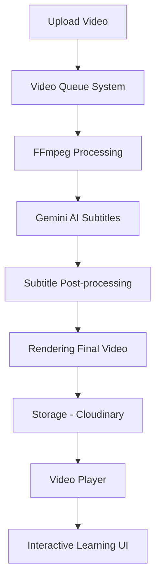

# Tính Năng Xử Lý Video

## Tổng Quan
Hệ thống E-Learning cung cấp khả năng xử lý video nâng cao với các tính năng chính:
- Tạo phụ đề tự động bằng AI
- Xử lý video qua hàng đợi (queue)
- Hiển thị tiến trình theo thời gian thực
- Tối ưu hóa video (kích thước, chất lượng)
- Tích hợp Gemini AI để phân tích nội dung video

## Kiến Trúc Xử Lý Video



## Quy Trình Xử Lý Video

### 1. Upload & Phân Tích Video
- Upload video qua UI (Demo/Content video)
- Phân tích metadata (duration, resolution)
- Thêm vào hàng đợi xử lý

### 2. Tiền Xử Lý Video
- Chuẩn hóa kích thước (max 1280x720)
- Điều chỉnh bitrate (tối đa 2.5 Mbps)
- Chuẩn hóa âm thanh (nếu cần)

### 3. Phân Đoạn Video Thông Minh
- Video ngắn (< 10 phút): xử lý trực tiếp
- Video dài (> 10 phút): chia thành các phân đoạn nhỏ
- Phát hiện khoảng lặng để phân đoạn tối ưu
- Xử lý song song các phân đoạn

### 4. Tạo Phụ Đề với AI
- Gọi Gemini AI API
- Tạo phụ đề tự động bằng tiếng Việt
- Xử lý nhiều segment song song (đối với video dài)
- Cơ chế retry và fallback

### 5. Hậu Xử Lý Phụ Đề
- Loại bỏ phụ đề trùng lặp
- Điều chỉnh thời gian hiển thị
- Tạo file SRT (SubRip Text Format)
- Áp dụng kiểu dáng phụ đề (font, màu sắc)

### 6. Gắn Phụ Đề Vào Video
- Sử dụng FFmpeg để gắn phụ đề
- Cấu hình dựa trên loại nội dung video
- Tối ưu hóa chất lượng kết xuất

### 7. Lưu Trữ & Hiển Thị
- Upload video đã xử lý lên Cloudinary
- Lưu metadata vào database
- Trả về URL và publicId

## Hệ Thống Hàng Đợi Video (Video Queue)

### Cấu Trúc Dữ Liệu VideoQueueItem
```typescript
interface VideoQueueItem {
  processId: string;        // ID duy nhất cho tiến trình
  fileName: string;         // Tên file gốc
  progress: number;         // Tiến độ xử lý (0-100%)
  message: string;          // Thông báo trạng thái
  status: "pending" | "processing" | "success" | "error";
  result?: {
    publicId?: string;      // Cloudinary public ID
    url?: string;           // URL video đã xử lý
    duration?: number;      // Độ dài video (giây)
    format?: string;        // Định dạng video
    error?: string;         // Thông báo lỗi
    warning?: string;       // Cảnh báo
  };
  uploadType: "demo" | "content";  // Loại video
  contentIndex?: number;    // Chỉ số trong course content
  timestamp: number;        // Thời gian thêm vào queue
}
```

### Luồng Xử Lý Thời Gian Thực
1. Frontend thêm video vào hàng đợi
2. Backend xử lý video, gửi cập nhật qua Socket.IO
3. React Context cập nhật UI theo thời gian thực
4. Hiển thị tiến độ và thông báo cho người dùng

## Công Nghệ Sử Dụng

### Backend
- **FFmpeg**: Xử lý và chuyển đổi video
- **Google Generative AI (Gemini)**: Tạo phụ đề từ nội dung video
- **Socket.IO**: Truyền thông tin tiến độ thời gian thực
- **fs-extra**: Quản lý file hệ thống
- **Cloudinary**: Lưu trữ và phân phối video

### Frontend
- **React Context API**: Quản lý trạng thái hàng đợi
- **Socket.IO Client**: Nhận cập nhật tiến độ
- **React Icons**: UI cho queue
- **React-Hot-Toast**: Thông báo

## Kiểu Dáng Phụ Đề

Hệ thống hỗ trợ nhiều kiểu dáng phụ đề (subtitle presets) khác nhau phù hợp với từng loại nội dung:

| Preset | Mô tả | Đặc điểm |
|--------|-------|----------|
| default | Kiểu cơ bản | Font Arial 24px, viền đen, màu trắng |
| lecture | Bài giảng | Font Arial 28px, nền đen mờ, viết đậm |
| tutorial | Hướng dẫn | Font Arial 22px, phía trên, căn trái |
| documentary | Tài liệu | Verdana 26px, nền trong suốt, bóng đổ |
| minimal | Tối giản | Helvetica 20px, viền mỏng |
| highContrast | Tương phản cao | Arial 28px đậm, màu vàng, viền đậm |

## Phân Tích Hiệu Suất
- Tối ưu hóa đa luồng: Sử dụng song song dựa trên số CPU cores
- Quản lý bộ nhớ: Tự động giảm kích thước với file lớn (>50MB, >200MB)
- Tăng tốc phần cứng: Phát hiện và sử dụng GPU/CPU tối ưu
- Retry & Fallback: Thử lại tự động khi gặp lỗi

## Mẫu Code Chính

### Tạo Phụ Đề Tự Động
```typescript
export async function callGeminiApi(videoBase64: string, options: GeminiApiOptions = {}): Promise<Subtitle[]> {
  try {
    const mimeType = options.mimeType || 'video/mp4';
    const contentType = options.contentType || 'lecture';
    const segmentInfo = options.segmentInfo || null;

    // Chuẩn bị prompt
    const prompt = getEnhancedPrompt(contentType, segmentInfo);

    // Chuẩn bị request parts
    const requestParts: Part[] = [
      { text: prompt },
      {
        inlineData: {
          mimeType: mimeType,
          data: videoBase64
        }
      }
    ];

    // Gọi API Gemini
    const result: GenerateContentResult = await model.generateContent({
      contents: [{ role: "user", parts: requestParts }],
      generationConfig: {
        temperature: 0.2,
        topK: 32,
        topP: 0.95,
        maxOutputTokens: 8192,
      }
    });

    // Xử lý response JSON
    // ...
  } catch (error) {
    // Xử lý lỗi
  }
}
```

## Triển Khai Hàng Đợi Video (Frontend)

### VideoQueueContext
```tsx
const VideoQueueProvider: React.FC<{ children: React.ReactNode }> = ({ children }) => {
  const [queue, setQueue] = useState<VideoQueueItem[]>([]);
  const [socket, setSocket] = useState<Socket | null>(null);

  // Kết nối Socket.IO
  useEffect(() => {
    const socketInstance = io(process.env.NEXT_PUBLIC_SOCKET_SERVER_URI || "");
    
    socketInstance.on("videoProgress", (data: any) => {
      setQueue((prevQueue) => {
        // Cập nhật item trong queue
        // ...
      });
    });
    
    setSocket(socketInstance);
    
    return () => {
      socketInstance.disconnect();
    };
  }, []);

  // Thêm video vào queue, cập nhật, xóa,...
  // ...

  return (
    <VideoQueueContext.Provider value={{
      queue,
      addToQueue,
      updateQueueItem,
      removeFromQueue,
      clearQueue,
      setVideoUrlFromQueue,
    }}>
      {children}
    </VideoQueueContext.Provider>
  );
};
```

## Tương Tác Với AI Trong Khóa Học

- Tóm tắt tự động nội dung video
- Phân tích văn bản từ phụ đề
- Trả lời câu hỏi dựa trên nội dung video
- Khuyến nghị tài liệu học tập bổ sung