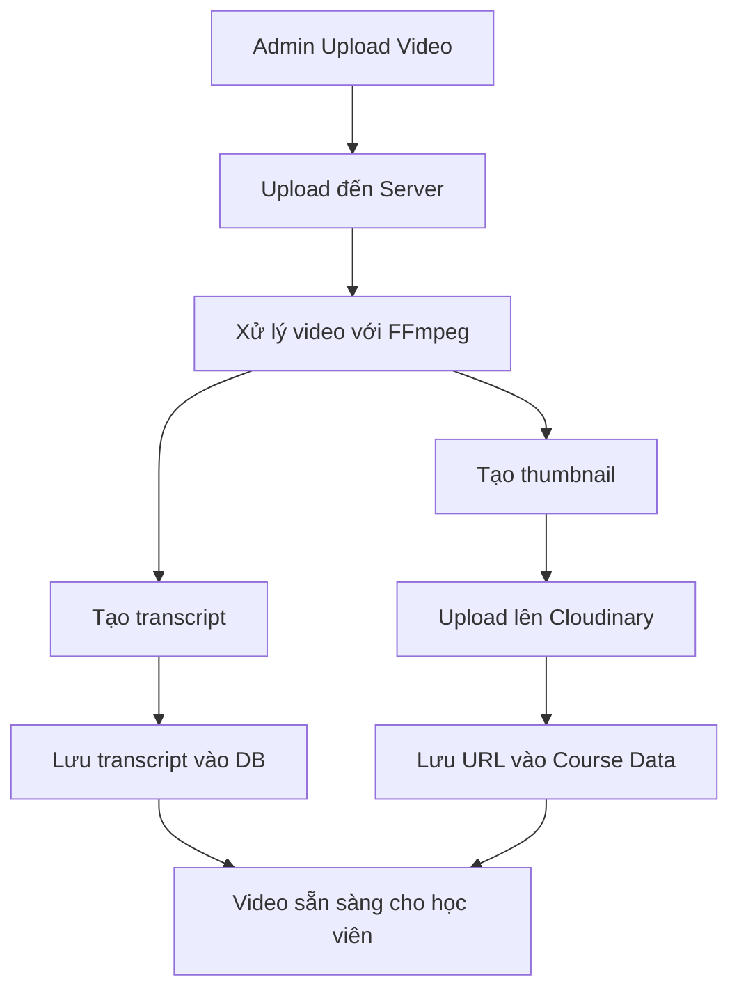

# Xử Lý Video Trong Dự Án E-Learning

Một trong những tính năng quan trọng của nền tảng E-Learning là khả năng quản lý, xử lý và phân phối nội dung video. Tài liệu này mô tả chi tiết về quy trình xử lý video trong dự án, từ việc upload, xử lý đến hiển thị cho người dùng.

## 1. Tổng Quan Về Xử Lý Video

### 1.1. Luồng Xử Lý Video



### 1.2. Công Nghệ Sử Dụng

- **FFmpeg**: Xử lý video, tạo thumbnail, chuyển đổi định dạng
- **Cloudinary**: Lưu trữ và phân phối video
- **Multer**: Xử lý upload file
- **Google Generative AI**: Tạo transcript từ audio của video
- **MongoDB**: Lưu trữ metadata và transcript

## 2. Upload Video

### 2.1. Backend Configuration

#### Multer Setup

```typescript
// Backend/middleware/multer.ts
import multer from "multer";
import path from "path";
import fs from "fs-extra";

// Đảm bảo thư mục uploads tồn tại
const uploadDir = path.join(__dirname, "../uploads");
fs.ensureDirSync(uploadDir);

// Cấu hình lưu trữ file
const storage = multer.diskStorage({
  destination: function (req, file, cb) {
    // Tạo thư mục nếu chưa tồn tại
    const fileDir = path.join(uploadDir, "videos");
    fs.ensureDirSync(fileDir);
    cb(null, fileDir);
  },
  filename: function (req, file, cb) {
    // Tạo tên file an toàn
    const uniqueSuffix = Date.now() + "-" + Math.round(Math.random() * 1e9);
    const ext = path.extname(file.originalname);
    cb(null, `video-${uniqueSuffix}${ext}`);
  },
});

// Lọc file
const fileFilter = (req: Express.Request, file: Express.Multer.File, cb: multer.FileFilterCallback) => {
  // Chấp nhận video formats
  const allowedTypes = ["video/mp4", "video/webm", "video/ogg"];
  
  if (allowedTypes.includes(file.mimetype)) {
    cb(null, true);
  } else {
    cb(new Error("Invalid file type. Only MP4, WebM, and OGG video formats are allowed."));
  }
};

// Cấu hình multer
export const videoUpload = multer({
  storage: storage,
  fileFilter: fileFilter,
  limits: {
    fileSize: 200 * 1024 * 1024, // 200MB limit
  },
});
```

#### Route Setup

```typescript
// Backend/routes/course.route.ts
import express from "express";
import { 
  uploadCourseVideo,
  processVideo,
  generateVideoSubtitle
} from "../controller/course.controller";
import { isAuthenticated, authorizeRoles } from "../middleware/auth";
import { videoUpload } from "../middleware/multer";

const courseRouter = express.Router();

// Route để upload video (admin only)
courseRouter.post(
  "/upload-course-video",
  isAuthenticated,
  authorizeRoles("admin"),
  videoUpload.single("video"),
  uploadCourseVideo
);

// Route để xử lý video đã upload
courseRouter.post(
  "/process-video/:id",
  isAuthenticated,
  authorizeRoles("admin"),
  processVideo
);

// Route để tạo subtitle tự động cho video
courseRouter.post(
  "/generate-video-subtitle",
  isAuthenticated,
  authorizeRoles("admin"),
  generateVideoSubtitle
);

export default courseRouter;
```

### 2.2. Upload Controller

```typescript
// Backend/controller/course.controller.ts
import { Request, Response, NextFunction } from "express";
import cloudinary from "cloudinary";
import ErrorHandler from "../utils/ErrorHandler";
import catchAsyncErrors from "../middleware/catchAsyncErrors";
import CourseModel from "../models/course.model";
import path from "path";
import fs from "fs-extra";

// Upload video lên Cloudinary
export const uploadCourseVideo = catchAsyncErrors(
  async (req: Request, res: Response, next: NextFunction) => {
    try {
      // Kiểm tra xem file có tồn tại không
      if (!req.file) {
        return next(new ErrorHandler("Please upload a video file", 400));
      }
      
      // Lấy courseId và videoSection từ request
      const { courseId, videoSection } = req.body;
      
      if (!courseId) {
        // Xóa file tạm nếu không có courseId
        fs.unlinkSync(req.file.path);
        return next(new ErrorHandler("Please provide a course ID", 400));
      }
      
      // Kiểm tra khóa học có tồn tại không
      const course = await CourseModel.findById(courseId);
      if (!course) {
        // Xóa file tạm nếu không tìm thấy khóa học
        fs.unlinkSync(req.file.path);
        return next(new ErrorHandler("Course not found", 404));
      }
      
      // Upload lên Cloudinary
      const result = await cloudinary.v2.uploader.upload(req.file.path, {
        folder: `courses/${courseId}`,
        resource_type: "video",
        chunk_size: 6000000, // 6MB chunks for better upload
        eager: [
          { format: "mp4", transformation: [{ quality: "auto" }] },
        ],
        eager_async: true,
      });
      
      // Xóa file tạm sau khi upload thành công
      fs.unlinkSync(req.file.path);
      
      // Tạo thumbnail từ video
      const thumbnailResult = await cloudinary.v2.uploader.upload(req.file.path, {
        folder: `courses/${courseId}/thumbnails`,
        resource_type: "image",
        transformation: [
          { width: 720, crop: "scale" },
          { quality: "auto" },
        ],
      });
      
      // Trả về thông tin video đã upload
      res.status(200).json({
        success: true,
        videoInfo: {
          public_id: result.public_id,
          url: result.secure_url,
          duration: Math.round(result.duration || 0),
          format: result.format,
          thumbnail: {
            public_id: thumbnailResult.public_id,
            url: thumbnailResult.secure_url,
          },
        },
      });
    } catch (error: any) {
      // Xóa file tạm nếu có lỗi
      if (req.file && fs.existsSync(req.file.path)) {
        fs.unlinkSync(req.file.path);
      }
      
      return next(new ErrorHandler(error.message, 500));
    }
  }
);
```

### 2.3. Frontend Upload Component

```tsx
// Frontend/app/components/Admin/Course/VideoUpload.tsx
"use client";
import React, { useState, useRef } from "react";
import { useUploadCourseMutation } from "@/redux/features/courses/coursesApi";
import toast from "react-hot-toast";
import { styles } from "@/app/styles/style";
import { AiOutlineCloudUpload } from "react-icons/ai";
import { MdDelete } from "react-icons/md";

interface VideoUploadProps {
  courseId: string;
  videoSection: string;
  onUploadSuccess: (videoData: any) => void;
}

const VideoUpload: React.FC<VideoUploadProps> = ({
  courseId,
  videoSection,
  onUploadSuccess,
}) => {
  const [video, setVideo] = useState<File | null>(null);
  const [videoPreview, setVideoPreview] = useState<string | null>(null);
  const [isUploading, setIsUploading] = useState(false);
  const [uploadProgress, setUploadProgress] = useState(0);
  const [uploadCourseVideo] = useUploadCourseMutation();
  const fileInputRef = useRef<HTMLInputElement>(null);

  // Xử lý khi chọn file
  const handleFileChange = (e: React.ChangeEvent<HTMLInputElement>) => {
    const file = e.target.files?.[0];
    if (!file) return;

    // Kiểm tra file type
    const validTypes = ["video/mp4", "video/webm", "video/ogg"];
    if (!validTypes.includes(file.type)) {
      toast.error("Invalid file type. Please upload MP4, WebM, or OGG video.");
      return;
    }

    // Kiểm tra kích thước (max 200MB)
    if (file.size > 200 * 1024 * 1024) {
      toast.error("File too large. Maximum size is 200MB.");
      return;
    }

    // Tạo preview URL
    const url = URL.createObjectURL(file);
    setVideo(file);
    setVideoPreview(url);
  };

  // Xử lý xóa video đã chọn
  const handleRemoveVideo = () => {
    setVideo(null);
    setVideoPreview(null);
    if (fileInputRef.current) {
      fileInputRef.current.value = "";
    }
  };

  // Xử lý upload video
  const handleUpload = async () => {
    if (!video) {
      toast.error("Please select a video to upload.");
      return;
    }

    setIsUploading(true);
    setUploadProgress(0);

    try {
      // Tạo FormData
      const formData = new FormData();
      formData.append("video", video);
      formData.append("courseId", courseId);
      formData.append("videoSection", videoSection);

      // Simulate progress (actual progress tracking requires server support)
      const interval = setInterval(() => {
        setUploadProgress((prev) => {
          if (prev >= 95) {
            clearInterval(interval);
            return prev;
          }
          return prev + 5;
        });
      }, 500);

      // Call API để upload
      const response = await uploadCourseVideo(formData).unwrap();

      // Upload thành công
      clearInterval(interval);
      setUploadProgress(100);
      
      toast.success("Video uploaded successfully!");
      setVideo(null);
      setVideoPreview(null);
      
      // Call callback với thông tin video
      onUploadSuccess(response.videoInfo);
    } catch (error: any) {
      toast.error(error.data?.message || "Error uploading video");
    } finally {
      setIsUploading(false);
    }
  };

  return (
    <div className="w-full p-4 bg-white dark:bg-gray-800 rounded-lg shadow-md">
      <h3 className="text-lg font-semibold mb-4">Upload Video</h3>
      
      {videoPreview ? (
        <div className="relative mb-4">
          <video
            controls
            className="w-full h-auto max-h-[300px] rounded-lg"
            src={videoPreview}
          />
          <button
            onClick={handleRemoveVideo}
            className="absolute top-2 right-2 bg-red-500 p-2 rounded-full text-white"
            disabled={isUploading}
          >
            <MdDelete size={20} />
          </button>
        </div>
      ) : (
        <div
          onClick={() => fileInputRef.current?.click()}
          className="border-2 border-dashed border-gray-300 dark:border-gray-600 rounded-lg p-8 text-center cursor-pointer mb-4"
        >
          <input
            type="file"
            ref={fileInputRef}
            onChange={handleFileChange}
            accept="video/mp4,video/webm,video/ogg"
            className="hidden"
            disabled={isUploading}
          />
          <AiOutlineCloudUpload className="text-4xl mx-auto text-gray-500 dark:text-gray-400" />
          <p className="mt-2 text-sm text-gray-600 dark:text-gray-300">
            Drag and drop or click to select a video
          </p>
          <p className="text-xs text-gray-500 dark:text-gray-400 mt-1">
            MP4, WebM, or OGG (max 200MB)
          </p>
        </div>
      )}
      
      {isUploading && (
        <div className="mb-4">
          <div className="w-full bg-gray-200 rounded-full h-2.5 dark:bg-gray-700 mb-1">
            <div
              className="bg-blue-600 h-2.5 rounded-full"
              style={{ width: `${uploadProgress}%` }}
            ></div>
          </div>
          <p className="text-xs text-gray-500 dark:text-gray-400">
            Uploading: {uploadProgress}%
          </p>
        </div>
      )}
      
      <button
        onClick={handleUpload}
        disabled={!video || isUploading}
        className={`${styles.button} w-full !bg-blue-600 hover:!bg-blue-700 !text-white !h-[40px] !rounded-lg ${
          (!video || isUploading) && "opacity-50 cursor-not-allowed"
        }`}
      >
        {isUploading ? "Uploading..." : "Upload Video"}
      </button>
    </div>
  );
};

export default VideoUpload;
```

## 3. Xử Lý Video với FFmpeg

### 3.1. Cài Đặt FFmpeg

```typescript
// Backend/utils/ffmpeg.ts
import ffmpeg from "fluent-ffmpeg";
import ffmpegInstaller from "@ffmpeg-installer/ffmpeg";
import path from "path";
import fs from "fs-extra";

// Set FFmpeg path
ffmpeg.setFfmpegPath(ffmpegInstaller.path);

// Thư mục tạm cho xử lý video
const tempDir = path.join(__dirname, "../temp");
fs.ensureDirSync(tempDir);

// Hàm để tạo thumbnail từ video
export const createThumbnail = (
  videoPath: string,
  outputFileName: string
): Promise<string> => {
  const outputPath = path.join(tempDir, `${outputFileName}.jpg`);
  
  return new Promise((resolve, reject) => {
    ffmpeg(videoPath)
      .on("error", (err) => {
        reject(err);
      })
      .on("end", () => {
        resolve(outputPath);
      })
      .screenshots({
        count: 1,
        folder: tempDir,
        filename: `${outputFileName}.jpg`,
        size: "720x?",
      });
  });
};

// Hàm để trích xuất audio từ video
export const extractAudio = (
  videoPath: string,
  outputFileName: string
): Promise<string> => {
  const outputPath = path.join(tempDir, `${outputFileName}.mp3`);
  
  return new Promise((resolve, reject) => {
    ffmpeg(videoPath)
      .output(outputPath)
      .noVideo()
      .audioCodec("libmp3lame")
      .audioBitrate("128k")
      .on("error", (err) => {
        reject(err);
      })
      .on("end", () => {
        resolve(outputPath);
      })
      .run();
  });
};

// Hàm để lấy thông tin video
export const getVideoInfo = (videoPath: string): Promise<any> => {
  return new Promise((resolve, reject) => {
    ffmpeg.ffprobe(videoPath, (err, metadata) => {
      if (err) {
        reject(err);
        return;
      }
      
      resolve(metadata);
    });
  });
};

// Hàm để tối ưu hóa video
export const optimizeVideo = (
  videoPath: string,
  outputFileName: string,
  options = { width: 720, videoBitrate: "1000k", audioBitrate: "128k" }
): Promise<string> => {
  const outputPath = path.join(tempDir, `${outputFileName}.mp4`);
  
  return new Promise((resolve, reject) => {
    ffmpeg(videoPath)
      .output(outputPath)
      .videoCodec("libx264")
      .size(`${options.width}x?`)
      .videoBitrate(options.videoBitrate)
      .audioBitrate(options.audioBitrate)
      .on("error", (err) => {
        reject(err);
      })
      .on("end", () => {
        resolve(outputPath);
      })
      .run();
  });
};

// Hàm để xóa file tạm
export const cleanupTempFiles = (filePaths: string[]) => {
  filePaths.forEach((filePath) => {
    if (fs.existsSync(filePath)) {
      fs.unlinkSync(filePath);
    }
  });
};
```

### 3.2. Controller Xử Lý Video

```typescript
// Backend/controller/course.controller.ts
import { createThumbnail, extractAudio, getVideoInfo, optimizeVideo, cleanupTempFiles } from "../utils/ffmpeg";

// Controller xử lý video
export const processVideo = catchAsyncErrors(
  async (req: Request, res: Response, next: NextFunction) => {
    try {
      const { id } = req.params; // videoId
      const { courseId, videoTitle, videoSection } = req.body;
      
      // Validate input
      if (!id || !courseId || !videoTitle) {
        return next(new ErrorHandler("Missing required parameters", 400));
      }
      
      // Tìm khóa học
      const course = await CourseModel.findById(courseId);
      if (!course) {
        return next(new ErrorHandler("Course not found", 404));
      }
      
      // Lấy video từ Cloudinary
      const videoUrl = `https://res.cloudinary.com/${process.env.CLOUD_NAME}/video/upload/${id}`;
      
      // Tạo filename duy nhất
      const uniqueFilename = `video_${Date.now()}`;
      const tempFilePath = path.join(__dirname, "../temp", `${uniqueFilename}.mp4`);
      
      // Download video
      const response = await axios({
        method: "GET",
        url: videoUrl,
        responseType: "stream",
      });
      
      const writer = fs.createWriteStream(tempFilePath);
      response.data.pipe(writer);
      
      await new Promise((resolve, reject) => {
        writer.on("finish", resolve);
        writer.on("error", reject);
      });
      
      // Xử lý video
      const [videoInfo, thumbnailPath, audioPath, optimizedPath] = await Promise.all([
        getVideoInfo(tempFilePath),
        createThumbnail(tempFilePath, `${uniqueFilename}_thumbnail`),
        extractAudio(tempFilePath, `${uniqueFilename}_audio`),
        optimizeVideo(tempFilePath, `${uniqueFilename}_optimized`),
      ]);
      
      // Upload thumbnail lên Cloudinary
      const thumbnailResult = await cloudinary.v2.uploader.upload(thumbnailPath, {
        folder: `courses/${courseId}/thumbnails`,
      });
      
      // Upload optimized video lên Cloudinary
      const videoResult = await cloudinary.v2.uploader.upload(optimizedPath, {
        folder: `courses/${courseId}/videos`,
        resource_type: "video",
      });
      
      // Lấy video length
      const videoLength = Math.round(videoInfo.format.duration || 0);
      
      // Tạo courseData object
      const newVideoData = {
        title: videoTitle,
        videoUrl: videoResult.secure_url,
        videoSection: videoSection || "Untitled Section",
        videoLength,
        videoPlayer: "cloudinary",
        thumbnail: {
          public_id: thumbnailResult.public_id,
          url: thumbnailResult.secure_url,
        },
      };
      
      // Thêm vào khóa học
      course.courseData.push(newVideoData);
      await course.save();
      
      // Xóa files tạm
      cleanupTempFiles([tempFilePath, thumbnailPath, audioPath, optimizedPath]);
      
      // Trả về response
      res.status(200).json({
        success: true,
        message: "Video processed successfully",
        video: newVideoData,
      });
    } catch (error: any) {
      return next(new ErrorHandler(error.message, 500));
    }
  }
);
```

## 4. Tạo Transcript Với AI

### 4.1. Service AI Transcript Generation

```typescript
// Backend/services/ai.service.ts
import fs from "fs-extra";
import path from "path";
import { GoogleGenerativeAI } from "@google/generative-ai";
import SubtitleModel from "../models/subtitle.model";
import { extractAudio } from "../utils/ffmpeg";

// Google Generative AI setup
const genAI = new GoogleGenerativeAI(process.env.GEMINI_API_KEY || "");
const model = genAI.getGenerativeModel({ model: "gemini-1.0-pro-001" });

// Hàm chuyển đổi File sang Base64
const fileToBase64 = async (filePath: string): Promise<string> => {
  const data = await fs.readFile(filePath);
  return data.toString("base64");
};

// Tạo transcript từ audio
export const generateTranscriptFromAudio = async (
  audioPath: string
): Promise<string> => {
  try {
    // Đọc file audio như base64
    const audioData = await fileToBase64(audioPath);
    
    // Chuẩn bị prompt
    const prompt = `
      You are a professional transcription service. 
      Transcribe the following audio to text.
      Return only the transcript, without any additional explanation or notes.
      Please maintain any technical terms and code snippets if they appear in the audio.
    `;
    
    // Gọi AI để generate transcript
    const result = await model.generateContent([
      prompt,
      {
        inlineData: {
          data: audioData,
          mimeType: "audio/mpeg",
        },
      },
    ]);
    
    // Lấy transcript text
    const transcript = result.response.text();
    
    return transcript;
  } catch (error: any) {
    console.error("Error generating transcript:", error);
    throw error;
  }
};

// Service tạo transcript từ video
export const generateVideoTranscript = async (
  videoUrl: string,
  courseId: string,
  fileName: string
): Promise<string> => {
  try {
    // Download video
    const tempDir = path.join(__dirname, "../temp");
    fs.ensureDirSync(tempDir);
    
    const videoPath = path.join(tempDir, `${fileName}.mp4`);
    const response = await axios({
      method: "GET",
      url: videoUrl,
      responseType: "stream",
    });
    
    const writer = fs.createWriteStream(videoPath);
    response.data.pipe(writer);
    
    await new Promise((resolve, reject) => {
      writer.on("finish", resolve);
      writer.on("error", reject);
    });
    
    // Trích xuất audio
    const audioPath = await extractAudio(videoPath, `${fileName}_audio`);
    
    // Generate transcript
    const transcript = await generateTranscriptFromAudio(audioPath);
    
    // Lưu transcript vào database
    await SubtitleModel.findOneAndUpdate(
      { courseId, fileName },
      { transcript },
      { upsert: true, new: true }
    );
    
    // Xóa files tạm
    cleanupTempFiles([videoPath, audioPath]);
    
    return transcript;
  } catch (error: any) {
    console.error("Error in generateVideoTranscript:", error);
    throw error;
  }
};
```

### 4.2. Controller Generate Subtitle

```typescript
// Backend/controller/course.controller.ts
import { generateVideoTranscript } from "../services/ai.service";

// Controller tạo subtitle
export const generateVideoSubtitle = catchAsyncErrors(
  async (req: Request, res: Response, next: NextFunction) => {
    try {
      const { courseId, videoId, fileName } = req.body;
      
      // Validate input
      if (!courseId || !videoId || !fileName) {
        return next(new ErrorHandler("Missing required parameters", 400));
      }
      
      // Tìm khóa học
      const course = await CourseModel.findById(courseId);
      if (!course) {
        return next(new ErrorHandler("Course not found", 404));
      }
      
      // Tìm video trong khóa học
      const courseVideo = course.courseData.find(
        (data) => data._id.toString() === videoId
      );
      
      if (!courseVideo) {
        return next(new ErrorHandler("Video not found in course", 404));
      }
      
      // Kiểm tra xem đã có subtitle chưa
      const existingSubtitle = await SubtitleModel.findOne({
        courseId,
        fileName,
      });
      
      if (existingSubtitle && existingSubtitle.transcript) {
        return res.status(200).json({
          success: true,
          message: "Subtitle already exists",
          transcript: existingSubtitle.transcript,
        });
      }
      
      // Tạo transcript từ video
      const transcript = await generateVideoTranscript(
        courseVideo.videoUrl,
        courseId,
        fileName
      );
      
      res.status(200).json({
        success: true,
        message: "Subtitle generated successfully",
        transcript,
      });
    } catch (error: any) {
      return next(new ErrorHandler(error.message, 500));
    }
  }
);
```

### 4.3. Get Transcript API

```typescript
// Backend/controller/course.controller.ts
export const getTranscript = catchAsyncErrors(
  async (req: Request, res: Response, next: NextFunction) => {
    try {
      const { id, videoName } = req.body;

      // Tìm khóa học
      const course = await CourseModel.findById(id);
      if (!course) {
        return next(new ErrorHandler("Course not found", 404));
      }

      // Tìm subtitle trong database
      const subtitle = await SubtitleModel.findOne({
        courseId: id,
        fileName: videoName,
      });

      // Nếu có subtitle, trả về
      if (subtitle) {
        return res.status(200).json({
          success: true,
          transcript: subtitle.transcript,
          courseName: course.name,
        });
      }

      // Nếu không có, trả về rỗng
      return res.status(200).json({
        success: true,
        transcript: "",
        courseName: course.name,
      });
    } catch (error: any) {
      return next(new ErrorHandler(error.message, 500));
    }
  }
);
```

## 5. Video Player Frontend

### 5.1. Custom Video Player

```tsx
// Frontend/app/components/Course/VideoPlayer.tsx
"use client";
import React, { useState, useRef, useEffect } from "react";
import {
  BsPlayFill,
  BsPauseFill,
  BsFullscreen,
  BsFullscreenExit,
  BsVolumeUp,
  BsVolumeMute,
} from "react-icons/bs";
import { MdOutlineForward10, MdOutlineReplay10 } from "react-icons/md";

interface VideoPlayerProps {
  videoUrl: string;
  thumbnail?: string;
}

const VideoPlayer: React.FC<VideoPlayerProps> = ({ videoUrl, thumbnail }) => {
  const videoRef = useRef<HTMLVideoElement>(null);
  const playerRef = useRef<HTMLDivElement>(null);
  const progressRef = useRef<HTMLDivElement>(null);
  const [isPlaying, setIsPlaying] = useState(false);
  const [currentTime, setCurrentTime] = useState(0);
  const [duration, setDuration] = useState(0);
  const [volume, setVolume] = useState(1);
  const [isMuted, setIsMuted] = useState(false);
  const [isFullscreen, setIsFullscreen] = useState(false);
  const [showControls, setShowControls] = useState(true);
  const [loading, setLoading] = useState(true);

  // Handle video metadata loaded
  const handleLoadedMetadata = () => {
    if (videoRef.current) {
      setDuration(videoRef.current.duration);
      setLoading(false);
    }
  };

  // Handle play/pause
  const togglePlay = () => {
    if (videoRef.current) {
      if (isPlaying) {
        videoRef.current.pause();
      } else {
        videoRef.current.play();
      }
      setIsPlaying(!isPlaying);
    }
  };

  // Handle time update
  const handleTimeUpdate = () => {
    if (videoRef.current) {
      setCurrentTime(videoRef.current.currentTime);
    }
  };

  // Handle seeking
  const handleSeek = (e: React.MouseEvent) => {
    if (progressRef.current && videoRef.current) {
      const rect = progressRef.current.getBoundingClientRect();
      const pos = (e.clientX - rect.left) / rect.width;
      videoRef.current.currentTime = pos * duration;
    }
  };

  // Handle volume change
  const handleVolumeChange = (e: React.ChangeEvent<HTMLInputElement>) => {
    const value = parseFloat(e.target.value);
    setVolume(value);
    if (videoRef.current) {
      videoRef.current.volume = value;
    }
    setIsMuted(value === 0);
  };

  // Handle mute toggle
  const toggleMute = () => {
    if (videoRef.current) {
      if (isMuted) {
        videoRef.current.volume = volume > 0 ? volume : 0.5;
        setVolume(volume > 0 ? volume : 0.5);
      } else {
        videoRef.current.volume = 0;
      }
      setIsMuted(!isMuted);
    }
  };

  // Handle fullscreen toggle
  const toggleFullscreen = () => {
    if (playerRef.current) {
      if (!isFullscreen) {
        if (playerRef.current.requestFullscreen) {
          playerRef.current.requestFullscreen();
        }
      } else {
        if (document.exitFullscreen) {
          document.exitFullscreen();
        }
      }
    }
  };

  // Handle forward/rewind
  const handleForward = () => {
    if (videoRef.current) {
      videoRef.current.currentTime += 10;
    }
  };

  const handleRewind = () => {
    if (videoRef.current) {
      videoRef.current.currentTime -= 10;
    }
  };

  // Format time (seconds to MM:SS)
  const formatTime = (time: number) => {
    const minutes = Math.floor(time / 60);
    const seconds = Math.floor(time % 60);
    return `${minutes}:${seconds < 10 ? "0" : ""}${seconds}`;
  };

  // Auto-hide controls after inactivity
  useEffect(() => {
    let timeout: NodeJS.Timeout;
    
    const handleMouseMove = () => {
      setShowControls(true);
      clearTimeout(timeout);
      
      timeout = setTimeout(() => {
        if (isPlaying) {
          setShowControls(false);
        }
      }, 3000);
    };
    
    const playerElement = playerRef.current;
    if (playerElement) {
      playerElement.addEventListener("mousemove", handleMouseMove);
      playerElement.addEventListener("mouseleave", () => {
        if (isPlaying) {
          setShowControls(false);
        }
      });
      playerElement.addEventListener("mouseenter", () => {
        setShowControls(true);
      });
    }
    
    return () => {
      clearTimeout(timeout);
      if (playerElement) {
        playerElement.removeEventListener("mousemove", handleMouseMove);
      }
    };
  }, [isPlaying]);

  // Listen for fullscreen change events
  useEffect(() => {
    const handleFullscreenChange = () => {
      setIsFullscreen(!!document.fullscreenElement);
    };
    
    document.addEventListener("fullscreenchange", handleFullscreenChange);
    
    return () => {
      document.removeEventListener("fullscreenchange", handleFullscreenChange);
    };
  }, []);

  return (
    <div 
      ref={playerRef}
      className="relative w-full bg-black rounded-lg overflow-hidden group"
      style={{ aspectRatio: "16/9" }}
    >
      {/* Video Element */}
      <video
        ref={videoRef}
        src={videoUrl}
        poster={thumbnail}
        className="w-full h-full object-contain"
        onTimeUpdate={handleTimeUpdate}
        onLoadedMetadata={handleLoadedMetadata}
        onEnded={() => setIsPlaying(false)}
        onClick={togglePlay}
        playsInline
      />
      
      {/* Loading Indicator */}
      {loading && (
        <div className="absolute inset-0 flex items-center justify-center bg-black bg-opacity-50">
          <div className="w-12 h-12 border-4 border-blue-500 border-t-transparent rounded-full animate-spin"></div>
        </div>
      )}
      
      {/* Play/Pause Overlay (Center) */}
      {!isPlaying && (
        <button
          onClick={togglePlay}
          className="absolute top-1/2 left-1/2 transform -translate-x-1/2 -translate-y-1/2 bg-blue-500 bg-opacity-80 rounded-full p-4 text-white"
        >
          <BsPlayFill size={30} />
        </button>
      )}
      
      {/* Controls */}
      <div 
        className={`absolute bottom-0 left-0 right-0 bg-gradient-to-t from-black to-transparent p-4 transition-opacity duration-300 ${
          showControls ? "opacity-100" : "opacity-0"
        }`}
      >
        {/* Progress Bar */}
        <div 
          ref={progressRef}
          className="w-full h-2 bg-gray-600 rounded-full mb-4 cursor-pointer"
          onClick={handleSeek}
        >
          <div 
            className="h-full bg-blue-500 rounded-full relative"
            style={{ width: `${(currentTime / duration) * 100}%` }}
          >
            <div className="absolute top-1/2 right-0 transform translate-x-1/2 -translate-y-1/2 w-3 h-3 bg-white rounded-full"></div>
          </div>
        </div>
        
        <div className="flex items-center justify-between">
          <div className="flex items-center space-x-4">
            {/* Play/Pause Button */}
            <button onClick={togglePlay} className="text-white">
              {isPlaying ? <BsPauseFill size={24} /> : <BsPlayFill size={24} />}
            </button>
            
            {/* Rewind Button */}
            <button onClick={handleRewind} className="text-white">
              <MdOutlineReplay10 size={24} />
            </button>
            
            {/* Forward Button */}
            <button onClick={handleForward} className="text-white">
              <MdOutlineForward10 size={24} />
            </button>
            
            {/* Volume Control */}
            <div className="flex items-center space-x-2">
              <button onClick={toggleMute} className="text-white">
                {isMuted ? <BsVolumeMute size={20} /> : <BsVolumeUp size={20} />}
              </button>
              <input
                type="range"
                min="0"
                max="1"
                step="0.01"
                value={isMuted ? 0 : volume}
                onChange={handleVolumeChange}
                className="w-20 h-1 bg-gray-500 rounded-full appearance-none cursor-pointer"
              />
            </div>
            
            {/* Time Display */}
            <div className="text-white text-sm">
              {formatTime(currentTime)} / {formatTime(duration)}
            </div>
          </div>
          
          {/* Fullscreen Button */}
          <button onClick={toggleFullscreen} className="text-white">
            {isFullscreen ? <BsFullscreenExit size={20} /> : <BsFullscreen size={20} />}
          </button>
        </div>
      </div>
    </div>
  );
};

export default VideoPlayer;
```

### 5.2. Course Content Player

```tsx
// Frontend/app/course-access/[id]/page.tsx
"use client";
import React, { useState, useEffect } from "react";
import { useParams } from "next/navigation";
import {
  useGetCourseContentQuery,
} from "@/redux/features/courses/coursesApi";
import Loader from "@/app/components/Loader/Loader";
import VideoPlayer from "@/app/components/Course/VideoPlayer";
import Sidebar from "@/app/components/Course/CourseSidebar";
import CourseContentAccordion from "@/app/components/Course/CourseContentAccordion";
import AiChat from "@/app/components/AI/AiChat";

const CourseAccessPage = () => {
  const { id } = useParams<{ id: string }>();
  const [activeVideo, setActiveVideo] = useState<number>(0);
  const [activeSection, setActiveSection] = useState<number>(0);
  const [videoData, setVideoData] = useState<any>(null);
  const [openAI, setOpenAI] = useState<boolean>(false);
  
  const { data, isLoading, error } = useGetCourseContentQuery(id, {
    refetchOnMountOrArgChange: true,
  });
  
  useEffect(() => {
    if (data && data.content && data.content.length > 0) {
      const firstSection = data.content[0];
      if (firstSection.videos && firstSection.videos.length > 0) {
        setVideoData(firstSection.videos[0]);
      }
    }
  }, [data]);
  
  const handleVideoChange = (sectionIndex: number, videoIndex: number, videoData: any) => {
    setActiveSection(sectionIndex);
    setActiveVideo(videoIndex);
    setVideoData(videoData);
  };
  
  if (isLoading) {
    return <Loader />;
  }
  
  if (error) {
    return (
      <div className="flex items-center justify-center min-h-screen">
        <div className="text-center">
          <h2 className="text-2xl font-bold text-red-600 mb-2">Error</h2>
          <p className="text-gray-700 dark:text-gray-300">
            Failed to load course content. Please try again.
          </p>
        </div>
      </div>
    );
  }
  
  if (!data || !data.content || data.content.length === 0) {
    return (
      <div className="flex items-center justify-center min-h-screen">
        <div className="text-center">
          <h2 className="text-2xl font-bold mb-2">No Content Available</h2>
          <p className="text-gray-700 dark:text-gray-300">
            This course doesn't have any content yet.
          </p>
        </div>
      </div>
    );
  }
  
  return (
    <div className="flex flex-col lg:flex-row min-h-screen bg-gray-50 dark:bg-gray-900">
      {/* Sidebar for Mobile */}
      <div className="lg:hidden w-full bg-white dark:bg-gray-800 p-4 border-b dark:border-gray-700">
        <CourseContentAccordion
          data={data.content}
          activeSection={activeSection}
          activeVideo={activeVideo}
          onVideoSelect={handleVideoChange}
        />
      </div>
      
      {/* Main Content */}
      <div className="flex-1 p-4">
        <div className="max-w-4xl mx-auto">
          {videoData ? (
            <>
              <div className="mb-6 bg-white dark:bg-gray-800 rounded-lg shadow-sm overflow-hidden">
                <VideoPlayer
                  videoUrl={videoData.videoUrl}
                  thumbnail={videoData.thumbnail?.url}
                />
              </div>
              
              <div className="mb-6 bg-white dark:bg-gray-800 rounded-lg shadow-sm p-6">
                <h1 className="text-2xl font-bold mb-2">{videoData.title}</h1>
                <div className="flex items-center justify-between">
                  <p className="text-sm text-gray-500 dark:text-gray-400">
                    {Math.floor(videoData.videoLength / 60)}:{videoData.videoLength % 60 < 10 ? '0' : ''}
                    {videoData.videoLength % 60} mins
                  </p>
                  <button
                    onClick={() => setOpenAI(!openAI)}
                    className="px-4 py-2 bg-blue-600 text-white rounded-md hover:bg-blue-700 transition"
                  >
                    {openAI ? "Close AI Assistant" : "Open AI Assistant"}
                  </button>
                </div>
                
                {openAI && (
                  <div className="mt-6 border dark:border-gray-700 rounded-lg">
                    <AiChat videoName={videoData.title} />
                  </div>
                )}
                
                <div className="mt-6">
                  <h2 className="text-xl font-semibold mb-3">Description</h2>
                  <p className="text-gray-700 dark:text-gray-300">
                    {videoData.description}
                  </p>
                </div>
                
                {videoData.links && videoData.links.length > 0 && (
                  <div className="mt-6">
                    <h2 className="text-xl font-semibold mb-3">Resources</h2>
                    <ul className="list-disc pl-5">
                      {videoData.links.map((link: any, index: number) => (
                        <li key={index} className="mb-2">
                          <a
                            href={link.url}
                            target="_blank"
                            rel="noopener noreferrer"
                            className="text-blue-600 hover:underline"
                          >
                            {link.title}
                          </a>
                        </li>
                      ))}
                    </ul>
                  </div>
                )}
              </div>
            </>
          ) : (
            <div className="flex items-center justify-center min-h-[400px] bg-white dark:bg-gray-800 rounded-lg shadow-sm">
              <p className="text-gray-700 dark:text-gray-300">
                Please select a video from the sidebar.
              </p>
            </div>
          )}
        </div>
      </div>
      
      {/* Desktop Sidebar */}
      <div className="hidden lg:block w-80 bg-white dark:bg-gray-800 p-4 border-l dark:border-gray-700 overflow-y-auto">
        <Sidebar
          data={data.content}
          activeSection={activeSection}
          activeVideo={activeVideo}
          onVideoSelect={handleVideoChange}
        />
      </div>
    </div>
  );
};

export default CourseAccessPage;
```

## 6. Best Practices & Optimizations

### 6.1. Video Streaming Optimization

```typescript
// Backend/controller/course.controller.ts
export const streamCourseVideo = catchAsyncErrors(
  async (req: Request, res: Response, next: NextFunction) => {
    try {
      const { courseId, videoId } = req.params;
      
      // Validate input
      if (!courseId || !videoId) {
        return next(new ErrorHandler("Missing required parameters", 400));
      }
      
      // Kiểm tra quyền truy cập
      const user = req.user as IUser;
      const hasPurchased = user.courses.some(
        (course) => course.courseId.toString() === courseId
      );
      
      if (!hasPurchased) {
        return next(new ErrorHandler("You don't have access to this course", 403));
      }
      
      // Tìm khóa học
      const course = await CourseModel.findById(courseId);
      if (!course) {
        return next(new ErrorHandler("Course not found", 404));
      }
      
      // Tìm video
      const videoData = course.courseData.find(
        (data) => data._id.toString() === videoId
      );
      
      if (!videoData) {
        return next(new ErrorHandler("Video not found", 404));
      }
      
      // Lấy video URL từ Cloudinary
      const videoUrl = videoData.videoUrl;
      
      // Fetch video từ Cloudinary với hỗ trợ streaming
      const range = req.headers.range;
      
      if (!range) {
        // Không có range header, chuyển hướng tới Cloudinary URL
        return res.redirect(videoUrl);
      }
      
      // Nếu có range header, stream video
      const response = await axios({
        method: "GET",
        url: videoUrl,
        responseType: "stream",
        headers: { Range: range },
      });
      
      // Forward Cloudinary response headers
      res.status(206);
      res.set("Content-Type", response.headers["content-type"]);
      res.set("Content-Length", response.headers["content-length"]);
      res.set("Content-Range", response.headers["content-range"]);
      res.set("Accept-Ranges", "bytes");
      
      // Stream response to client
      response.data.pipe(res);
    } catch (error: any) {
      return next(new ErrorHandler(error.message, 500));
    }
  }
);
```

### 6.2. Video Quality Selection

```tsx
// Frontend/app/components/Course/VideoQualitySelector.tsx
import React from "react";

interface VideoQualityOption {
  label: string;
  value: string;
}

interface VideoQualitySelectorProps {
  options: VideoQualityOption[];
  selectedQuality: string;
  onChange: (quality: string) => void;
}

const VideoQualitySelector: React.FC<VideoQualitySelectorProps> = ({
  options,
  selectedQuality,
  onChange,
}) => {
  return (
    <div className="relative inline-block text-left">
      <div>
        <button
          type="button"
          className="inline-flex justify-center w-full rounded-md border border-gray-300 dark:border-gray-600 shadow-sm px-4 py-2 bg-white dark:bg-gray-700 text-sm font-medium text-gray-700 dark:text-gray-200 hover:bg-gray-50 dark:hover:bg-gray-600 focus:outline-none"
          id="quality-menu"
          aria-expanded="true"
          aria-haspopup="true"
        >
          {options.find(option => option.value === selectedQuality)?.label || "Quality"}
          <svg
            className="-mr-1 ml-2 h-5 w-5"
            xmlns="http://www.w3.org/2000/svg"
            viewBox="0 0 20 20"
            fill="currentColor"
            aria-hidden="true"
          >
            <path
              fillRule="evenodd"
              d="M5.293 7.293a1 1 0 011.414 0L10 10.586l3.293-3.293a1 1 0 111.414 1.414l-4 4a1 1 0 01-1.414 0l-4-4a1 1 0 010-1.414z"
              clipRule="evenodd"
            />
          </svg>
        </button>
      </div>

      <div
        className="origin-top-right absolute right-0 mt-2 w-56 rounded-md shadow-lg bg-white dark:bg-gray-800 ring-1 ring-black ring-opacity-5 focus:outline-none"
        role="menu"
        aria-orientation="vertical"
        aria-labelledby="quality-menu"
      >
        <div className="py-1" role="none">
          {options.map((option) => (
            <button
              key={option.value}
              onClick={() => onChange(option.value)}
              className={`${
                selectedQuality === option.value
                  ? "bg-gray-100 dark:bg-gray-700 text-gray-900 dark:text-white"
                  : "text-gray-700 dark:text-gray-200"
              } block w-full text-left px-4 py-2 text-sm hover:bg-gray-100 dark:hover:bg-gray-700`}
              role="menuitem"
            >
              {option.label}
            </button>
          ))}
        </div>
      </div>
    </div>
  );
};

export default VideoQualitySelector;
```

### 6.3. HLS Streaming Support

```typescript
// Backend/utils/hls.ts
import ffmpeg from "fluent-ffmpeg";
import fs from "fs-extra";
import path from "path";

// Tạo HLS playlist và segments
export const createHLSPlaylist = async (
  videoPath: string,
  outputDir: string,
  outputFileName: string,
  options = {
    segmentLength: 10,
    qualities: [
      { resolution: "480x?", bitrate: "800k", audioBitrate: "96k", name: "480p" },
      { resolution: "720x?", bitrate: "1500k", audioBitrate: "128k", name: "720p" },
      { resolution: "1080x?", bitrate: "3000k", audioBitrate: "192k", name: "1080p" },
    ],
  }
): Promise<string> => {
  // Tạo thư mục output
  fs.ensureDirSync(outputDir);
  
  // Master playlist file
  const masterPlaylist = `${outputDir}/${outputFileName}_master.m3u8`;
  
  // Tạo master playlist content
  let masterContent = "#EXTM3U\n";
  masterContent += "#EXT-X-VERSION:3\n";
  
  // Tạo variant playlists cho từng chất lượng
  const createVariantPlaylist = (quality: any) => {
    return new Promise<void>((resolve, reject) => {
      const variantDir = `${outputDir}/${quality.name}`;
      fs.ensureDirSync(variantDir);
      
      const variantPlaylist = `${variantDir}/${outputFileName}.m3u8`;
      
      // Thêm vào master playlist
      masterContent += `#EXT-X-STREAM-INF:BANDWIDTH=${parseInt(quality.bitrate) * 1000},RESOLUTION=${quality.resolution.replace("x?", "x" + quality.resolution.split("x")[0] * 9 / 16)}\n`;
      masterContent += `${quality.name}/${outputFileName}.m3u8\n`;
      
      // Tạo variant playlist với ffmpeg
      ffmpeg(videoPath)
        .outputOptions([
          "-c:v libx264",
          "-c:a aac",
          `-vf scale=${quality.resolution}`,
          `-b:v ${quality.bitrate}`,
          `-b:a ${quality.audioBitrate}`,
          "-preset slow",
          "-g 48",
          "-sc_threshold 0",
          "-map 0:0",
          "-map 0:1",
          "-f hls",
          `-hls_time ${options.segmentLength}`,
          "-hls_playlist_type vod",
          "-hls_segment_filename",
          `${variantDir}/${outputFileName}_%03d.ts`,
        ])
        .output(variantPlaylist)
        .on("end", () => {
          resolve();
        })
        .on("error", (err) => {
          reject(err);
        })
        .run();
    });
  };
  
  // Tạo tất cả các variant playlists
  await Promise.all(options.qualities.map(createVariantPlaylist));
  
  // Ghi master playlist
  fs.writeFileSync(masterPlaylist, masterContent);
  
  return masterPlaylist;
};
```

### 6.4. Video Analytics

```typescript
// Backend/controller/analytics.controller.ts
export const trackVideoProgress = catchAsyncErrors(
  async (req: Request, res: Response, next: NextFunction) => {
    try {
      const { courseId, videoId, progress, completed } = req.body;
      const user = req.user as IUser;
      
      // Validate input
      if (!courseId || !videoId || progress === undefined) {
        return next(new ErrorHandler("Missing required parameters", 400));
      }
      
      // Tìm hoặc tạo mới video progress
      const videoProgress = await VideoProgressModel.findOneAndUpdate(
        {
          userId: user._id,
          courseId,
          videoId,
        },
        {
          progress: Math.min(Math.max(progress, 0), 100), // Giữa 0-100
          completed: !!completed,
          lastViewed: new Date(),
        },
        { upsert: true, new: true }
      );
      
      // Cập nhật completion status của khóa học
      if (completed) {
        await updateCourseCompletion(user._id, courseId);
      }
      
      res.status(200).json({
        success: true,
        progress: videoProgress,
      });
    } catch (error: any) {
      return next(new ErrorHandler(error.message, 500));
    }
  }
);

// Cập nhật tỷ lệ hoàn thành khóa học
const updateCourseCompletion = async (userId: string, courseId: string) => {
  // Lấy tổng số video trong khóa học
  const course = await CourseModel.findById(courseId);
  if (!course) {
    throw new Error("Course not found");
  }
  
  // Đếm tổng số video
  let totalVideos = 0;
  course.courseData.forEach((section) => {
    if (Array.isArray(section.videos)) {
      totalVideos += section.videos.length;
    }
  });
  
  // Đếm số video đã hoàn thành
  const completedVideos = await VideoProgressModel.countDocuments({
    userId,
    courseId,
    completed: true,
  });
  
  // Tính tỷ lệ hoàn thành
  const completionPercentage = totalVideos > 0 ? Math.round((completedVideos / totalVideos) * 100) : 0;
  
  // Cập nhật thông tin hoàn thành
  await CourseProgressModel.findOneAndUpdate(
    { userId, courseId },
    {
      completionPercentage,
      lastUpdated: new Date(),
    },
    { upsert: true }
  );
};
```

## 7. Security Considerations

### 7.1. Signed URLs for Video Access

```typescript
// Backend/utils/signedUrl.ts
import crypto from "crypto";

// Tạo signed URL cho video
export const generateSignedUrl = (
  videoUrl: string,
  validitySeconds = 3600, // 1 hour
  secret = process.env.VIDEO_URL_SECRET || "default-secret"
): string => {
  // Tạo expiration timestamp
  const expires = Math.floor(Date.now() / 1000) + validitySeconds;
  
  // URL được ký
  const urlToSign = videoUrl.includes("?") ? `${videoUrl}&expires=${expires}` : `${videoUrl}?expires=${expires}`;
  
  // Tạo signature
  const hmac = crypto.createHmac("sha256", secret);
  hmac.update(urlToSign);
  const signature = hmac.digest("hex");
  
  // Trả về URL đã ký
  return `${urlToSign}&signature=${signature}`;
};

// Xác thực signed URL
export const verifySignedUrl = (
  signedUrl: string,
  secret = process.env.VIDEO_URL_SECRET || "default-secret"
): boolean => {
  try {
    // Parse URL
    const url = new URL(signedUrl);
    const params = url.searchParams;
    
    // Lấy signature và expires từ URL
    const signature = params.get("signature");
    const expires = params.get("expires");
    
    if (!signature || !expires) {
      return false;
    }
    
    // Kiểm tra expiration
    const expiresTimestamp = parseInt(expires, 10);
    if (isNaN(expiresTimestamp) || expiresTimestamp < Math.floor(Date.now() / 1000)) {
      return false;
    }
    
    // Xóa signature từ URL
    params.delete("signature");
    const urlWithoutSignature = url.toString();
    
    // Tạo lại signature cho so sánh
    const hmac = crypto.createHmac("sha256", secret);
    hmac.update(urlWithoutSignature);
    const expectedSignature = hmac.digest("hex");
    
    // So sánh signatures
    return signature === expectedSignature;
  } catch (error) {
    return false;
  }
};
```

### 7.2. Content Protection

```typescript
// Backend/middleware/videoProtection.ts
import { Request, Response, NextFunction } from "express";
import ErrorHandler from "../utils/ErrorHandler";
import { verifySignedUrl } from "../utils/signedUrl";
import CourseModel from "../models/course.model";

export const verifyVideoAccess = async (
  req: Request,
  res: Response,
  next: NextFunction
) => {
  try {
    const { courseId, videoId } = req.params;
    const user = req.user;
    
    // Kiểm tra đã đăng nhập chưa
    if (!user) {
      return next(new ErrorHandler("Please login to access this resource", 401));
    }
    
    // Kiểm tra quyền truy cập khóa học
    const hasPurchased = user.courses.some(
      (course) => course.courseId.toString() === courseId
    );
    
    // Admin có quyền truy cập tất cả
    if (user.role !== "admin" && !hasPurchased) {
      return next(new ErrorHandler("You haven't purchased this course", 403));
    }
    
    // Xác thực URL
    const { url } = req.query;
    if (url && typeof url === "string" && !verifySignedUrl(url)) {
      return next(new ErrorHandler("Invalid or expired video URL", 403));
    }
    
    next();
  } catch (error: any) {
    return next(new ErrorHandler(error.message, 500));
  }
};
```

### 7.3. Video DRM Considerations

```typescript
/*
Đối với Digital Rights Management (DRM), dự án sử dụng:

1. Encrypted HLS (HTTP Live Streaming):
   - Mã hóa các segment video
   - Sử dụng AES-128 encryption

2. Token-based Authentication:
   - Signed URLs có thời hạn
   - Session-based authorization

3. Watermarking:
   - Dynamic watermarking với thông tin người dùng
   - Visible và invisible watermarks

4. Restricted Embedding:
   - Content-Security-Policy headers
   - X-Frame-Options để ngăn nhúng trái phép

5. Domain Restriction:
   - Giới hạn phát video chỉ từ domain được phép
   - Cloudinary transformation restrictions

Lưu ý: DRM hoàn chỉnh thường yêu cầu các giải pháp bên thứ ba như 
Widevine (Google), FairPlay (Apple), PlayReady (Microsoft).
*/
```

## 8. Mobile & Responsive Optimizations

### 8.1. Adaptive Streaming

```typescript
// Backend/services/video.service.ts
import ffmpeg from "fluent-ffmpeg";
import path from "path";
import fs from "fs-extra";

// Tạo stream adaptive cho mobile & desktop
export const createAdaptiveStreams = async (
  videoPath: string,
  outputDir: string,
  filename: string
) => {
  // Tạo các phiên bản video cho các thiết bị khác nhau
  const formats = [
    {
      name: "mobile-low",
      resolution: "480x?",
      bitrate: "600k",
      audioBitrate: "64k",
      format: "mp4",
    },
    {
      name: "mobile-high",
      resolution: "720x?",
      bitrate: "1500k",
      audioBitrate: "96k",
      format: "mp4",
    },
    {
      name: "desktop-low",
      resolution: "720x?",
      bitrate: "1800k",
      audioBitrate: "128k",
      format: "mp4",
    },
    {
      name: "desktop-high",
      resolution: "1080x?",
      bitrate: "3500k",
      audioBitrate: "192k",
      format: "mp4",
    },
  ];
  
  // Đảm bảo thư mục tồn tại
  fs.ensureDirSync(outputDir);
  
  // Tạo các phiên bản
  const createVersion = (format) => {
    return new Promise((resolve, reject) => {
      const outputPath = path.join(outputDir, `${filename}-${format.name}.${format.format}`);
      
      ffmpeg(videoPath)
        .size(format.resolution)
        .videoBitrate(format.bitrate)
        .audioBitrate(format.audioBitrate)
        .output(outputPath)
        .on("end", () => resolve(outputPath))
        .on("error", (err) => reject(err))
        .run();
    });
  };
  
  // Xử lý tất cả các phiên bản
  const results = await Promise.all(formats.map(createVersion));
  
  return {
    versions: formats.map((format, index) => ({
      name: format.name,
      path: results[index],
    })),
  };
};
```

### 8.2. Video Player Component Mobile-Friendly

```tsx
// Thêm vào VideoPlayer.tsx
// Các optimizations cho mobile

// Detect touch device
const isTouchDevice = () => {
  return ('ontouchstart' in window) || (navigator.maxTouchPoints > 0);
};

// Double tap to fullscreen on mobile
useEffect(() => {
  if (!isTouchDevice() || !videoRef.current) return;
  
  let lastTap = 0;
  const handleDoubleTap = (e: TouchEvent) => {
    const currentTime = new Date().getTime();
    const tapLength = currentTime - lastTap;
    
    if (tapLength < 300 && tapLength > 0) {
      toggleFullscreen();
      e.preventDefault();
    }
    
    lastTap = currentTime;
  };
  
  const videoElement = videoRef.current;
  videoElement.addEventListener('touchend', handleDoubleTap);
  
  return () => {
    videoElement.removeEventListener('touchend', handleDoubleTap);
  };
}, [toggleFullscreen]);

// Add responsive controls for small screens
const [isMobile, setIsMobile] = useState(false);

useEffect(() => {
  const checkMobile = () => {
    setIsMobile(window.innerWidth < 640);
  };
  
  checkMobile();
  window.addEventListener('resize', checkMobile);
  
  return () => {
    window.removeEventListener('resize', checkMobile);
  };
}, []);

// Mobile-optimized controls layout
{isMobile ? (
  <div className="flex items-center justify-between">
    <div className="flex items-center">
      <button onClick={togglePlay} className="text-white">
        {isPlaying ? <BsPauseFill size={24} /> : <BsPlayFill size={24} />}
      </button>
    </div>
    
    <div className="text-white text-xs">
      {formatTime(currentTime)} / {formatTime(duration)}
    </div>
    
    <button onClick={toggleFullscreen} className="text-white">
      <BsFullscreen size={20} />
    </button>
  </div>
) : (
  // Desktop controls...
)}
```

## 9. Future Enhancements

### 9.1. Video Machine Learning

```typescript
/*
Các tính năng ML được lên kế hoạch cho tương lai:

1. Automatic Chapter Detection
   - Phân tích nội dung video để tự động tạo chapter
   - Sử dụng scene detection và speech recognition

2. Intelligent Search
   - Tìm kiếm trong transcript và nội dung video
   - Nhảy trực tiếp đến phần có nội dung liên quan

3. Content Moderation
   - Tự động kiểm tra nội dung không phù hợp
   - Flagging cho admin review

4. User Behavior Analytics
   - Phân tích hành vi xem video của người dùng
   - Đề xuất cải thiện nội dung dựa trên engagement

5. Personalizing Video Playback
   - Tự động điều chỉnh chất lượng video dựa trên người dùng
   - Đề xuất tốc độ phát tối ưu dựa trên nội dung

6. Advanced Captioning
   - Caption với nhiều ngôn ngữ tự động
   - Nhận dạng thuật ngữ chuyên ngành trong transcript
*/
```

### 9.2. Video Collaboration

```typescript
/*
Tính năng Collaboration được lên kế hoạch:

1. Collaborative Annotations
   - Cho phép học viên thêm note tại các thời điểm cụ thể
   - Chia sẻ annotations giữa các học viên

2. Instructor Feedback Points
   - Giáo viên có thể thêm điểm đánh dấu quan trọng
   - Popup thông tin bổ sung tại các thời điểm cụ thể

3. Live Watch Parties
   - Xem video cùng nhau theo thời gian thực
   - Chat và tương tác trong khi xem

4. Group Projects
   - Tích hợp video vào các không gian làm việc nhóm
   - Tạo clip ngắn để chia sẻ trong nhóm

5. Video Response
   - Học viên có thể ghi video phản hồi ngắn
   - Tương tác qua video với giáo viên
*/
```