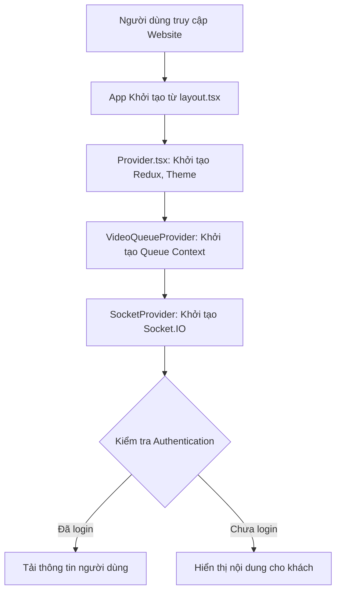
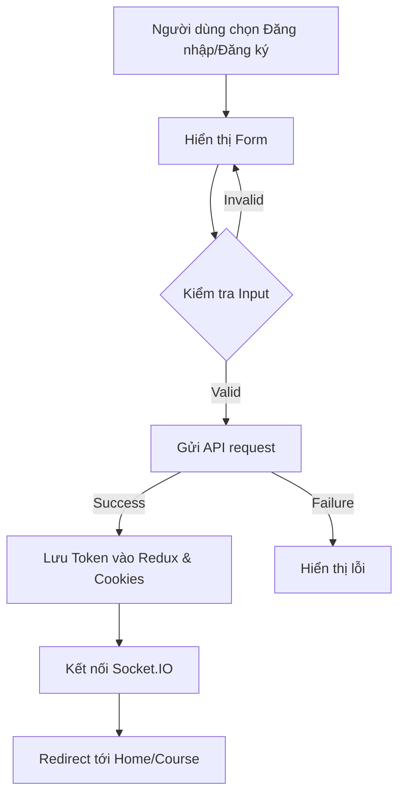
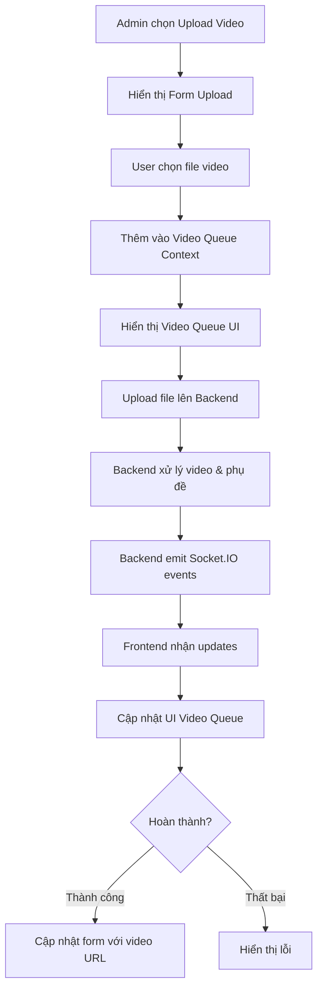
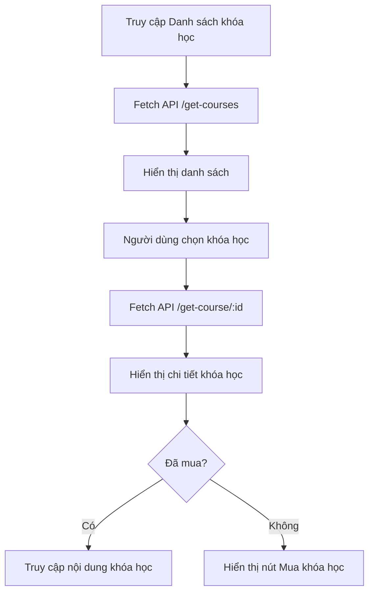
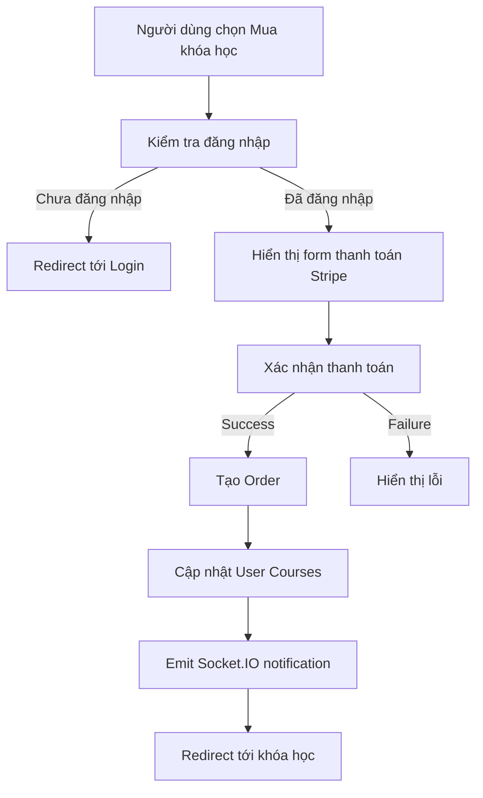
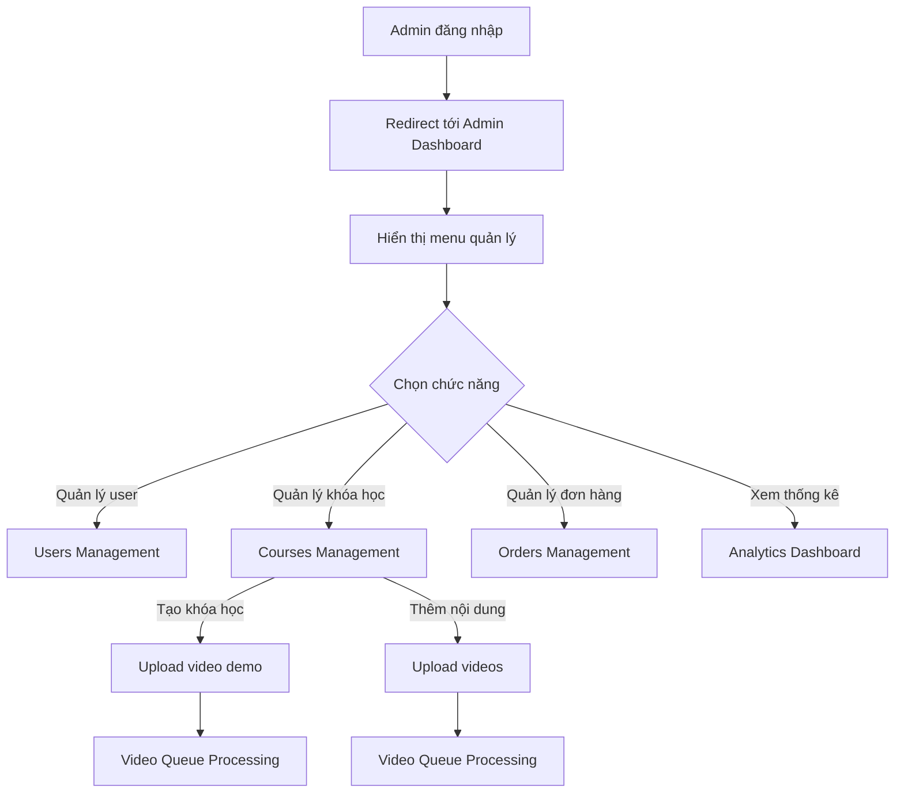
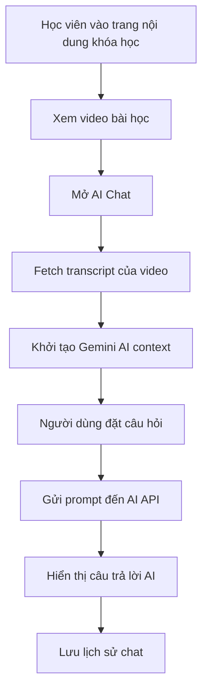
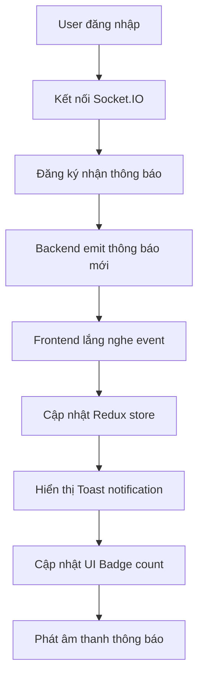

# Frontend Flow

## Cấu Trúc Dự Án Frontend

Dự án Frontend của E-Learning được xây dựng với Next.js, một framework React hỗ trợ Server-Side Rendering và Static Generation. Dưới đây là cấu trúc thư mục và luồng xử lý chính của dự án.

```
Frontend/
├── app/                    # Thư mục chính của Next.js App Router
│   ├── about/              # Trang giới thiệu
│   ├── admin/              # Các trang dành cho admin
│   ├── components/         # Các components dùng chung
│   │   ├── Admin/          # Components cho admin panel
│   │   ├── AI/             # Components tích hợp AI
│   │   ├── Auth/           # Components xác thực
│   │   ├── Course/         # Components cho khóa học
│   │   ├── FAQ/            # Components FAQ
│   │   ├── Loader/         # Components loading
│   │   ├── Payment/        # Components thanh toán
│   │   ├── Profile/        # Components trang cá nhân
│   │   ├── Review/         # Components đánh giá
│   │   ├── Route/          # Components định tuyến
│   │   ├── VideoQueue/     # Components quản lý video queue
│   │   ├── Footer.tsx      # Footer
│   │   └── Header.tsx      # Header
│   ├── contexts/           # React Contexts 
│   │   ├── VideoQueueContext.tsx # Context quản lý tiến trình xử lý video
│   │   └── SocketContext.tsx     # Context quản lý Socket.IO
│   ├── course/             # Trang chi tiết khóa học
│   ├── course-access/      # Trang truy cập nội dung khóa học
│   │   ├── [id]/           # Dynamic route cho khóa học 
│   │   └── ai/[id]/        # Chat AI cho khóa học
│   ├── courses/            # Trang danh sách khóa học
│   ├── faq/                # Trang câu hỏi thường gặp
│   ├── hooks/              # Custom hooks
│   │   ├── useVideoQueue.tsx    # Hook sử dụng VideoQueueContext
│   │   ├── useVideoUpload.tsx   # Hook upload và xử lý video
│   │   ├── useAuth.tsx          # Hook authentication
│   │   ├── adminProtected.tsx   # Hook bảo vệ route admin
│   │   └── userAuth.tsx         # Hook kiểm tra user auth
│   ├── policy/             # Trang chính sách
│   ├── profile/            # Trang cá nhân
│   ├── styles/             # Styles chung
│   ├── utils/              # Các hàm tiện ích
│   │   ├── CoursePlayer.tsx      # Trình phát video tùy chỉnh
│   │   ├── theme-provider.tsx    # Provider cho dark/light mode
│   │   └── socketConfig.ts       # Cấu hình Socket.IO
│   ├── globals.css         # CSS toàn cục
│   ├── layout.tsx          # Layout chung
│   ├── page.tsx            # Trang chủ
│   └── Provider.tsx        # Provider cho Redux và theme
├── pages/                  # Thư mục Pages Router (Next.js <13)
├── public/                 # Assets tĩnh
├── redux/                  # State management
│   ├── features/           # Redux slices
│   │   ├── analytics/      # Quản lý state analytics
│   │   ├── api/            # API slices (RTK Query)
│   │   ├── auth/           # Quản lý state authentication
│   │   ├── courses/        # Quản lý state courses
│   │   ├── layout/         # Quản lý state layout
│   │   ├── notifications/  # Quản lý state notifications
│   │   ├── orders/         # Quản lý state orders
│   │   ├── user/           # Quản lý state user
│   │   └── videoQueue/     # Quản lý state video processing
│   └── store.ts            # Redux store
├── .env                    # Environment variables
├── next.config.mjs         # Next.js config
├── package.json            # Dependencies
└── tsconfig.json           # TypeScript config
```

## Luồng Xử Lý Frontend

### 1. Khởi Tạo Ứng Dụng



#### Provider Hierarchy
1. **Redux Provider**: Global state management
2. **SessionProvider**: Next-Auth session
3. **ThemeProvider**: Dark/Light mode
4. **VideoQueueProvider**: Video processing state
5. **SocketProvider**: Realtime connection

### 2. Luồng Authentication



- **Đăng ký**: `/app/components/Auth/SignUp.tsx`
  - Gửi email, mật khẩu, tên
  - Nhận activation token
  - Hiển thị form xác thực (nhập mã)

- **Đăng nhập**: `/app/components/Auth/Login.tsx`
  - Gửi email, mật khẩu
  - Nhận access token
  - Lưu token vào Redux và cookies
  - Tự động kết nối Socket.IO

- **Social Auth**: Hỗ trợ đăng nhập qua mạng xã hội với NextAuth

### 3. Luồng Xử Lý Video



#### Video Queue Management
- **VideoQueueContext**: Quản lý trạng thái và tiến trình xử lý video
- **VideoQueue.tsx**: Component hiển thị hàng đợi video đang xử lý
- **VideoQueueItem.tsx**: Component hiển thị từng item trong queue
- **Socket Integration**: Nhận cập nhật tiến trình từ backend qua Socket.IO

### 4. Luồng Hiển Thị Khóa Học



#### Course Display Components
- **CourseCard**: Hiển thị card khóa học trong danh sách
- **CourseDetails**: Hiển thị chi tiết khóa học
- **CourseContent**: Hiển thị nội dung khóa học sau khi mua
- **CoursePlayer**: Trình phát video tùy chỉnh với phụ đề

### 5. Luồng Thanh Toán



#### Payment Components
- **CheckoutForm**: Form thanh toán Stripe
- **PayButton**: Nút thanh toán
- **PaymentSuccess**: Thông báo thanh toán thành công

### 6. Luồng Admin



#### Admin Components
- **DashboardLayout**: Layout chung cho khu vực admin
- **DashboardHero**: Header và thông tin tổng quan
- **Sidebar**: Thanh điều hướng admin
- **UsersTable**: Bảng quản lý người dùng
- **CoursesTable**: Bảng quản lý khóa học
- **CourseCreate**: Form tạo khóa học mới với hỗ trợ upload và xử lý video

### 7. Luồng AI Chat



#### AI Components
- **AiChat**: Component chính tương tác với Google Generative AI
- **VideoWithAI**: Kết hợp trình phát video và AI assistant
- **SummaryGenerator**: Tự động tạo tóm tắt nội dung video

### 8. Luồng Realtime Notifications



#### Notification Components
- **NotificationCenter**: Hiển thị danh sách thông báo
- **NotificationBadge**: Hiển thị số lượng thông báo chưa đọc
- **NotificationSound**: Phát âm thanh khi có thông báo mới

## State Management

### Redux Store
Dự án sử dụng Redux Toolkit và RTK Query để quản lý global state:

```typescript
// store.ts
import { configureStore } from "@reduxjs/toolkit";
import { apiSlice } from "./features/api/apiSlice";
import authReducer from "./features/auth/authSlice";
import videoQueueReducer from "./features/videoQueue/videoQueueSlice";
// ...other reducers

export const store = configureStore({
  reducer: {
    [apiSlice.reducerPath]: apiSlice.reducer,
    auth: authReducer,
    videoQueue: videoQueueReducer,
    // ...other reducers
  },
  middleware: (getDefaultMiddleware) =>
    getDefaultMiddleware().concat(apiSlice.middleware),
});
```

### Context API
Quản lý state cụ thể cho từng tính năng:

```typescript
// VideoQueueContext.tsx
"use client";
export const VideoQueueProvider: React.FC<{ children: React.ReactNode }> = ({ children }) => {
  const [queue, setQueue] = useState<VideoQueueItem[]>([]);
  const [socket, setSocket] = useState<Socket | null>(null);

  // Socket.IO setup for video progress updates
  useEffect(() => {
    const socketInstance = io(process.env.NEXT_PUBLIC_SOCKET_SERVER_URI || "");
    socketInstance.on("videoProgress", (data) => {
      // Update queue with progress from backend
      // ...
    });
    setSocket(socketInstance);
    return () => { socketInstance.disconnect(); };
  }, []);

  // Queue management methods
  // ...

  return (
    <VideoQueueContext.Provider value={{ queue, addToQueue, /* ... */ }}>
      {children}
    </VideoQueueContext.Provider>
  );
};
```

## Form Management

Dự án sử dụng Formik và Yup để quản lý form và validation:

```typescript
// Ví dụ sử dụng Formik và Yup trong Login
const loginSchema = Yup.object().shape({
  email: Yup.string()
    .email("Email không hợp lệ")
    .required("Vui lòng nhập email"),
  password: Yup.string().required("Vui lòng nhập mật khẩu"),
});

const formik = useFormik({
  initialValues: { email: "", password: "" },
  validationSchema: loginSchema,
  onSubmit: async ({ email, password }) => {
    // xử lý đăng nhập
  },
});
```

## Video Player Tích Hợp

### Custom Video Player
Dự án sử dụng custom video player với các tính năng:

```tsx
// app/utils/CoursePlayer.tsx
"use client";
import React, { useRef, useState, useEffect } from "react";
import toast from "react-hot-toast";
// ...

const CoursePlayer = ({ videoUrl, courseId, videoId, subtitles }: CoursePlayerProps) => {
  const videoRef = useRef<HTMLVideoElement>(null);
  const [isPlaying, setIsPlaying] = useState(false);
  const [currentTime, setCurrentTime] = useState(0);
  const [duration, setDuration] = useState(0);
  const [volume, setVolume] = useState(1);
  const [subtitleVisible, setSubtitleVisible] = useState(true);
  
  // Manage playback
  const togglePlay = () => {
    if (videoRef.current) {
      if (isPlaying) {
        videoRef.current.pause();
      } else {
        videoRef.current.play();
      }
      setIsPlaying(!isPlaying);
    }
  };
  
  // Track progress for analytics
  useEffect(() => {
    // Report progress to backend
    const interval = setInterval(() => {
      if (isPlaying && videoRef.current) {
        trackProgress(courseId, videoId, videoRef.current.currentTime, duration);
      }
    }, 30000); // Every 30 seconds
    
    return () => clearInterval(interval);
  }, [isPlaying, courseId, videoId, duration]);
  
  // Render subtitles
  const getCurrentSubtitle = () => {
    if (!subtitles || !subtitleVisible) return null;
    
    return subtitles.find(sub => 
      currentTime >= sub.start && currentTime <= sub.end
    )?.text || null;
  };
  
  return (
    <div className="relative">
      <video
        ref={videoRef}
        src={videoUrl}
        className="w-full rounded-lg"
        onTimeUpdate={() => setCurrentTime(videoRef.current?.currentTime || 0)}
        onDurationChange={() => setDuration(videoRef.current?.duration || 0)}
        onEnded={() => setIsPlaying(false)}
      />
      
      {/* Custom controls */}
      <div className="absolute bottom-0 left-0 right-0 bg-gradient-to-t from-black p-3">
        {/* Playback controls */}
        <div className="flex items-center gap-2">
          <button onClick={togglePlay}>
            {isPlaying ? <FiPause /> : <FiPlay />}
          </button>
          {/* Other controls */}
        </div>
        
        {/* Progress bar */}
        <div className="h-1 bg-gray-700 rounded-full mt-2">
          <div 
            className="h-full bg-blue-500 rounded-full"
            style={{ width: `${(currentTime / duration) * 100}%` }}
          />
        </div>
      </div>
      
      {/* Subtitles */}
      {getCurrentSubtitle() && (
        <div className="absolute bottom-16 left-0 right-0 text-center">
          <div className="inline-block bg-black bg-opacity-70 px-4 py-1 rounded text-white">
            {getCurrentSubtitle()}
          </div>
        </div>
      )}
      
      {/* AI chat button */}
      <div className="absolute top-2 right-2">
        <button 
          className="bg-blue-600 text-white p-2 rounded-full"
          onClick={() => openAIChat(courseId, videoId)}
        >
          <FiMessageSquare />
        </button>
      </div>
    </div>
  );
};
```

## Realtime Features

### Socket.IO Integration

```tsx
// Tích hợp Socket.IO với React
"use client";
import { useEffect } from "react";
import { useSelector } from "react-redux";
import { socket } from "@/utils/socket";

const NotificationListener = () => {
  const { user } = useSelector(state => state.auth);
  
  useEffect(() => {
    if (!user || !user._id) return;
    
    // Đăng ký nhận thông báo
    socket.emit("registerUser", { userId: user._id });
    
    // Lắng nghe thông báo mới
    socket.on("newNotification", (data) => {
      // Xử lý thông báo
      toast.success(data.title, {
        description: data.message,
      });
      
      // Phát âm thanh
      const audio = new Audio("/assets/notification.mp3");
      audio.play().catch(err => console.error("Could not play sound", err));
    });
    
    return () => {
      socket.off("newNotification");
    };
  }, [user]);
  
  return null; // Component không render UI
};
```

### Video Queue

```tsx
// components/VideoQueue/VideoQueue.tsx
"use client";
import React, { useState } from "react";
import { useVideoQueue } from "@/app/contexts/VideoQueueContext";
import VideoQueueItem from "./VideoQueueItem";
import { FiXCircle, FiChevronDown, FiChevronUp } from "react-icons/fi";

const VideoQueue: React.FC = () => {
  const { queue, clearQueue } = useVideoQueue();
  const [isCollapsed, setIsCollapsed] = useState(false);
  
  // Không hiển thị nếu không có video trong queue
  if (queue.length === 0) {
    return null;
  }
  
  // Đếm các videos theo trạng thái
  const countByStatus = {
    pending: queue.filter(item => item.status === "pending").length,
    processing: queue.filter(item => item.status === "processing").length,
    success: queue.filter(item => item.status === "success").length,
    error: queue.filter(item => item.status === "error").length,
  };
  
  return (
    <div className="fixed bottom-4 right-4 w-80 bg-white dark:bg-gray-800 rounded-lg shadow-lg z-50 max-h-[70vh] flex flex-col">
      {/* Header */}
      <div className="p-3 border-b dark:border-gray-700 flex items-center justify-between bg-gray-50 dark:bg-gray-900 rounded-t-lg">
        <div className="flex items-center">
          <h3 className="text-sm font-semibold">Video Upload Queue</h3>
          <div className="flex ml-2 text-xs">
            {countByStatus.processing > 0 && (
              <span className="bg-blue-100 text-blue-800 dark:bg-blue-900 dark:text-blue-300 px-2 py-0.5 rounded-full mr-1">
                {countByStatus.processing} processing
              </span>
            )}
            {/* Other status badges */}
          </div>
        </div>
        <div className="flex items-center">
          <button onClick={() => setIsCollapsed(!isCollapsed)}>
            {isCollapsed ? <FiChevronUp /> : <FiChevronDown />}
          </button>
          <button onClick={clearQueue}>
            <FiXCircle />
          </button>
        </div>
      </div>
      
      {/* Queue content */}
      {!isCollapsed && (
        <div className="p-2 overflow-y-auto">
          {queue.map((item) => (
            <VideoQueueItem key={item.processId} item={item} />
          ))}
        </div>
      )}
    </div>
  );
};
```

## Routing

Dự án sử dụng Next.js App Router (app directory) với các tính năng:

- **Dynamic Routes**: Đường dẫn động (e.g., `/course/[id]`)
- **Layout**: Layout chung cho nhiều trang
- **Server Components**: Components render từ server
- **Client Components**: Components render từ client (với "use client" directive)

### Admin Route Protection Example

```tsx
// app/hooks/adminProtected.tsx
"use client";
import { useSelector } from "react-redux";
import { redirect } from "next/navigation";
import { useEffect } from "react";
import { useLoadUserQuery } from "@/redux/features/api/apiSlice";

export default function AdminProtected({
  children,
}: {
  children: React.ReactNode;
}) {
  const { user, token } = useSelector((state: any) => state.auth);
  const { isLoading } = useLoadUserQuery(undefined, {
    skip: !token,
  });

  useEffect(() => {
    if (!isLoading) {
      if (!token) {
        redirect("/login");
      }
      if (user && user.role !== "admin") {
        redirect("/");
      }
    }
  }, [isLoading, token, user]);

  if (isLoading) {
    return <div>Loading...</div>;
  }

  return <>{children}</>;
}
```

## Styling

Dự án sử dụng kết hợp:

- **Tailwind CSS**: Utility-first CSS framework
- **Material UI**: Component library
- **CSS Modules**: CSS cô lập theo component
- **Dark Mode**: Hỗ trợ chuyển đổi dark/light mode

```tsx
// app/utils/ThemeSwitcher.tsx
"use client";
import { useState, useEffect } from "react";
import { useTheme } from "next-themes";
import { RiMoonFill, RiSunFill } from "react-icons/ri";

export const ThemeSwitcher = () => {
  const [mounted, setMounted] = useState(false);
  const { theme, setTheme } = useTheme();

  useEffect(() => {
    setMounted(true);
  }, []);

  if (!mounted) {
    return null;
  }

  return (
    <button
      onClick={() => setTheme(theme === "dark" ? "light" : "dark")}
      className="rounded-full p-2 hover:bg-gray-100 dark:hover:bg-gray-800"
    >
      {theme === "dark" ? (
        <RiSunFill className="text-white" />
      ) : (
        <RiMoonFill className="text-gray-800" />
      )}
    </button>
  );
};
```

## Tối Ưu Hóa Performance

### Code-Splitting và Lazy Loading

```tsx
// Lazy load components
import dynamic from "next/dynamic";

// Lazy load AI chat component (only when needed)
const AiChat = dynamic(() => import("../components/AI/AiChat"), {
  loading: () => <div>Loading AI Chat...</div>,
  ssr: false, // Disable server-side rendering
});
```

### Image Optimization

```tsx
// Sử dụng Next.js Optimized Images
import Image from "next/image";

const CourseCard = ({ course }) => (
  <div className="card">
    <Image
      src={course.thumbnail.url}
      alt={course.name}
      width={300}
      height={200}
      priority={false}
      loading="lazy"
      className="rounded-lg"
    />
    {/* Card content */}
  </div>
);
```

## Tích Hợp Bên Thứ Ba

- **Stripe**: Xử lý thanh toán
- **Google Generative AI**: Chat AI trong khóa học
- **Socket.IO**: Realtime notifications và video processing updates
- **Cloudinary**: Lưu trữ và streaming video

## Responsive Design

Dự án hỗ trợ đầy đủ cho các kích thước màn hình thông qua Tailwind CSS:

```tsx
// Responsive example
<div className="grid grid-cols-1 md:grid-cols-2 lg:grid-cols-3 xl:grid-cols-4 gap-4">
  {courses.map(course => (
    <CourseCard key={course._id} course={course} />
  ))}
</div>
```