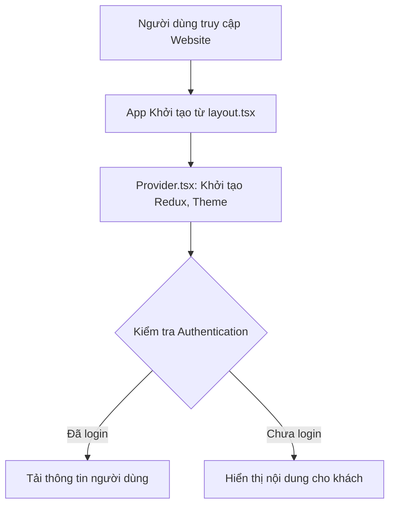
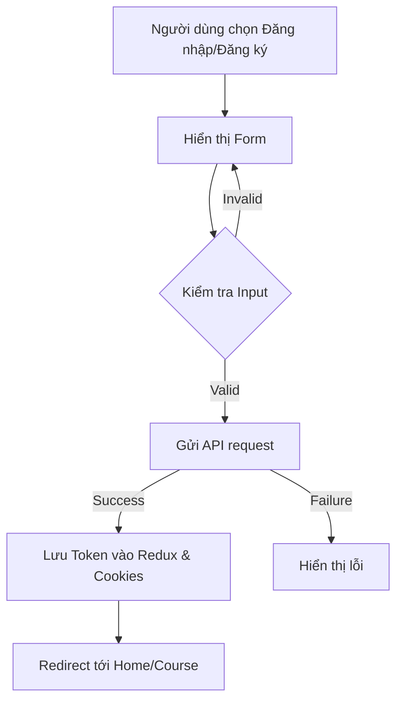
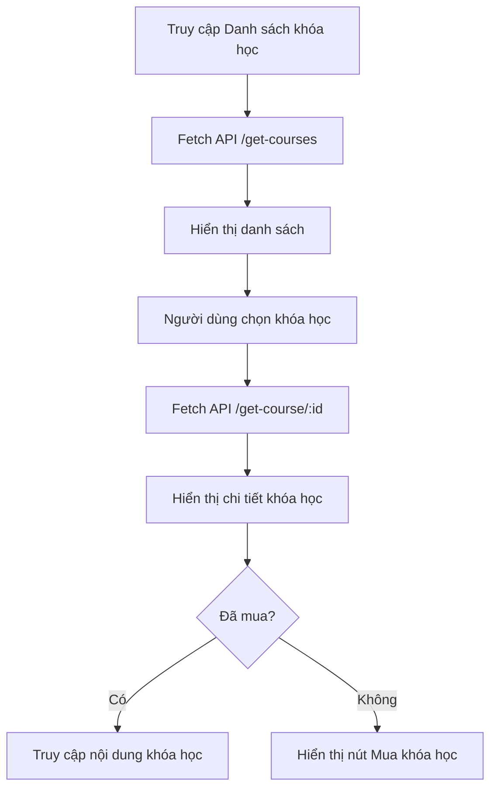
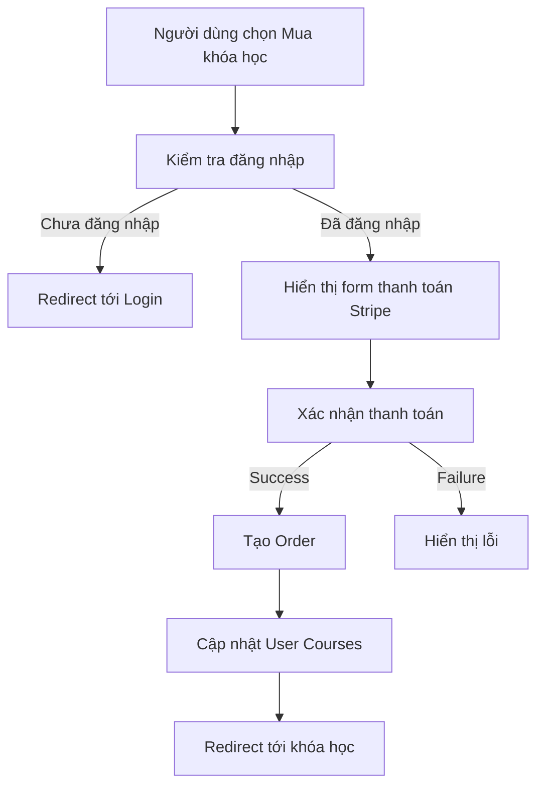
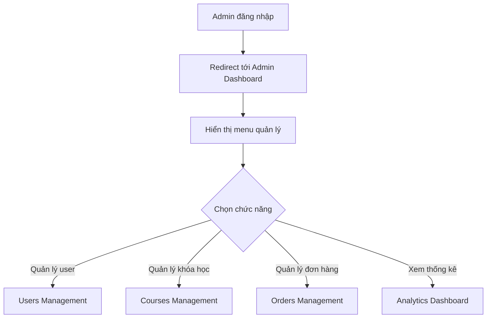
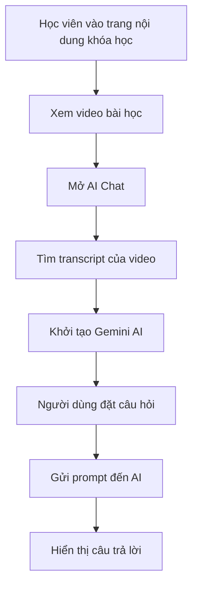

# Frontend Flow

## Cấu Trúc Dự Án Frontend

Dự án Frontend của E-Learning được xây dựng với Next.js, một framework React hỗ trợ Server-Side Rendering và Static Generation. Dưới đây là cấu trúc thư mục và luồng xử lý chính của dự án.

```
Frontend/
├── app/                    # Thư mục chính của Next.js App Router
│   ├── about/              # Trang giới thiệu
│   ├── admin/              # Các trang dành cho admin
│   ├── components/         # Các components dùng chung
│   │   ├── Admin/          # Components cho admin panel
│   │   ├── AI/             # Components tích hợp AI
│   │   ├── Auth/           # Components xác thực
│   │   ├── Course/         # Components cho khóa học
│   │   ├── FAQ/            # Components FAQ
│   │   ├── Loader/         # Components loading
│   │   ├── Payment/        # Components thanh toán
│   │   ├── Profile/        # Components trang cá nhân
│   │   ├── Review/         # Components đánh giá
│   │   ├── Route/          # Components định tuyến
│   │   ├── Footer.tsx      # Footer
│   │   └── Header.tsx      # Header
│   ├── course/             # Trang chi tiết khóa học
│   ├── course-access/      # Trang truy cập nội dung khóa học
│   ├── courses/            # Trang danh sách khóa học
│   ├── faq/                # Trang câu hỏi thường gặp
│   ├── hooks/              # Custom hooks
│   ├── policy/             # Trang chính sách
│   ├── profile/            # Trang cá nhân
│   ├── styles/             # Styles chung
│   ├── utils/              # Các hàm tiện ích
│   ├── globals.css         # CSS toàn cục
│   ├── layout.tsx          # Layout chung
│   ├── page.tsx            # Trang chủ
│   └── Provider.tsx        # Provider cho Redux và theme
├── pages/                  # Thư mục Pages Router (Next.js <13)
├── public/                 # Assets tĩnh
├── redux/                  # State management
│   ├── features/           # Redux slices
│   │   ├── analytics/      # Quản lý state analytics
│   │   ├── api/            # API slices (RTK Query)
│   │   ├── auth/           # Quản lý state authentication
│   │   ├── courses/        # Quản lý state courses
│   │   ├── layout/         # Quản lý state layout
│   │   ├── notifications/  # Quản lý state notifications
│   │   ├── orders/         # Quản lý state orders
│   │   └── user/           # Quản lý state user
│   └── store.ts            # Redux store
├── .env                    # Environment variables
├── next.config.mjs         # Next.js config
├── package.json            # Dependencies
└── tsconfig.json           # TypeScript config
```

## Luồng Xử Lý Frontend

### 1. Khởi Tạo Ứng Dụng



#### Provider.tsx
- Cung cấp Redux Provider
- Cung cấp Theme Provider (DarkMode/LightMode)
- Quản lý cấu hình NextAuth

#### Layout.tsx
- Định nghĩa layout cơ bản với Header, Footer
- Đóng vai trò là Root Layout cho tất cả trang

### 2. Luồng Authentication



- **Đăng ký**: `/app/components/Auth/SignUp.tsx`
  - Gửi email, mật khẩu, tên
  - Nhận activation token
  - Hiển thị form xác thực (nhập mã)

- **Đăng nhập**: `/app/components/Auth/Login.tsx`
  - Gửi email, mật khẩu
  - Nhận access token
  - Lưu token vào Redux và cookies

- **Social Auth**: Hỗ trợ đăng nhập qua mạng xã hội với NextAuth

### 3. Luồng Hiển Thị Khóa Học



#### Course Display Components
- **CourseCard**: Hiển thị card khóa học trong danh sách
- **CourseDetails**: Hiển thị chi tiết khóa học
- **CourseContent**: Hiển thị nội dung khóa học sau khi mua

### 4. Luồng Thanh Toán



#### Payment Components
- **CheckoutForm**: Form thanh toán Stripe
- **PayButton**: Nút thanh toán
- **PaymentSuccess**: Thông báo thanh toán thành công

### 5. Luồng Admin



#### Admin Components
- **DashboardLayout**: Layout chung cho khu vực admin
- **DashboardHero**: Header và thông tin tổng quan
- **Sidebar**: Thanh điều hướng admin
- **UsersTable**: Bảng quản lý người dùng
- **CoursesTable**: Bảng quản lý khóa học
- **CourseCreate**: Form tạo khóa học mới

### 6. Luồng AI Chat



#### AI Components
- **AiChat**: Component chính tương tác với Google Generative AI
- Tích hợp với transcript của video để cung cấp ngữ cảnh cho AI

## State Management với Redux

Dự án sử dụng Redux Toolkit và RTK Query để quản lý state và API calls.

### Cấu trúc Redux Store

```
redux/
├── features/
│   ├── api/
│   │   └── apiSlice.ts        # Base API configuration
│   ├── auth/
│   │   └── authSlice.ts       # Authentication state
│   ├── courses/
│   │   ├── coursesApi.ts      # Course-related API endpoints
│   │   └── coursesSlice.ts    # Course state
│   └── ... (other slices)
└── store.ts                  # Redux store configuration
```

### Redux Slices
- **auth**: Quản lý trạng thái đăng nhập, đăng ký, đăng xuất
- **courses**: Quản lý danh sách và chi tiết khóa học
- **orders**: Quản lý đơn hàng và thanh toán
- **user**: Quản lý thông tin người dùng
- **layout**: Quản lý giao diện (banner, categories, FAQ)
- **analytics**: Quản lý dữ liệu thống kê
- **notifications**: Quản lý thông báo

### RTK Query API
- **authApi**: Endpoints xác thực
- **coursesApi**: Endpoints khóa học
- **ordersApi**: Endpoints đơn hàng
- **userApi**: Endpoints người dùng

## Form Management

Dự án sử dụng Formik và Yup để quản lý form và validation:

```typescript
// Ví dụ sử dụng Formik và Yup trong Login
const loginSchema = Yup.object().shape({
  email: Yup.string()
    .email("Email không hợp lệ")
    .required("Vui lòng nhập email"),
  password: Yup.string().required("Vui lòng nhập mật khẩu"),
});

const formik = useFormik({
  initialValues: { email: "", password: "" },
  validationSchema: loginSchema,
  onSubmit: async ({ email, password }) => {
    // xử lý đăng nhập
  },
});
```

## Routing

Dự án sử dụng Next.js App Router (app directory) với các tính năng:

- **Dynamic Routes**: Đường dẫn động (e.g., `/course/[id]`)
- **Layout**: Layout chung cho nhiều trang
- **Server Components**: Components render từ server
- **Client Components**: Components render từ client (với "use client" directive)

## Styling

Dự án sử dụng kết hợp:

- **Tailwind CSS**: Utility-first CSS framework
- **Material UI**: Component library
- **CSS Modules**: CSS cô lập theo component

## Tích Hợp Bên Thứ Ba

- **Stripe**: Xử lý thanh toán
- **Google Generative AI**: Chat AI trong khóa học
- **Socket.IO**: Realtime notifications

## Responsive Design

Dự án hỗ trợ đầy đủ cho các kích thước màn hình:
- Desktop
- Tablet
- Mobile

Sử dụng Tailwind CSS breakpoints và MUI responsive components.