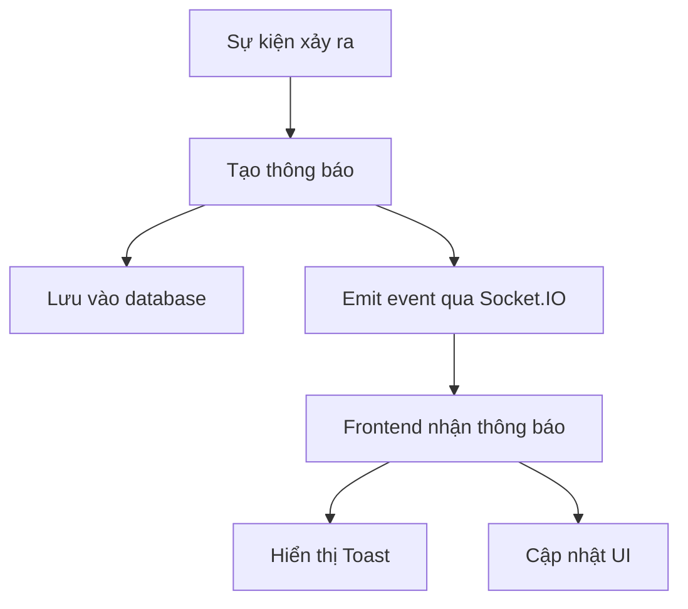
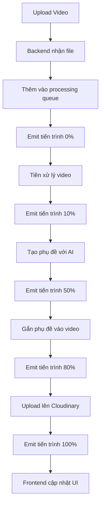

# Tính Năng Realtime Trong Dự Án E-Learning

Dự án E-Learning tích hợp tính năng realtime thông qua Socket.IO để cung cấp trải nghiệm tương tác, cập nhật dữ liệu ngay lập tức và thông báo thời gian thực cho người dùng. Tài liệu này mô tả chi tiết về các tính năng realtime và cách chúng được triển khai trong dự án.

## 1. Tổng Quan Về Tính Năng Realtime

### 1.1. Công Nghệ Sử Dụng

- **Socket.IO**: Thư viện WebSocket chính được sử dụng để kết nối realtime
- **Redis**: Adapter cho Socket.IO để hỗ trợ scaling nhiều node
- **MongoDB Change Streams**: Lắng nghe thay đổi dữ liệu từ MongoDB

### 1.2. Các Tính Năng Realtime Chính

1. **Thông Báo Realtime**:
   - Thông báo về các sự kiện hệ thống
   - Thông báo khi có người mua khóa học
   - Thông báo bình luận và trả lời

2. **Chat Trực Tiếp**:
   - Chat với giảng viên
   - Hỗ trợ trực tiếp từ admin

3. **Cập Nhật Trạng Thái**:
   - Hiển thị trạng thái online của người dùng
   - Hiển thị trạng thái xem video của học viên

4. **Cập Nhật Dữ Liệu Realtime**:
   - Hiển thị số lượng người đang xem khóa học
   - Cập nhật điểm đánh giá và bình luận mới

5. **Hàng Đợi Xử Lý Video (Video Queue)**:
   - Hiển thị tiến trình xử lý video theo thời gian thực
   - Cập nhật trạng thái upload, xử lý, tạo phụ đề, và hoàn thành

## 2. Kiến Trúc Socket.IO

### 2.1. Cấu Hình Socket Server

```typescript
// Backend/socketServer.ts
import { Server as SocketIOServer } from "socket.io";
import http from "http";
import Redis from "ioredis";
import { createAdapter } from "@socket.io/redis-adapter";

// Khởi tạo Redis clients
const pubClient = new Redis(process.env.REDIS_URL || "redis://localhost:6379");
const subClient = pubClient.duplicate();

// Khởi tạo Socket.IO server
export const initSocketServer = (server: http.Server) => {
  const io = new SocketIOServer(server, {
    cors: {
      origin: process.env.ORIGIN?.split(",") || ["http://localhost:3000"],
      credentials: true,
    },
    adapter: createAdapter(pubClient, subClient),
    transports: ["websocket", "polling"],
  });

  // Xác thực người dùng khi kết nối
  io.use(async (socket, next) => {
    try {
      const token = socket.handshake.auth.token;
      
      if (!token) {
        return next(new Error("Authentication error"));
      }
      
      // Xác thực token
      const decoded = jwt.verify(token, process.env.ACCESS_TOKEN as string);
      socket.data.user = decoded;
      
      next();
    } catch (error) {
      next(new Error("Authentication error"));
    }
  });

  // Xử lý kết nối
  io.on("connection", (socket) => {
    console.log(`User connected: ${socket.id}`);

    // Tham gia room cá nhân dựa trên user ID
    if (socket.data.user?.id) {
      socket.join(`user:${socket.data.user.id}`);
    }

    // Xử lý thông báo
    socket.on("notification", (data) => {
      // Lưu thông báo vào DB
      saveNotificationToDB(data);
      
      // Gửi thông báo đến admin hoặc người dùng cụ thể
      if (data.userId) {
        io.to(`user:${data.userId}`).emit("newNotification", data);
      }
      
      // Gửi thông báo đến admin nếu cần
      if (data.toAdmin) {
        io.to("admin").emit("newNotification", data);
      }
    });

    // Xử lý tiến trình xử lý video
    socket.on("videoProgress", (data) => {
      if (data.userId) {
        // Gửi cập nhật tiến trình video đến người dùng cụ thể
        io.to(`user:${data.userId}`).emit("videoProgress", data);
      }
    });

    // Xử lý ngắt kết nối
    socket.on("disconnect", () => {
      console.log(`User disconnected: ${socket.id}`);
      
      // Xử lý các hành động khi người dùng ngắt kết nối
      // ...
    });
  });

  return io;
};
```

## 3. Hệ Thống Hàng Đợi Video (Video Queue)

### 3.1. VideoQueueContext (Frontend)

Quản lý trạng thái và hiển thị tiến trình xử lý video trên giao diện người dùng.

```tsx
// Frontend/app/contexts/VideoQueueContext.tsx
"use client";
import React, { createContext, useContext, useEffect, useState } from "react";
import { toast } from "react-hot-toast";
import io, { Socket } from "socket.io-client";

// Khai báo kiểu dữ liệu cho video trong queue
export interface VideoQueueItem {
  processId: string;
  fileName: string;
  progress: number;
  message: string;
  status: "pending" | "processing" | "success" | "error";
  result?: {
    publicId?: string;
    url?: string;
    duration?: number;
    format?: string;
    error?: string;
    warning?: string;
  };
  uploadType: "demo" | "content";
  contentIndex?: number; // Chỉ dùng cho content videos
  timestamp: number;
}

interface VideoQueueContextType {
  queue: VideoQueueItem[];
  addToQueue: (item: Omit<VideoQueueItem, "progress" | "message" | "status" | "timestamp">) => void;
  updateQueueItem: (processId: string, data: Partial<VideoQueueItem>) => void;
  removeFromQueue: (processId: string) => void;
  clearQueue: () => void;
  setVideoUrlFromQueue: (
    uploadType: "demo" | "content", 
    contentIndex?: number
  ) => { publicId?: string; duration?: number };
}

// Tạo context
const VideoQueueContext = createContext<VideoQueueContextType | undefined>(undefined);

// Provider Component
export const VideoQueueProvider: React.FC<{ children: React.ReactNode }> = ({ children }) => {
  const [queue, setQueue] = useState<VideoQueueItem[]>([]);
  const [socket, setSocket] = useState<Socket | null>(null);

  // Kết nối Socket.IO khi component mount
  useEffect(() => {
    // Kết nối đến Socket.IO server
    const socketInstance = io(process.env.NEXT_PUBLIC_SOCKET_SERVER_URI || "", {
      path: "/socket.io",
      transports: ["polling", "websocket"]
    });
    
    socketInstance.on("connect", () => {
      console.log("Socket connected for video queue updates");
    });
    
    socketInstance.on("disconnect", () => {
      console.log("Socket disconnected from video queue updates");
    });
    
    // Lắng nghe cập nhật tiến độ video
    socketInstance.on("videoProgress", (data: any) => {
      console.log("Video progress update:", data);
      
      // Cập nhật item trong queue
      setQueue((prevQueue) => {
        // Tìm video trong queue
        const index = prevQueue.findIndex(item => item.processId === data.processId);
        
        if (index !== -1) {
          // Cập nhật thông tin
          const updatedQueue = [...prevQueue];
          updatedQueue[index] = {
            ...updatedQueue[index],
            progress: data.progress,
            message: data.message,
            status: data.progress === 100 
              ? data.result?.error ? "error" : "success" 
              : "processing",
            result: data.result,
            timestamp: data.timestamp,
          };

          // Thông báo khi hoàn thành
          if (data.progress === 100) {
            if (data.result?.error) {
              toast.error(`Upload failed: ${data.message}`);
            } else {
              toast.success(`Upload complete: ${updatedQueue[index].fileName}`);
            }
          }
          
          return updatedQueue;
        }
        
        return prevQueue;
      });
    });
    
    setSocket(socketInstance);
    
    // Cleanup khi unmount
    return () => {
      socketInstance.disconnect();
    };
  }, []);

  // Thêm video vào queue
  const addToQueue = (item: Omit<VideoQueueItem, "progress" | "message" | "status" | "timestamp">) => {
    const newItem: VideoQueueItem = {
      ...item,
      progress: 0,
      message: "Waiting to process...",
      status: "pending",
      timestamp: Date.now(),
    };
    
    setQueue((prev) => [...prev, newItem]);
  };

  // Cập nhật thông tin của một video trong queue
  const updateQueueItem = (processId: string, data: Partial<VideoQueueItem>) => {
    setQueue((prev) => 
      prev.map((item) => 
        item.processId === processId ? { ...item, ...data } : item
      )
    );
  };

  // Xóa video khỏi queue
  const removeFromQueue = (processId: string) => {
    setQueue((prev) => prev.filter((item) => item.processId !== processId));
  };

  // Xóa toàn bộ queue
  const clearQueue = () => {
    setQueue([]);
  };

  // Lấy thông tin publicId và duration từ video đã upload thành công
  // để cập nhật vào form
  const setVideoUrlFromQueue = (uploadType: "demo" | "content", contentIndex?: number) => {
    // Tìm video phù hợp nhất trong queue (mới nhất, đã hoàn thành, đúng loại)
    const matchedVideos = queue.filter(item => 
      item.uploadType === uploadType && 
      item.status === "success" &&
      (uploadType === "content" ? item.contentIndex === contentIndex : true)
    );
    
    if (matchedVideos.length === 0) {
      return { publicId: undefined, duration: undefined };
    }
    
    // Lấy video mới nhất
    const latestVideo = matchedVideos.sort((a, b) => b.timestamp - a.timestamp)[0];
    
    return { 
      publicId: latestVideo.result?.publicId,
      duration: latestVideo.result?.duration
    };
  };

  return (
    <VideoQueueContext.Provider
      value={{
        queue,
        addToQueue,
        updateQueueItem,
        removeFromQueue,
        clearQueue,
        setVideoUrlFromQueue,
      }}
    >
      {children}
    </VideoQueueContext.Provider>
  );
};

// Custom hook để sử dụng context
export const useVideoQueue = () => {
  const context = useContext(VideoQueueContext);
  if (context === undefined) {
    throw new Error("useVideoQueue must be used within a VideoQueueProvider");
  }
  return context;
};
```

### 3.2. VideoQueue Component

Hiển thị danh sách video đang được xử lý và tiến trình của chúng.

```tsx
// Frontend/app/components/VideoQueue/VideoQueue.tsx
"use client";
import React, { useState } from "react";
import { useVideoQueue } from "@/app/contexts/VideoQueueContext";
import VideoQueueItem from "./VideoQueueItem";
import { FiXCircle, FiChevronDown, FiChevronUp } from "react-icons/fi";

const VideoQueue: React.FC = () => {
  const { queue, clearQueue } = useVideoQueue();
  const [isCollapsed, setIsCollapsed] = useState(false);
  
  // Không hiển thị nếu không có video trong queue
  if (queue.length === 0) {
    return null;
  }
  
  // Đếm các videos theo trạng thái
  const countByStatus = {
    pending: queue.filter(item => item.status === "pending").length,
    processing: queue.filter(item => item.status === "processing").length,
    success: queue.filter(item => item.status === "success").length,
    error: queue.filter(item => item.status === "error").length,
  };
  
  return (
    <div className="fixed bottom-4 right-4 w-80 bg-white dark:bg-gray-800 rounded-lg shadow-lg z-50 max-h-[70vh] flex flex-col">
      {/* Header */}
      <div className="p-3 border-b dark:border-gray-700 flex items-center justify-between bg-gray-50 dark:bg-gray-900 rounded-t-lg">
        <div className="flex items-center">
          <h3 className="text-sm font-semibold">Video Upload Queue</h3>
          <div className="flex ml-2 text-xs">
            {countByStatus.processing > 0 && (
              <span className="bg-blue-100 text-blue-800 dark:bg-blue-900 dark:text-blue-300 px-2 py-0.5 rounded-full mr-1">
                {countByStatus.processing} processing
              </span>
            )}
            {countByStatus.success > 0 && (
              <span className="bg-green-100 text-green-800 dark:bg-green-900 dark:text-green-300 px-2 py-0.5 rounded-full mr-1">
                {countByStatus.success} done
              </span>
            )}
            {countByStatus.error > 0 && (
              <span className="bg-red-100 text-red-800 dark:bg-red-900 dark:text-red-300 px-2 py-0.5 rounded-full">
                {countByStatus.error} failed
              </span>
            )}
          </div>
        </div>
        <div className="flex items-center">
          <button 
            onClick={() => setIsCollapsed(!isCollapsed)}
            className="text-gray-500 hover:text-gray-700 dark:text-gray-400 dark:hover:text-gray-300 mr-2"
          >
            {isCollapsed ? <FiChevronUp size={18} /> : <FiChevronDown size={18} />}
          </button>
          <button 
            onClick={clearQueue}
            className="text-gray-500 hover:text-gray-700 dark:text-gray-400 dark:hover:text-gray-300"
          >
            <FiXCircle size={18} />
          </button>
        </div>
      </div>
      
      {/* Queue content */}
      {!isCollapsed && (
        <div className="p-2 overflow-y-auto">
          {queue.length === 0 ? (
            <p className="text-center text-gray-500 text-sm py-4">No videos in queue</p>
          ) : (
            queue.map((item) => (
              <VideoQueueItem key={item.processId} item={item} />
            ))
          )}
        </div>
      )}
    </div>
  );
};

export default VideoQueue;
```

### 3.3. VideoQueueItem Component

Hiển thị thông tin chi tiết và tiến trình của từng video.

```tsx
// Frontend/app/components/VideoQueue/VideoQueueItem.tsx
"use client";
import React from "react";
import { VideoQueueItem as VideoQueueItemType } from "@/app/contexts/VideoQueueContext";
import { FiFile, FiCheckCircle, FiAlertCircle, FiClock } from "react-icons/fi";

interface Props {
  item: VideoQueueItemType;
}

const VideoQueueItem: React.FC<Props> = ({ item }) => {
  // Hàm định dạng thời gian từ duration (seconds)
  const formatDuration = (seconds?: number) => {
    if (!seconds) return "Unknown";
    
    const minutes = Math.floor(seconds / 60);
    const remainingSeconds = Math.floor(seconds % 60);
    
    return `${minutes}:${remainingSeconds < 10 ? '0' : ''}${remainingSeconds}`;
  };

  // Xác định icon theo trạng thái
  const getStatusIcon = () => {
    switch (item.status) {
      case "success":
        return <FiCheckCircle className="text-green-500" size={18} />;
      case "error":
        return <FiAlertCircle className="text-red-500" size={18} />;
      case "processing":
        return (
          <div className="h-4 w-4 border-2 border-blue-500 border-t-transparent rounded-full animate-spin"></div>
        );
      default:
        return <FiClock className="text-gray-400" size={18} />;
    }
  };

  // Truncate file name if too long
  const truncateFileName = (name: string, maxLength = 25) => {
    if (name.length <= maxLength) return name;
    
    const extension = name.split('.').pop() || '';
    const nameWithoutExt = name.substring(0, name.length - extension.length - 1);
    
    const truncatedName = nameWithoutExt.substring(0, maxLength - 3 - extension.length);
    return `${truncatedName}...${extension}`;
  };

  return (
    <div className="bg-white dark:bg-gray-800 rounded-lg shadow-sm p-3 mb-2">
      <div className="flex items-center justify-between mb-2">
        <div className="flex items-center">
          <FiFile className="mr-2 text-gray-400" size={16} />
          <span className="font-medium text-sm" title={item.fileName}>
            {truncateFileName(item.fileName)}
          </span>
        </div>
        <div className="flex items-center">
          <span className="text-xs text-gray-500 mr-2">
            {item.status === "success" && item.result?.duration && 
              `${formatDuration(item.result.duration)}`
            }
          </span>
          {getStatusIcon()}
        </div>
      </div>
      
      {/* Progress bar */}
      <div className="w-full bg-gray-200 dark:bg-gray-700 rounded-full h-1.5">
        <div 
          className={`h-1.5 rounded-full ${
            item.status === "error" 
              ? "bg-red-500" 
              : item.status === "success" 
                ? "bg-green-500" 
                : "bg-blue-500"
          }`}
          style={{ width: `${item.progress}%` }}
        ></div>
      </div>
      
      {/* Message */}
      <p className="text-xs text-gray-500 mt-1">{item.message}</p>
    </div>
  );
};

export default VideoQueueItem;
```

### 3.4. Tích Hợp Video Queue với App Layout

```tsx
// Frontend/app/layout.tsx
"use client";
import type { Metadata } from "next";
import { Inter, Poppins, Josefin_Sans } from "next/font/google";
import "./globals.css";
import { ThemeProvider } from "./utils/theme-provider";
import { Toaster } from "react-hot-toast";
import { Providers } from "./Provider";
import { SessionProvider } from "next-auth/react";
import React, { FC, useEffect } from "react";
import { VideoQueueProvider } from "./contexts/VideoQueueContext";
import VideoQueue from "./components/VideoQueue/VideoQueue";
import { useLoadUserQuery } from "@/redux/features/api/apiSlice";
import Loader from "./components/Loader/Loader";
import socketIO from "socket.io-client";
const ENDPOINT = process.env.NEXT_PUBLIC_SOCKET_SERVER_URI || "";
const socketId = socketIO(ENDPOINT, { transports: ["websocket"] });

const poppins = Poppins({
  subsets: ["latin"],
  weight: ["400", "500", "600", "700"],
  variable: "--font-Poppins",
});

const josefin = Josefin_Sans({
  subsets: ["latin"],
  weight: ["400", "500", "600", "700"],
  variable: "--font-Josefin",
});

export default function RootLayout({
  children,
}: Readonly<{
  children: React.ReactNode;
}>) {
  return (
    <html lang="en" suppressHydrationWarning={true}>
      <body
        className={`${poppins.variable} ${josefin.variable} !bg-white bg-no-repeat dark:bg-gradient-to-b dark:from-gray-900 dark:to-black duration-300`}
      >
        <Providers>
          <SessionProvider>
            <ThemeProvider attribute="class" defaultTheme="system" enableSystem>
              <Custom>{children}</Custom>
              <Toaster position="top-center" reverseOrder={false} />
            </ThemeProvider>
          </SessionProvider>
        </Providers>
      </body>
    </html>
  );
}

const Custom: FC<{ children: React.ReactNode }> = ({ children }) => {
  const { isLoading } = useLoadUserQuery({});

  useEffect(() => {
    socketId.on("connection", () => {});
  }, []);

  return (
    <VideoQueueProvider>
      <div>{isLoading ? <Loader /> : <div>{children} <VideoQueue /></div>}</div>
    </VideoQueueProvider>
  );
};
```

## 4. Thông Báo Realtime

### 4.1. Luồng Xử Lý Thông Báo



### 4.2. Backend Event Handlers

```typescript
// Backend/socketServer.ts
// Trong phần io.on("connection")

// Xử lý thông báo khi người dùng mua khóa học
socket.on("buyCourse", async (data) => {
  try {
    // Tạo thông báo cho admin
    const adminNotification = {
      title: "New Course Purchase",
      message: `${data.userName} purchased ${data.courseName}`,
      userId: null,
      toAdmin: true,
    };
    
    // Tạo thông báo cho người bán khóa học (instructor)
    const instructorNotification = {
      title: "Course Purchased",
      message: `Your course "${data.courseName}" was purchased by a new student`,
      userId: data.instructorId,
    };
    
    // Lưu thông báo vào DB
    await saveNotificationToDB(adminNotification);
    await saveNotificationToDB(instructorNotification);
    
    // Gửi thông báo
    io.to("admin").emit("newNotification", adminNotification);
    io.to(`user:${data.instructorId}`).emit("newNotification", instructorNotification);
    
    // Phát âm thanh thông báo nếu instructor đang online
    io.to(`user:${data.instructorId}`).emit("playNotificationSound");
  } catch (error) {
    console.error("Error handling course purchase notification:", error);
  }
});

// Xử lý tiến trình video
socket.on("videoProcessing", (data) => {
  try {
    // Gửi cập nhật tiến trình video
    io.to(`user:${data.userId}`).emit("videoProgress", {
      processId: data.processId,
      fileName: data.fileName,
      progress: data.progress,
      message: data.message,
      status: data.status,
      result: data.result,
      timestamp: Date.now(),
    });
  } catch (error) {
    console.error("Error handling video processing update:", error);
  }
});
```

## 5. Tối Ưu Hóa Hiệu Suất Socket.IO

### 5.1. Server-Side Optimizations

```typescript
// Backend/utils/socketConfig.ts
import { ServerOptions } from "socket.io";

// Socket.IO options
export const socketOptions: Partial<ServerOptions> = {
  cors: {
    origin: process.env.ORIGIN?.split(",") || ["http://localhost:3000"],
    credentials: true,
  },
  transports: ["websocket", "polling"],
  pingTimeout: 60000, // 60 seconds
  pingInterval: 25000, // 25 seconds
  connectTimeout: 10000, // 10 seconds
  maxHttpBufferSize: 1e6, // 1MB
  // Các cài đặt để giảm sử dụng băng thông và tài nguyên
  perMessageDeflate: {
    threshold: 1024, // Chỉ nén messages lớn hơn 1KB
  },
  allowEIO3: true, // Hỗ trợ engine.io phiên bản 3
};

// Sử dụng trong socketServer.ts
import { socketOptions } from "./utils/socketConfig";

const io = new SocketIOServer(server, socketOptions);
```

### 5.2. Client-Side Optimizations

```typescript
// Frontend/app/utils/socketConfig.ts
import { ManagerOptions, SocketOptions } from "socket.io-client";

// Cấu hình tối ưu cho Socket.IO client
export const socketConfig: Partial<ManagerOptions & SocketOptions> = {
  transports: ["websocket"], // Ưu tiên WebSocket
  autoConnect: false, // Chỉ kết nối khi cần
  reconnection: true,
  reconnectionAttempts: 5,
  reconnectionDelay: 1000,
  reconnectionDelayMax: 5000,
  timeout: 10000,
  forceNew: false, // Tái sử dụng kết nối
};
```

## 6. Video Processing Với Socket.IO

### 6.1. Luồng Xử Lý Video



### 6.2. Backend Task Queue Processor

```typescript
// Backend/services/videoQueue.service.ts
import Bull from 'bull';
import { Server as SocketIOServer } from 'socket.io';
import { processVideo, generateSubtitles } from './subtitle.service';
import cloudinary from '../utils/cloudinary';

// Tạo Redis queue
const videoQueue = new Bull('video-processing', {
  redis: {
    host: process.env.REDIS_HOST || 'localhost',
    port: parseInt(process.env.REDIS_PORT || '6379')
  },
  defaultJobOptions: {
    attempts: 3,
    backoff: {
      type: 'exponential',
      delay: 5000
    },
    removeOnComplete: true
  }
});

// Khởi tạo service với Socket.IO instance
export const initVideoQueueService = (io: SocketIOServer) => {
  // Xử lý jobs
  videoQueue.process(async (job) => {
    const { 
      videoPath, 
      fileName, 
      userId, 
      processId, 
      uploadType, 
      contentIndex 
    } = job.data;
    
    try {
      // Cập nhật tiến trình
      io.to(`user:${userId}`).emit('videoProgress', {
        processId,
        fileName,
        progress: 0,
        message: 'Starting video processing...',
        status: 'processing',
        timestamp: Date.now()
      });
      
      // Tiền xử lý video
      io.to(`user:${userId}`).emit('videoProgress', {
        processId,
        progress: 10,
        message: 'Pre-processing video...',
        status: 'processing'
      });
      
      // Tạo phụ đề với AI
      io.to(`user:${userId}`).emit('videoProgress', {
        processId,
        progress: 30,
        message: 'Generating subtitles with AI...',
        status: 'processing'
      });
      
      const { subtitles, outputVideoPath } = await processVideo(videoPath, {
        contentType: uploadType === 'demo' ? 'lecture' : 'tutorial',
        onProgress: (progress, message) => {
          // Map tiến trình từ service (0-100) sang tiến trình tổng thể (30-80)
          const mappedProgress = 30 + Math.round(progress * 0.5);
          io.to(`user:${userId}`).emit('videoProgress', {
            processId,
            progress: mappedProgress,
            message,
            status: 'processing'
          });
        }
      });
      
      // Upload lên Cloudinary
      io.to(`user:${userId}`).emit('videoProgress', {
        processId,
        progress: 80,
        message: 'Uploading to cloud storage...',
        status: 'processing'
      });
      
      // Upload video lên Cloudinary
      const result = await cloudinary.uploader.upload(outputVideoPath, {
        resource_type: 'video',
        folder: 'courses',
        use_filename: true,
        unique_filename: true
      });
      
      // Hoàn thành
      io.to(`user:${userId}`).emit('videoProgress', {
        processId,
        progress: 100,
        message: 'Processing completed',
        status: 'success',
        result: {
          publicId: result.public_id,
          url: result.secure_url,
          duration: result.duration,
          format: result.format
        },
        timestamp: Date.now()
      });
      
      return {
        success: true,
        publicId: result.public_id,
        url: result.secure_url
      };
    } catch (error) {
      console.error(`Error processing video ${processId}:`, error);
      
      // Thông báo lỗi
      io.to(`user:${userId}`).emit('videoProgress', {
        processId,
        progress: 100,
        message: `Error: ${error.message || 'Unknown error'}`,
        status: 'error',
        result: {
          error: error.message
        },
        timestamp: Date.now()
      });
      
      throw error;
    }
  });
  
  // Xử lý khi job hoàn thành
  videoQueue.on('completed', (job, result) => {
    console.log(`Job ${job.id} completed with result:`, result);
  });
  
  // Xử lý khi job thất bại
  videoQueue.on('failed', (job, error) => {
    console.error(`Job ${job.id} failed with error:`, error);
  });
  
  // API để thêm video vào queue
  return {
    addVideoToQueue: async (data: {
      videoPath: string;
      fileName: string;
      userId: string;
      processId: string;
      uploadType: 'demo' | 'content';
      contentIndex?: number;
    }) => {
      return await videoQueue.add(data);
    }
  };
};
```

### 6.3. Backend Controller

```typescript
// Backend/controller/video.controller.ts
import { Request, Response, NextFunction } from 'express';
import { catchAsyncError } from '../middleware/catchAsyncError';
import { videoQueueService } from '../services';
import fs from 'fs-extra';
import path from 'path';
import { v4 as uuidv4 } from 'uuid';

// Upload và xử lý video
export const uploadVideo = catchAsyncError(
  async (req: Request, res: Response, next: NextFunction) => {
    try {
      const { uploadType, contentIndex } = req.body;
      const file = req.file;
      
      if (!file) {
        return res.status(400).json({
          success: false,
          message: 'No video file provided'
        });
      }
      
      // Tạo process ID duy nhất
      const processId = uuidv4();
      
      // Thêm vào queue xử lý
      await videoQueueService.addVideoToQueue({
        videoPath: file.path,
        fileName: file.originalname,
        userId: req.user._id,
        processId,
        uploadType,
        contentIndex: contentIndex ? parseInt(contentIndex) : undefined
      });
      
      res.status(200).json({
        success: true,
        message: 'Video uploaded and processing started',
        processId
      });
    } catch (error: any) {
      return next(new ErrorHandler(error.message, 500));
    }
  }
);
```

## 7. Kết Hợp Socket.IO và Redis

### 7.1. Redis Adapter cho Scaling

```typescript
// Backend/server.ts
import http from "http";
import { Server as SocketIOServer } from "socket.io";
import cluster from "cluster";
import os from "os";
import { createAdapter } from "@socket.io/redis-adapter";
import Redis from "ioredis";

// Số CPU cores
const numCPUs = os.cpus().length;

// Xử lý clustering
if (cluster.isPrimary) {
  console.log(`Master ${process.pid} is running`);
  
  // Fork workers
  for (let i = 0; i < numCPUs; i++) {
    cluster.fork();
  }
  
  cluster.on("exit", (worker, code, signal) => {
    console.log(`Worker ${worker.process.pid} died`);
    // Fork worker mới
    cluster.fork();
  });
} else {
  // Workers share the TCP connection
  const app = require("./app").default;
  
  // Create HTTP server
  const server = http.createServer(app);
  
  // Redis clients for Socket.IO adapter
  const pubClient = new Redis(process.env.REDIS_URL);
  const subClient = pubClient.duplicate();
  
  // Create Socket.IO server with Redis adapter
  const io = new SocketIOServer(server, {
    adapter: createAdapter(pubClient, subClient),
    cors: {
      origin: process.env.ORIGIN?.split(",") || ["http://localhost:3000"],
      credentials: true,
    },
  });
  
  // Set up Socket.IO handlers
  require("./socketServer").initSocketServer(io);
  
  // Init video queue service
  require("./services/videoQueue.service").initVideoQueueService(io);
  
  // Start server
  const PORT = process.env.PORT || 8000;
  server.listen(PORT, () => {
    console.log(`Worker ${process.pid} started on port ${PORT}`);
  });
}
```

## 8. Tích Hợp Socket.IO với Redux

### 8.1. Socket Middleware

```typescript
// Frontend/redux/middleware/socketMiddleware.ts
import { io, Socket } from 'socket.io-client';
import { Middleware } from 'redux';
import { socketConfig } from '@/app/utils/socketConfig';

// Socket middleware cho Redux
export const createSocketMiddleware = (): Middleware => {
  let socket: Socket | null = null;

  return store => next => action => {
    // Các action related với socket
    if (action.type === 'socket/connect') {
      // Kết nối socket nếu chưa kết nối
      if (!socket) {
        const { token } = action.payload;
        
        socket = io(process.env.NEXT_PUBLIC_SOCKET_SERVER_URI || '', {
          ...socketConfig,
          auth: { token }
        });
        
        // Lắng nghe sự kiện từ server
        socket.on('connect', () => {
          store.dispatch({ type: 'socket/connected' });
        });
        
        socket.on('disconnect', () => {
          store.dispatch({ type: 'socket/disconnected' });
        });
        
        // Lắng nghe sự kiện thông báo mới
        socket.on('newNotification', (notification) => {
          store.dispatch({
            type: 'notifications/addNotification',
            payload: notification
          });
        });
        
        // Lắng nghe sự kiện cập nhật video
        socket.on('videoProgress', (data) => {
          store.dispatch({
            type: 'videoQueue/updateProgress',
            payload: data
          });
        });
      }
    }
    
    // Ngắt kết nối socket
    if (action.type === 'socket/disconnect' && socket) {
      socket.disconnect();
      socket = null;
    }
    
    // Emit event qua socket
    if (action.type === 'socket/emit' && socket) {
      const { event, data } = action.payload;
      socket.emit(event, data);
    }
    
    return next(action);
  };
};
```

### 8.2. Video Queue Slice

```typescript
// Frontend/redux/features/videoQueue/videoQueueSlice.ts
import { createSlice, PayloadAction } from '@reduxjs/toolkit';
import { VideoQueueItem } from '@/app/contexts/VideoQueueContext';

interface VideoQueueState {
  queue: VideoQueueItem[];
}

const initialState: VideoQueueState = {
  queue: []
};

const videoQueueSlice = createSlice({
  name: 'videoQueue',
  initialState,
  reducers: {
    // Thêm video vào queue
    addToQueue: (state, action: PayloadAction<Omit<VideoQueueItem, 'progress' | 'message' | 'status' | 'timestamp'>>) => {
      state.queue.push({
        ...action.payload,
        progress: 0,
        message: 'Waiting to process...',
        status: 'pending',
        timestamp: Date.now()
      });
    },
    
    // Cập nhật tiến trình video
    updateProgress: (state, action: PayloadAction<{
      processId: string;
      progress: number;
      message: string;
      status: string;
      result?: any;
    }>) => {
      const { processId, progress, message, status, result } = action.payload;
      const index = state.queue.findIndex(item => item.processId === processId);
      
      if (index !== -1) {
        state.queue[index] = {
          ...state.queue[index],
          progress,
          message,
          status,
          result,
          timestamp: Date.now()
        };
      }
    },
    
    // Xóa video khỏi queue
    removeFromQueue: (state, action: PayloadAction<string>) => {
      state.queue = state.queue.filter(item => item.processId !== action.payload);
    },
    
    // Xóa toàn bộ queue
    clearQueue: (state) => {
      state.queue = [];
    }
  }
});

export const {
  addToQueue,
  updateProgress,
  removeFromQueue,
  clearQueue
} = videoQueueSlice.actions;

export default videoQueueSlice.reducer;
```

## 9. Tài Liệu Tham Khảo

1. [Socket.IO Official Documentation](https://socket.io/docs/v4)
2. [Redis Adapter for Socket.IO](https://socket.io/docs/v4/redis-adapter)
3. [Bull Queue Documentation](https://github.com/OptimalBits/bull/blob/master/REFERENCE.md)
4. [React Context API Documentation](https://reactjs.org/docs/context.html)
5. [Redux Toolkit Documentation](https://redux-toolkit.js.org)