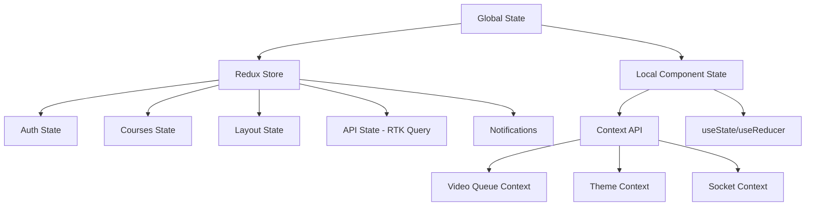

# Quản Lý State (State Management)

Hệ thống E-Learning sử dụng Redux Toolkit, RTK Query và React Context API để quản lý state và API calls. Dưới đây là phân tích chi tiết về cách quản lý state trong dự án.

## Tổng Quan Kiến Trúc Quản Lý State



## Cấu Trúc Redux

```
redux/
├── features/                 # Redux slices
│   ├── analytics/            # Analytics state
│   │   └── analyticsApi.ts   # API cho analytics
│   ├── api/                  # Base API configuration
│   │   └── apiSlice.ts       # RTK Query setup
│   ├── auth/                 # Authentication state
│   │   ├── authApi.ts        # API cho authentication
│   │   └── authSlice.ts      # State cho authentication
│   ├── courses/              # Courses state
│   │   └── coursesApi.tsx    # API cho courses
│   ├── layout/               # Layout state 
│   │   └── layoutApi.ts      # API cho layout
│   ├── notifications/        # Notifications state
│   │   └── notificationsApi.ts # API cho notifications
│   ├── orders/               # Orders state
│   │   └── ordersApi.ts      # API cho orders
│   ├── user/                 # User state
│   │   └── userApi.ts        # API cho user
│   └── videoQueue/           # Video Queue state 
│       └── videoQueueSlice.ts # Video processing state
└── store.ts                  # Redux store configuration
```

## Redux Store

```typescript
// store.ts
import { configureStore } from "@reduxjs/toolkit";
import { apiSlice } from "./features/api/apiSlice";
import authReducer from "./features/auth/authSlice";
import userReducer from "./features/user/userSlice";
import coursesReducer from "./features/courses/coursesSlice";
import layoutReducer from "./features/layout/layoutSlice";
import notificationsReducer from "./features/notifications/notificationsSlice";
import ordersReducer from "./features/orders/ordersSlice";
import analyticsReducer from "./features/analytics/analyticsSlice";
import videoQueueReducer from "./features/videoQueue/videoQueueSlice";
import { createSocketMiddleware } from "./middleware/socketMiddleware";

// Socket middleware
const socketMiddleware = createSocketMiddleware();

export const store = configureStore({
  reducer: {
    [apiSlice.reducerPath]: apiSlice.reducer,
    auth: authReducer,
    user: userReducer,
    courses: coursesReducer,
    layout: layoutReducer,
    notifications: notificationsReducer,
    orders: ordersReducer,
    analytics: analyticsReducer,
    videoQueue: videoQueueReducer,
  },
  middleware: (getDefaultMiddleware) =>
    getDefaultMiddleware()
      .concat(apiSlice.middleware)
      .concat(socketMiddleware),
  devTools: process.env.NODE_ENV !== "production",
});

export type RootState = ReturnType<typeof store.getState>;
export type AppDispatch = typeof store.dispatch;
```

## RTK Query Base Setup

```typescript
// features/api/apiSlice.ts
import { createApi, fetchBaseQuery } from "@reduxjs/toolkit/query/react";
import { userLoggedIn } from "../auth/authSlice";

export const apiSlice = createApi({
  reducerPath: "api",
  baseQuery: fetchBaseQuery({
    baseUrl: process.env.NEXT_PUBLIC_SERVER_URI,
  }),
  tagTypes: [
    "Courses", 
    "Users", 
    "Notifications", 
    "Layout", 
    "Orders",
    "Analytics",
    "Subtitles",
    "AIData"
  ],
  endpoints: (builder) => ({
    refreshToken: builder.query({
      query: (data) => ({
        url: "refresh",
        method: "GET",
        credentials: "include" as const,
      }),
    }),
    loadUser: builder.query({
      query: (data) => ({
        url: "me",
        method: "GET",
        credentials: "include" as const,
      }),
      async onQueryStarted(arg, { queryFulfilled, dispatch }) {
        try {
          const result = await queryFulfilled;
          dispatch(
            userLoggedIn({
              accessToken: result.data.accessToken,
              user: result.data.user,
            })
          );
        } catch (error: any) {
          console.log(error);
        }
      },
    }),
  }),
});

export const { useRefreshTokenQuery, useLoadUserQuery } = apiSlice;
```

## Socket Middleware

```typescript
// redux/middleware/socketMiddleware.ts
import { io, Socket } from 'socket.io-client';
import { Middleware } from 'redux';
import { socketConfig } from '@/app/utils/socketConfig';

// Socket middleware cho Redux
export const createSocketMiddleware = (): Middleware => {
  let socket: Socket | null = null;

  return store => next => action => {
    // Các action related với socket
    if (action.type === 'socket/connect') {
      // Kết nối socket nếu chưa kết nối
      if (!socket) {
        const { token } = action.payload;
        
        socket = io(process.env.NEXT_PUBLIC_SOCKET_SERVER_URI || '', {
          ...socketConfig,
          auth: { token }
        });
        
        // Lắng nghe sự kiện từ server
        socket.on('connect', () => {
          store.dispatch({ type: 'socket/connected' });
        });
        
        socket.on('disconnect', () => {
          store.dispatch({ type: 'socket/disconnected' });
        });
        
        // Lắng nghe sự kiện thông báo mới
        socket.on('newNotification', (notification) => {
          store.dispatch({
            type: 'notifications/addNotification',
            payload: notification
          });
        });
        
        // Lắng nghe sự kiện cập nhật video
        socket.on('videoProgress', (data) => {
          store.dispatch({
            type: 'videoQueue/updateProgress',
            payload: data
          });
        });
      }
    }
    
    // Ngắt kết nối socket
    if (action.type === 'socket/disconnect' && socket) {
      socket.disconnect();
      socket = null;
    }
    
    // Emit event qua socket
    if (action.type === 'socket/emit' && socket) {
      const { event, data } = action.payload;
      socket.emit(event, data);
    }
    
    return next(action);
  };
};
```

## Tính Năng Mới: Video Queue Slice

```typescript
// features/videoQueue/videoQueueSlice.ts
import { createSlice, PayloadAction } from '@reduxjs/toolkit';

export interface VideoQueueItem {
  processId: string;
  fileName: string;
  progress: number;
  message: string;
  status: "pending" | "processing" | "success" | "error";
  result?: {
    publicId?: string;
    url?: string;
    duration?: number;
    format?: string;
    error?: string;
    warning?: string;
  };
  uploadType: "demo" | "content";
  contentIndex?: number;
  timestamp: number;
}

interface VideoQueueState {
  queue: VideoQueueItem[];
  isMinimized: boolean;
}

const initialState: VideoQueueState = {
  queue: [],
  isMinimized: false
};

const videoQueueSlice = createSlice({
  name: 'videoQueue',
  initialState,
  reducers: {
    // Thêm video vào queue
    addToQueue: (state, action: PayloadAction<Omit<VideoQueueItem, 'progress' | 'message' | 'status' | 'timestamp'>>) => {
      state.queue.push({
        ...action.payload,
        progress: 0,
        message: 'Waiting to process...',
        status: 'pending',
        timestamp: Date.now()
      });
    },
    
    // Cập nhật tiến trình video
    updateProgress: (state, action: PayloadAction<{
      processId: string;
      progress: number;
      message: string;
      status: string;
      result?: any;
    }>) => {
      const { processId, progress, message, status, result } = action.payload;
      const index = state.queue.findIndex(item => item.processId === processId);
      
      if (index !== -1) {
        state.queue[index] = {
          ...state.queue[index],
          progress,
          message,
          status,
          result,
          timestamp: Date.now()
        };
      }
    },
    
    // Xóa video khỏi queue
    removeFromQueue: (state, action: PayloadAction<string>) => {
      state.queue = state.queue.filter(item => item.processId !== action.payload);
    },
    
    // Xóa toàn bộ queue
    clearQueue: (state) => {
      state.queue = [];
    },
    
    // Toggle minimize
    toggleMinimize: (state) => {
      state.isMinimized = !state.isMinimized;
    }
  }
});

export const {
  addToQueue,
  updateProgress,
  removeFromQueue,
  clearQueue,
  toggleMinimize
} = videoQueueSlice.actions;

export default videoQueueSlice.reducer;
```

## Context API Management

### 1. VideoQueueContext

```tsx
// app/contexts/VideoQueueContext.tsx
"use client";
import React, { createContext, useContext, useEffect, useState } from "react";
import { toast } from "react-hot-toast";
import io, { Socket } from "socket.io-client";

// Khai báo kiểu dữ liệu cho video trong queue
export interface VideoQueueItem {
  processId: string;
  fileName: string;
  progress: number;
  message: string;
  status: "pending" | "processing" | "success" | "error";
  result?: {
    publicId?: string;
    url?: string;
    duration?: number;
    format?: string;
    error?: string;
    warning?: string;
  };
  uploadType: "demo" | "content";
  contentIndex?: number; // Chỉ dùng cho content videos
  timestamp: number;
}

interface VideoQueueContextType {
  queue: VideoQueueItem[];
  addToQueue: (item: Omit<VideoQueueItem, "progress" | "message" | "status" | "timestamp">) => void;
  updateQueueItem: (processId: string, data: Partial<VideoQueueItem>) => void;
  removeFromQueue: (processId: string) => void;
  clearQueue: () => void;
  setVideoUrlFromQueue: (
    uploadType: "demo" | "content", 
    contentIndex?: number
  ) => { publicId?: string; duration?: number };
}

// Tạo context
const VideoQueueContext = createContext<VideoQueueContextType | undefined>(undefined);

// Provider Component
export const VideoQueueProvider: React.FC<{ children: React.ReactNode }> = ({ children }) => {
  const [queue, setQueue] = useState<VideoQueueItem[]>([]);
  const [socket, setSocket] = useState<Socket | null>(null);

  // Kết nối Socket.IO khi component mount
  useEffect(() => {
    // Kết nối đến Socket.IO server
    const socketInstance = io(process.env.NEXT_PUBLIC_SOCKET_SERVER_URI || "", {
      path: "/socket.io",
      transports: ["polling", "websocket"]
    });
    
    socketInstance.on("connect", () => {
      console.log("Socket connected for video queue updates");
    });
    
    socketInstance.on("disconnect", () => {
      console.log("Socket disconnected from video queue updates");
    });
    
    // Lắng nghe cập nhật tiến độ video
    socketInstance.on("videoProgress", (data: any) => {
      console.log("Video progress update:", data);
      
      // Cập nhật item trong queue
      setQueue((prevQueue) => {
        // Tìm video trong queue
        const index = prevQueue.findIndex(item => item.processId === data.processId);
        
        if (index !== -1) {
          // Cập nhật thông tin
          const updatedQueue = [...prevQueue];
          updatedQueue[index] = {
            ...updatedQueue[index],
            progress: data.progress,
            message: data.message,
            status: data.progress === 100 
              ? data.result?.error ? "error" : "success" 
              : "processing",
            result: data.result,
            timestamp: data.timestamp,
          };

          // Thông báo khi hoàn thành
          if (data.progress === 100) {
            if (data.result?.error) {
              toast.error(`Upload failed: ${data.message}`);
            } else {
              toast.success(`Upload complete: ${updatedQueue[index].fileName}`);
            }
          }
          
          return updatedQueue;
        }
        
        return prevQueue;
      });
    });
    
    setSocket(socketInstance);
    
    // Cleanup khi unmount
    return () => {
      socketInstance.disconnect();
    };
  }, []);

  // Thêm video vào queue
  const addToQueue = (item: Omit<VideoQueueItem, "progress" | "message" | "status" | "timestamp">) => {
    const newItem: VideoQueueItem = {
      ...item,
      progress: 0,
      message: "Waiting to process...",
      status: "pending",
      timestamp: Date.now(),
    };
    
    setQueue((prev) => [...prev, newItem]);
  };

  // Cập nhật thông tin của một video trong queue
  const updateQueueItem = (processId: string, data: Partial<VideoQueueItem>) => {
    setQueue((prev) => 
      prev.map((item) => 
        item.processId === processId ? { ...item, ...data } : item
      )
    );
  };

  // Xóa video khỏi queue
  const removeFromQueue = (processId: string) => {
    setQueue((prev) => prev.filter((item) => item.processId !== processId));
  };

  // Xóa toàn bộ queue
  const clearQueue = () => {
    setQueue([]);
  };

  // Lấy thông tin publicId và duration từ video đã upload thành công
  const setVideoUrlFromQueue = (uploadType: "demo" | "content", contentIndex?: number) => {
    // Tìm video phù hợp nhất trong queue (mới nhất, đã hoàn thành, đúng loại)
    const matchedVideos = queue.filter(item => 
      item.uploadType === uploadType && 
      item.status === "success" &&
      (uploadType === "content" ? item.contentIndex === contentIndex : true)
    );
    
    if (matchedVideos.length === 0) {
      return { publicId: undefined, duration: undefined };
    }
    
    // Lấy video mới nhất
    const latestVideo = matchedVideos.sort((a, b) => b.timestamp - a.timestamp)[0];
    
    return { 
      publicId: latestVideo.result?.publicId,
      duration: latestVideo.result?.duration
    };
  };

  return (
    <VideoQueueContext.Provider
      value={{
        queue,
        addToQueue,
        updateQueueItem,
        removeFromQueue,
        clearQueue,
        setVideoUrlFromQueue,
      }}
    >
      {children}
    </VideoQueueContext.Provider>
  );
};

// Custom hook để sử dụng context
export const useVideoQueue = () => {
  const context = useContext(VideoQueueContext);
  if (context === undefined) {
    throw new Error("useVideoQueue must be used within a VideoQueueProvider");
  }
  return context;
};
```

### 2. Socket Context

```tsx
// app/contexts/SocketContext.tsx
"use client";
import React, { createContext, useContext, useEffect, useState } from "react";
import { io, Socket } from "socket.io-client";
import { useSelector } from "react-redux";

interface SocketContextProps {
  socket: Socket | null;
  isConnected: boolean;
  connect: () => void;
  disconnect: () => void;
}

const SocketContext = createContext<SocketContextProps>({
  socket: null,
  isConnected: false,
  connect: () => {},
  disconnect: () => {},
});

export const useSocket = () => useContext(SocketContext);

export const SocketProvider: React.FC<{ children: React.ReactNode }> = ({ children }) => {
  const [socket, setSocket] = useState<Socket | null>(null);
  const [isConnected, setIsConnected] = useState(false);
  
  // Lấy token từ Redux store
  const { token, user } = useSelector((state: any) => state.auth);
  
  // Kết nối socket
  const connect = () => {
    // Kiểm tra nếu đã kết nối
    if (socket && socket.connected) return;
    
    // Tạo kết nối mới
    const socketInstance = io(process.env.NEXT_PUBLIC_SOCKET_SERVER_URI || "", {
      transports: ["websocket"],
      auth: { token },
      autoConnect: false,
    });
    
    // Set up event listeners
    socketInstance.on("connect", () => {
      console.log("Socket connected");
      setIsConnected(true);
    });
    
    socketInstance.on("disconnect", () => {
      console.log("Socket disconnected");
      setIsConnected(false);
    });
    
    socketInstance.on("connect_error", (err) => {
      console.error("Socket connection error:", err.message);
      setIsConnected(false);
    });
    
    // Kết nối socket
    socketInstance.connect();
    
    // Lưu socket instance
    setSocket(socketInstance);
  };
  
  // Ngắt kết nối socket
  const disconnect = () => {
    if (socket) {
      socket.disconnect();
      setSocket(null);
      setIsConnected(false);
    }
  };
  
  // Tự động kết nối khi có token
  useEffect(() => {
    if (token && user) {
      connect();
    } else {
      disconnect();
    }
    
    // Cleanup khi unmount
    return () => {
      if (socket) {
        socket.disconnect();
      }
    };
  }, [token, user]);
  
  return (
    <SocketContext.Provider value={{ socket, isConnected, connect, disconnect }}>
      {children}
    </SocketContext.Provider>
  );
};
```

### 3. Theme Context

```tsx
// app/utils/theme-provider.tsx
"use client";

import * as React from "react";
import { ThemeProvider as NextThemesProvider } from "next-themes";
import { type ThemeProviderProps } from "next-themes/dist/types";

export function ThemeProvider({ children, ...props }: ThemeProviderProps) {
  return <NextThemesProvider {...props}>{children}</NextThemesProvider>;
}
```

## Custom Hooks Kết Hợp Redux và Context API

### 1. useVideoUpload

```typescript
// hooks/useVideoUpload.ts
"use client";
import { useState } from "react";
import { useVideoQueue } from "@/app/contexts/VideoQueueContext";
import { v4 as uuidv4 } from "uuid";
import axios from "axios";

export const useVideoUpload = () => {
  const [isUploading, setIsUploading] = useState(false);
  const { addToQueue } = useVideoQueue();

  const uploadVideo = async (
    file: File,
    uploadType: "demo" | "content",
    contentIndex?: number
  ) => {
    try {
      setIsUploading(true);
      
      // Tạo process ID duy nhất
      const processId = uuidv4();
      
      // Tạo FormData
      const formData = new FormData();
      formData.append("video", file);
      formData.append("uploadType", uploadType);
      if (contentIndex !== undefined) {
        formData.append("contentIndex", contentIndex.toString());
      }
      formData.append("processId", processId);
      
      // Thêm vào video queue (UI)
      addToQueue({
        processId,
        fileName: file.name,
        uploadType,
        contentIndex,
      });
      
      // Gửi request API
      const response = await axios.post(
        `${process.env.NEXT_PUBLIC_SERVER_URI}/upload-video`,
        formData,
        {
          headers: {
            "Content-Type": "multipart/form-data",
          },
          withCredentials: true,
        }
      );
      
      return {
        success: true,
        processId,
        ...response.data,
      };
    } catch (error) {
      console.error("Video upload error:", error);
      return {
        success: false,
        error: "Không thể upload video. Vui lòng thử lại sau.",
      };
    } finally {
      setIsUploading(false);
    }
  };

  return {
    uploadVideo,
    isUploading,
  };
};
```

### 2. useCourse hook

```typescript
// hooks/useCourse.ts
"use client";
import { useGetCourseDetailsQuery, useGetCourseContentQuery } from "@/redux/features/courses/coursesApi";
import { useAppSelector } from "./reduxHooks";
import { useState, useEffect } from "react";

export const useCourse = (courseId: string) => {
  const [activeVideoIndex, setActiveVideoIndex] = useState<number>(0);
  const [activeContentIndex, setActiveContentIndex] = useState<number>(0);
  const [isCoursePurchased, setIsCoursePurchased] = useState<boolean>(false);
  
  // Fetch dữ liệu khóa học từ Redux
  const { data: courseData, isLoading: isLoadingCourse } = useGetCourseDetailsQuery(courseId, {
    skip: !courseId,
  });
  
  const { data: courseContent, isLoading: isLoadingContent } = useGetCourseContentQuery(courseId, {
    skip: !courseId || !isCoursePurchased,
  });
  
  // Lấy thông tin user từ Redux
  const { user } = useAppSelector((state) => state.auth);
  
  // Kiểm tra xem user đã mua khóa học chưa
  useEffect(() => {
    if (user && user.courses) {
      const purchased = user.courses.some((course: { courseId: string }) => 
        course.courseId === courseId
      );
      setIsCoursePurchased(purchased);
    }
  }, [user, courseId]);
  
  // Thay đổi video đang xem
  const changeVideo = (contentIndex: number, videoIndex: number) => {
    setActiveContentIndex(contentIndex);
    setActiveVideoIndex(videoIndex);
  };
  
  // Lấy video hiện tại
  const getCurrentVideo = () => {
    if (!courseContent || !courseContent.content) return null;
    
    try {
      return courseContent.content[activeContentIndex].videoUrl[activeVideoIndex];
    } catch (error) {
      return null;
    }
  };
  
  return {
    course: courseData?.course || null,
    courseContent: courseContent?.content || [],
    isLoading: isLoadingCourse || isLoadingContent,
    isCoursePurchased,
    activeVideoIndex,
    activeContentIndex,
    changeVideo,
    getCurrentVideo,
  };
};
```

### 3. useAuth Hook

```typescript
// hooks/useAuth.ts
"use client";
import { useAppSelector } from "./reduxHooks";
import { useRouter } from "next/navigation";
import { useCallback, useEffect } from "react";

export const useAuth = () => {
  const { user, token } = useAppSelector((state) => state.auth);
  const router = useRouter();
  
  const isAuthenticated = !!token && !!user;
  const isAdmin = user?.role === "admin";
  
  // Hàm kiểm tra xác thực
  const requireAuth = useCallback(() => {
    if (!isAuthenticated) {
      router.push("/login");
      return false;
    }
    return true;
  }, [isAuthenticated, router]);
  
  // Hàm kiểm tra quyền admin
  const requireAdmin = useCallback(() => {
    if (!isAuthenticated) {
      router.push("/login");
      return false;
    }
    
    if (!isAdmin) {
      router.push("/");
      return false;
    }
    
    return true;
  }, [isAuthenticated, isAdmin, router]);
  
  return {
    user,
    token,
    isAuthenticated,
    isAdmin,
    requireAuth,
    requireAdmin,
  };
};
```

## Tích Hợp Redux và Context trong Components

### Kết Hợp Redux và Video Queue Context

```tsx
// components/Admin/Course/CreateCourse.tsx
"use client";
import React, { useState, useEffect } from "react";
import { useCreateCourseMutation } from "@/redux/features/courses/coursesApi";
import { useVideoQueue } from "@/app/contexts/VideoQueueContext";
import { useVideoUpload } from "@/hooks/useVideoUpload";
import toast from "react-hot-toast";

const CreateCourse = () => {
  // State từ form
  const [courseData, setCourseData] = useState({
    name: "",
    description: "",
    // ...other fields
  });
  
  // Redux mutation
  const [createCourse, { isLoading: isCreating, error, isSuccess }] = useCreateCourseMutation();
  
  // Context API cho video queue
  const { setVideoUrlFromQueue } = useVideoQueue();
  
  // Custom hook cho upload video
  const { uploadVideo, isUploading } = useVideoUpload();
  
  // Xử lý upload demo video
  const handleDemoUpload = async (e: React.ChangeEvent<HTMLInputElement>) => {
    const file = e.target.files?.[0];
    if (!file) return;
    
    // Upload video and add to queue
    await uploadVideo(file, "demo");
  };
  
  // Cập nhật demoUrl từ video đã upload
  useEffect(() => {
    // Check if we have a recently uploaded demo video
    const { publicId, duration } = setVideoUrlFromQueue("demo");
    
    if (publicId) {
      setCourseData(prev => ({
        ...prev,
        demoUrl: publicId,
        duration: duration || 0,
      }));
      
      toast.success("Demo video uploaded successfully!");
    }
  }, [setVideoUrlFromQueue]);
  
  // Submit handler
  const handleSubmit = async (e: React.FormEvent) => {
    e.preventDefault();
    
    try {
      await createCourse(courseData).unwrap();
      toast.success("Course created successfully!");
    } catch (err) {
      toast.error(err.data?.message || "Failed to create course");
    }
  };
  
  return (
    <form onSubmit={handleSubmit}>
      {/* Form fields */}
      <div>
        <label>Demo Video</label>
        <input type="file" accept="video/*" onChange={handleDemoUpload} />
      </div>
      
      <button 
        type="submit" 
        disabled={isCreating || isUploading}
      >
        {isCreating ? "Creating..." : "Create Course"}
      </button>
    </form>
  );
};

export default CreateCourse;
```

### Socket.IO kết hợp với Redux và Context

```tsx
// components/Notification/NotificationManager.tsx
"use client";
import React, { useEffect } from "react";
import { useSocket } from "@/app/contexts/SocketContext";
import { useDispatch } from "react-redux";
import { addNotification } from "@/redux/features/notifications/notificationsSlice";
import { useAuth } from "@/hooks/useAuth";

const NotificationManager: React.FC = () => {
  const { socket, isConnected } = useSocket();
  const { isAuthenticated, user } = useAuth();
  const dispatch = useDispatch();
  
  // Lắng nghe thông báo từ socket
  useEffect(() => {
    if (!socket || !isConnected || !isAuthenticated) return;
    
    // Đăng ký nhận thông báo cho user hiện tại
    socket.emit("registerForNotifications", { userId: user?._id });
    
    // Lắng nghe thông báo mới
    const handleNewNotification = (notification: any) => {
      // Dispatch action để thêm thông báo vào Redux store
      dispatch(addNotification(notification));
      
      // Phát âm thanh thông báo
      const audio = new Audio("/assets/Notification.mp3");
      audio.play().catch(err => console.error("Could not play notification sound:", err));
    };
    
    socket.on("newNotification", handleNewNotification);
    
    // Cleanup
    return () => {
      socket.off("newNotification", handleNewNotification);
    };
  }, [socket, isConnected, isAuthenticated, user, dispatch]);
  
  // Component không render gì, chỉ quản lý side effects
  return null;
};

export default NotificationManager;
```

## Kết Luận

Dự án E-Learning áp dụng mô hình quản lý state hỗn hợp, kết hợp hiệu quả giữa:

1. **Redux và RTK Query**: Quản lý global state và API fetching
   - Auth, user, courses, và các dữ liệu chính
   - Caching và invalidation tự động với RTK Query
   - Quản lý API error và loading state

2. **Context API**: Quản lý state cho các tính năng cụ thể
   - Video Queue: Quản lý trạng thái upload và processing
   - Socket: Quản lý kết nối realtime
   - Theme: Quản lý dark/light mode

3. **Custom Hooks**: Kết hợp Redux và Context API
   - Cung cấp interface đơn giản cho component
   - Tách logic nghiệp vụ khỏi component
   - Tái sử dụng code dễ dàng

Mô hình này giúp cân bằng giữa:
- **Hiệu suất**: Tránh re-render không cần thiết
- **Quản lý state**: Tập trung hóa với Redux kết hợp phân tán hợp lý với Context
- **Khả năng bảo trì**: Tách biệt rõ ràng các lớp logic
- **Realtime**: Quản lý hiệu quả giao tiếp hai chiều với Socket.IO